# Application Architecture

<cite>
**Referenced Files in This Document**
- [App.tsx](file://src/App.tsx)
- [main.tsx](file://src/main.tsx)
- [types.ts](file://src/types.ts)
- [calculations.ts](file://src/lib/calculations.ts)
- [utils.ts](file://src/lib/utils.ts)
- [Header.tsx](file://src/components/Header.tsx)
- [MemberList.tsx](file://src/components/MemberList.tsx)
- [ExpenseForm.tsx](file://src/components/ExpenseForm.tsx)
- [ExpenseList.tsx](file://src/components/ExpenseList.tsx)
- [Settlement.tsx](file://src/components/Settlement.tsx)
- [Toast.tsx](file://src/components/Toast.tsx)
- [button.tsx](file://src/components/ui/button.tsx)
- [card.tsx](file://src/components/ui/card.tsx)
- [package.json](file://package.json)
- [vite.config.ts](file://vite.config.ts)
- [tailwind.config.ts](file://tailwind.config.ts)
</cite>

## Table of Contents
1. [Introduction](#introduction)
2. [Project Structure](#project-structure)
3. [Core Components](#core-components)
4. [Architecture Overview](#architecture-overview)
5. [Detailed Component Analysis](#detailed-component-analysis)
6. [Dependency Analysis](#dependency-analysis)
7. [Performance Considerations](#performance-considerations)
8. [Troubleshooting Guide](#troubleshooting-guide)
9. [Conclusion](#conclusion)

## Introduction
This document describes the architecture of the Travel Splitter application, a React-based web app for managing shared travel expenses. It focuses on the component hierarchy, state management strategy using React hooks, automatic synchronization with localStorage, and the separation of concerns between presentation (UI components), business logic (calculation modules), and data persistence. The system is designed around a single-page application pattern with a floating action button to add expenses, real-time settlement computation, and a responsive UI built with Tailwind CSS and custom animations.

## Project Structure
The application follows a feature-oriented structure under src/, with clear separation between:
- Entry point and rendering bootstrap
- Global application container and state orchestration
- UI components and reusable design system primitives
- Business logic modules for calculations and utilities
- Type definitions and currency helpers
- Build configuration and styling framework

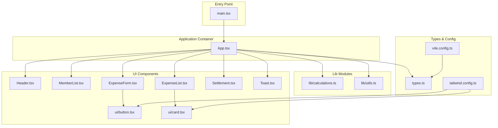

**Diagram sources**
- [main.tsx:1-11](file://src/main.tsx#L1-L11)
- [App.tsx:1-231](file://src/App.tsx#L1-L231)
- [Header.tsx:1-93](file://src/components/Header.tsx#L1-L93)
- [MemberList.tsx:1-180](file://src/components/MemberList.tsx#L1-L180)
- [ExpenseForm.tsx:1-274](file://src/components/ExpenseForm.tsx#L1-L274)
- [ExpenseList.tsx:1-152](file://src/components/ExpenseList.tsx#L1-L152)
- [Settlement.tsx:1-97](file://src/components/Settlement.tsx#L1-L97)
- [Toast.tsx:1-44](file://src/components/Toast.tsx#L1-L44)
- [button.tsx:1-54](file://src/components/ui/button.tsx#L1-L54)
- [card.tsx:1-79](file://src/components/ui/card.tsx#L1-L79)
- [calculations.ts:1-85](file://src/lib/calculations.ts#L1-L85)
- [utils.ts:1-7](file://src/lib/utils.ts#L1-L7)
- [types.ts:1-97](file://src/types.ts#L1-L97)
- [vite.config.ts:1-13](file://vite.config.ts#L1-L13)
- [tailwind.config.ts:1-118](file://tailwind.config.ts#L1-L118)

**Section sources**
- [main.tsx:1-11](file://src/main.tsx#L1-L11)
- [vite.config.ts:1-13](file://vite.config.ts#L1-L13)
- [tailwind.config.ts:1-118](file://tailwind.config.ts#L1-L118)

## Core Components
- App container: Manages global state (members, expenses, currency), orchestrates actions, computes derived values (totals and settlements), and persists data to localStorage. It also controls transient UI state such as form visibility and toast notifications.
- UI components: Presentational components that receive props for data and callbacks for user actions. They encapsulate local UI state for forms and interactions.
- Calculation module: Pure functions for computing totals and settlements, and utilities for ID generation and currency conversion/formatting.
- Types and utilities: Shared type definitions, currency metadata, exchange rates, formatting helpers, and Tailwind utility functions.

Key responsibilities:
- Presentation: Header, MemberList, ExpenseForm, ExpenseList, Settlement, Toast, and UI primitives (Button, Card).
- Business logic: calculations (settlements, totals, IDs), types (currency conversion/formatting).
- Persistence: App container reads/writes localStorage with a single storage key.

**Section sources**
- [App.tsx:18-231](file://src/App.tsx#L18-L231)
- [calculations.ts:1-85](file://src/lib/calculations.ts#L1-L85)
- [types.ts:1-97](file://src/types.ts#L1-L97)

## Architecture Overview
The system is a React SPA bootstrapped via Vite. The App component acts as the central orchestrator:
- Initializes state from localStorage on mount.
- Synchronizes state to localStorage on every change to members, expenses, or currency.
- Computes derived values (total expenses and settlements) using memoization.
- Renders child components and passes down data and callbacks.
- Uses a floating action button to open the ExpenseForm modal, which updates the parent state upon submission.

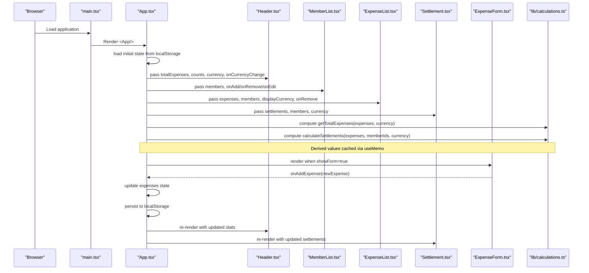

**Diagram sources**
- [main.tsx:1-11](file://src/main.tsx#L1-L11)
- [App.tsx:58-228](file://src/App.tsx#L58-L228)
- [Header.tsx:12-79](file://src/components/Header.tsx#L12-L79)
- [MemberList.tsx:14-179](file://src/components/MemberList.tsx#L14-L179)
- [ExpenseList.tsx:30-151](file://src/components/ExpenseList.tsx#L30-L151)
- [Settlement.tsx:11-96](file://src/components/Settlement.tsx#L11-L96)
- [ExpenseForm.tsx:49-273](file://src/components/ExpenseForm.tsx#L49-L273)
- [calculations.ts:4-84](file://src/lib/calculations.ts#L4-L84)

## Detailed Component Analysis

### App Container (State Orchestration and Persistence)
- State initialization: Loads members, expenses, and currency from localStorage with fallback defaults.
- Automatic persistence: A side effect writes the current state to localStorage whenever members, expenses, or currency change.
- Derived computations: Memoized totals and settlements computed from current state.
- Action handlers: Encapsulate mutations for adding/removing/editing members, adding/removing expenses, and toggling currency.
- UI coordination: Controls visibility of the floating add button, modal form, and toast notifications.

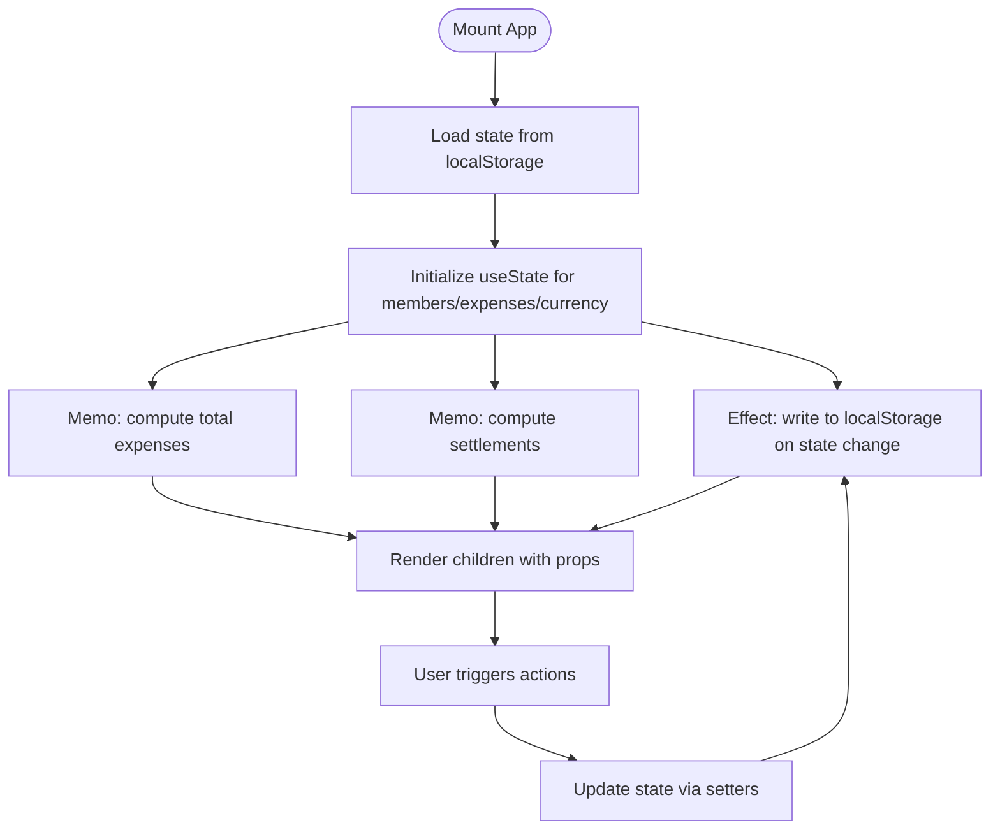

**Diagram sources**
- [App.tsx:26-76](file://src/App.tsx#L26-L76)
- [App.tsx:67-69](file://src/App.tsx#L67-L69)
- [App.tsx:148-161](file://src/App.tsx#L148-L161)

**Section sources**
- [App.tsx:18-231](file://src/App.tsx#L18-L231)

### Header Component (Presentation and Currency Switching)
- Displays aggregated stats (total expenses, member count, expense count).
- Provides currency toggle that updates the display currency in the parent.
- Uses currency metadata and formatting helpers for localized money display.

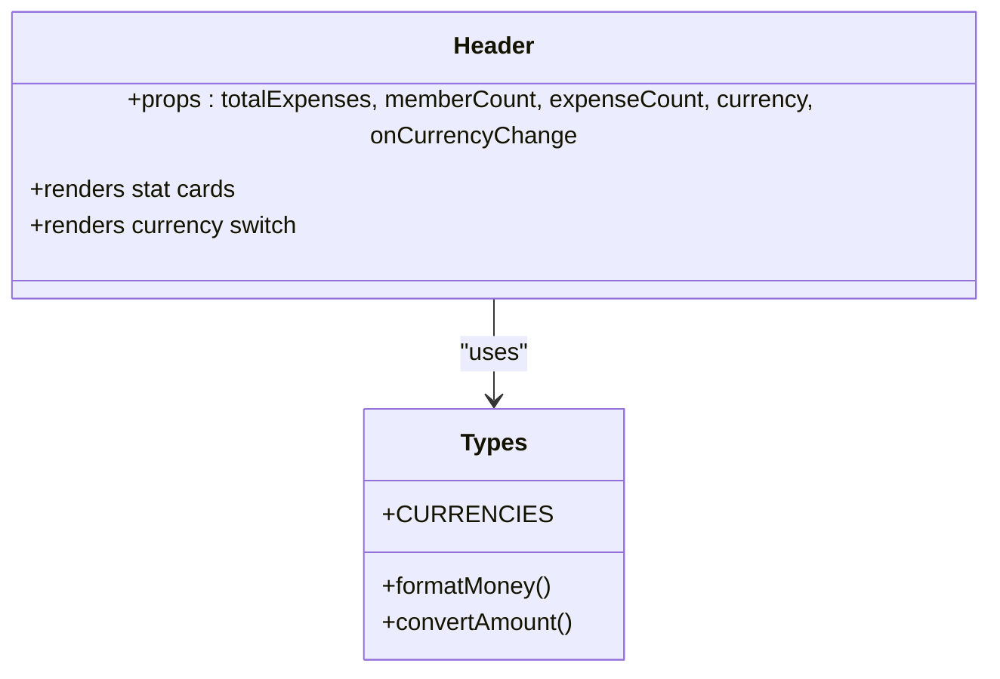

**Diagram sources**
- [Header.tsx:4-79](file://src/components/Header.tsx#L4-L79)
- [types.ts:9-48](file://src/types.ts#L9-L48)

**Section sources**
- [Header.tsx:1-93](file://src/components/Header.tsx#L1-L93)
- [types.ts:17-48](file://src/types.ts#L17-L48)

### MemberList Component (Local UI State and CRUD)
- Manages local form state for adding and editing members.
- Supports inline editing with keyboard shortcuts and confirmation.
- Delegates member creation, editing, and removal to parent callbacks.
- Uses avatar color mapping based on index.

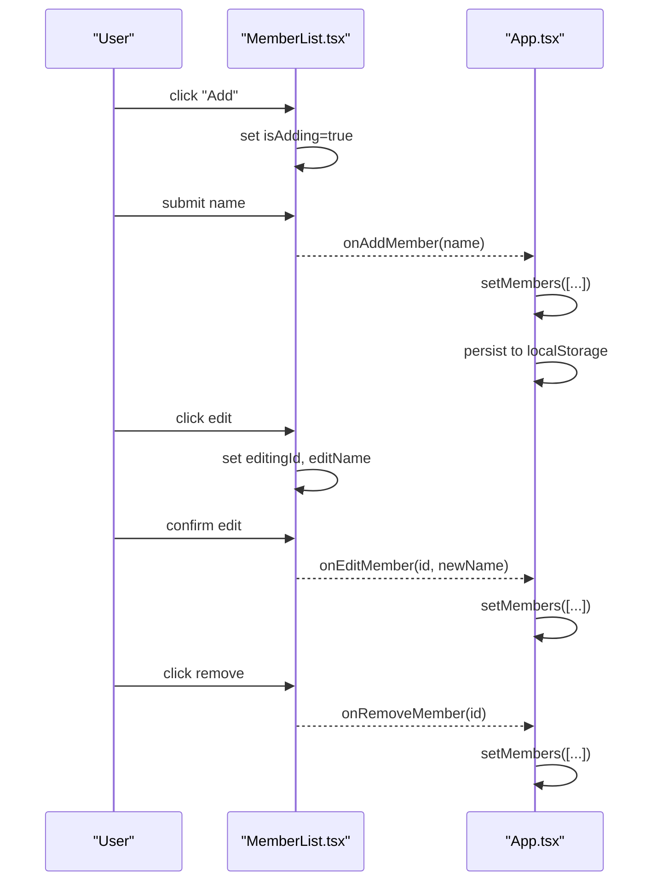

**Diagram sources**
- [MemberList.tsx:14-179](file://src/components/MemberList.tsx#L14-L179)
- [App.tsx:78-117](file://src/App.tsx#L78-L117)

**Section sources**
- [MemberList.tsx:1-180](file://src/components/MemberList.tsx#L1-L180)
- [App.tsx:78-117](file://src/App.tsx#L78-L117)

### ExpenseForm Component (Local Form State and Validation)
- Local state for description, amount, currency, paidBy, splitAmong, category, and date.
- Validation ensures required fields are present and positive numeric amounts.
- Calculates per-person share dynamically and supports selecting all participants.
- Emits a normalized expense object to the parent on submit.

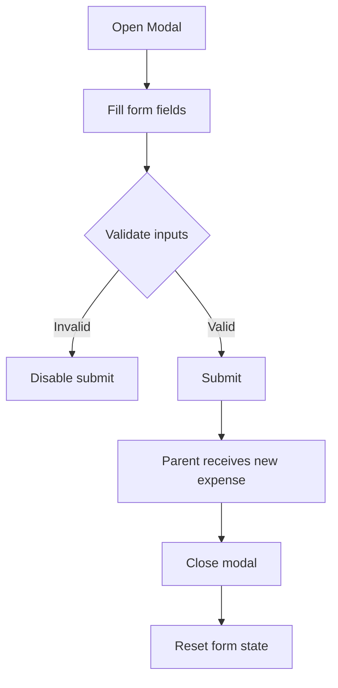

**Diagram sources**
- [ExpenseForm.tsx:49-273](file://src/components/ExpenseForm.tsx#L49-L273)

**Section sources**
- [ExpenseForm.tsx:1-274](file://src/components/ExpenseForm.tsx#L1-L274)

### ExpenseList Component (Read-Only Presentation)
- Renders a scrollable list of expenses with icons, payer identity, and split participants.
- Converts and formats amounts according to the current display currency.
- Delegates removal to the parent callback.

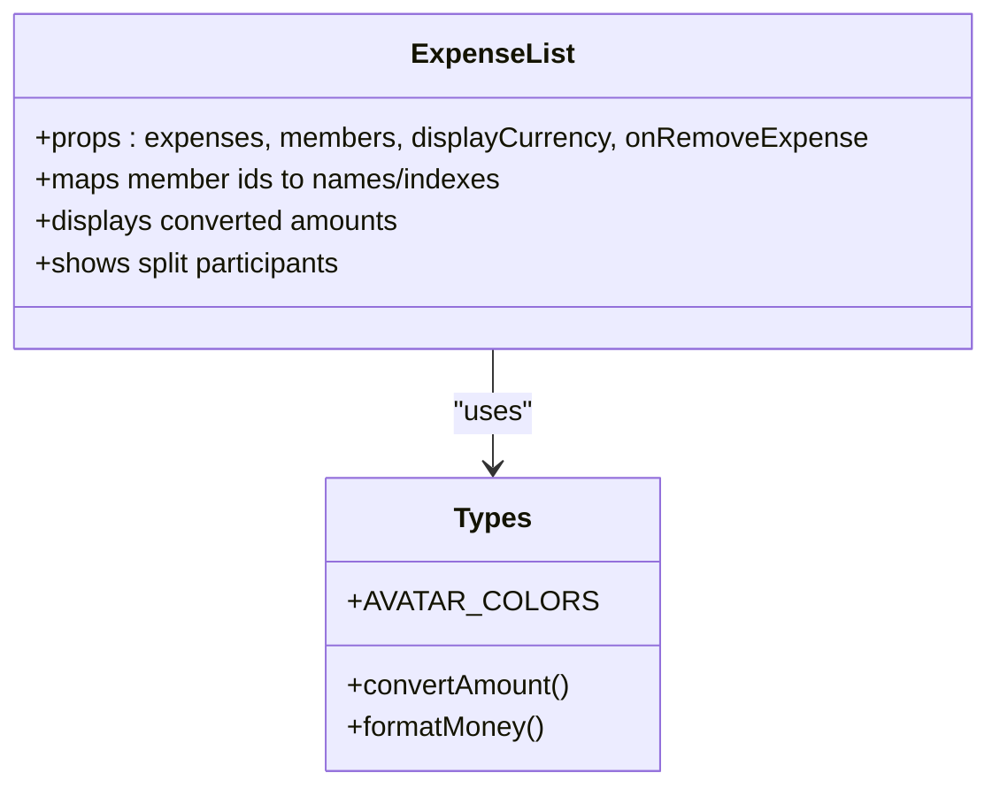

**Diagram sources**
- [ExpenseList.tsx:23-151](file://src/components/ExpenseList.tsx#L23-L151)
- [types.ts:25-48](file://src/types.ts#L25-L48)

**Section sources**
- [ExpenseList.tsx:1-152](file://src/components/ExpenseList.tsx#L1-L152)
- [types.ts:25-48](file://src/types.ts#L25-L48)

### Settlement Component (Derived View)
- Displays settlement instructions when imbalances exist.
- Uses member avatars and colors to visually represent parties.
- Shows the minimal number of transfers needed to settle balances.

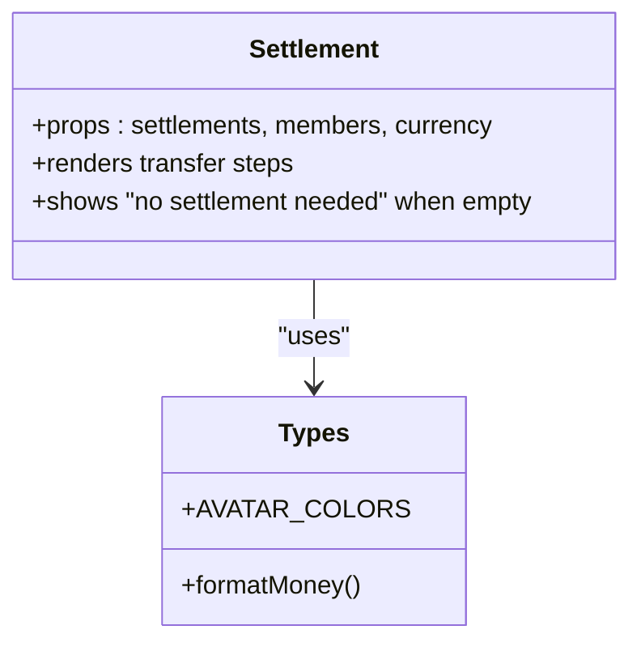

**Diagram sources**
- [Settlement.tsx:5-96](file://src/components/Settlement.tsx#L5-L96)
- [types.ts:87-97](file://src/types.ts#L87-L97)

**Section sources**
- [Settlement.tsx:1-97](file://src/components/Settlement.tsx#L1-L97)

### Toast Component (Transient Notification)
- Handles auto-dismissal with fade animations.
- Receives message and type from parent and exposes close callback.

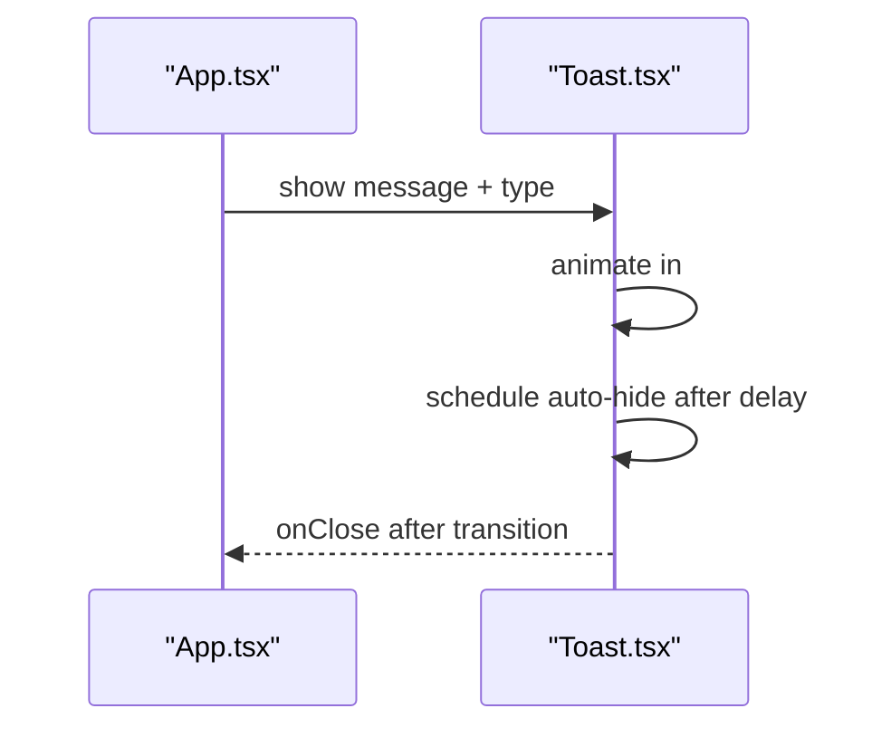

**Diagram sources**
- [App.tsx:219-226](file://src/App.tsx#L219-L226)
- [Toast.tsx:10-43](file://src/components/Toast.tsx#L10-L43)

**Section sources**
- [Toast.tsx:1-44](file://src/components/Toast.tsx#L1-L44)

### UI Primitives (Button and Card)
- Button: Variants and sizes powered by class variance authority and Tailwind merging utilities.
- Card: Reusable layout primitives for consistent section styling.

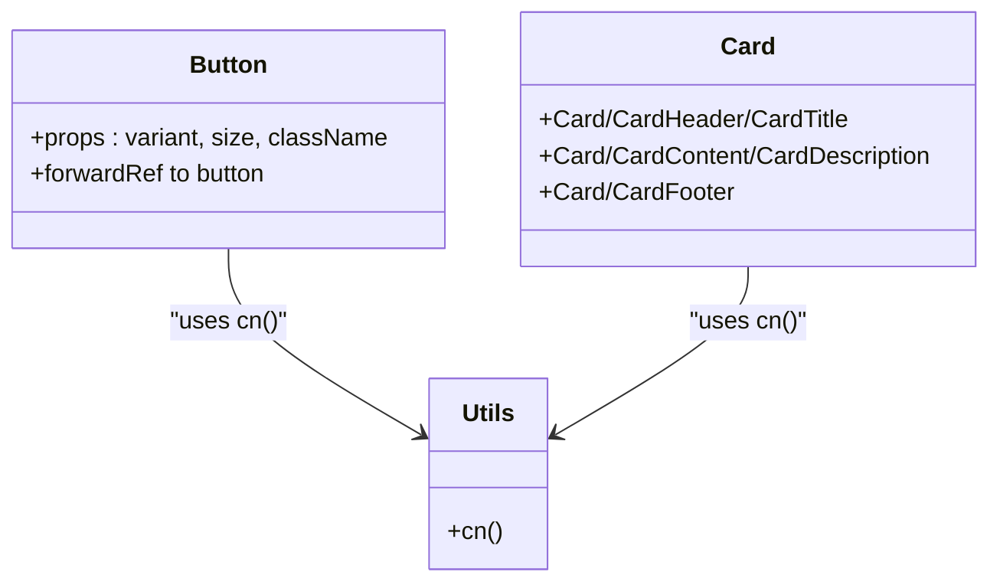

**Diagram sources**
- [button.tsx:40-53](file://src/components/ui/button.tsx#L40-L53)
- [card.tsx:4-78](file://src/components/ui/card.tsx#L4-L78)
- [utils.ts:4-6](file://src/lib/utils.ts#L4-L6)

**Section sources**
- [button.tsx:1-54](file://src/components/ui/button.tsx#L1-L54)
- [card.tsx:1-79](file://src/components/ui/card.tsx#L1-L79)
- [utils.ts:1-7](file://src/lib/utils.ts#L1-L7)

### Calculation Module (Pure Business Logic)
- calculateSettlements: Balances debts and credits across participants, returning minimal transfer instructions.
- getTotalExpenses: Sums expenses converted to the display currency.
- generateId: Lightweight deterministic ID generator.

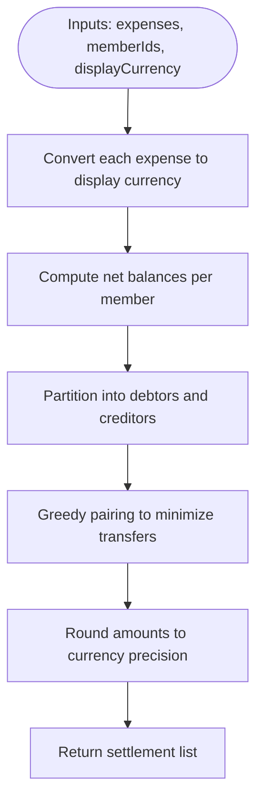

**Diagram sources**
- [calculations.ts:4-84](file://src/lib/calculations.ts#L4-L84)

**Section sources**
- [calculations.ts:1-85](file://src/lib/calculations.ts#L1-L85)

### Types and Utilities (Shared Contracts)
- Member, Expense, Settlement, and ExpenseCategory interfaces.
- Currency metadata, exchange rates, and formatting helpers.
- Utility for merging Tailwind classes.

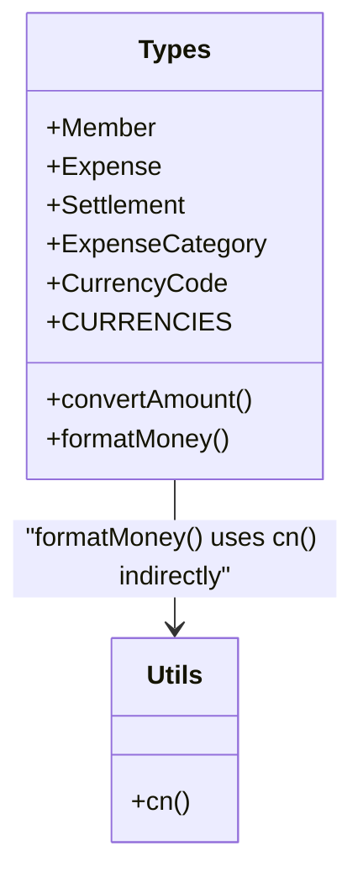

**Diagram sources**
- [types.ts:1-97](file://src/types.ts#L1-L97)
- [utils.ts:4-6](file://src/lib/utils.ts#L4-L6)

**Section sources**
- [types.ts:1-97](file://src/types.ts#L1-L97)
- [utils.ts:1-7](file://src/lib/utils.ts#L1-L7)

## Dependency Analysis
- App depends on:
  - UI components for rendering
  - Calculation module for derived values
  - Types for shape and currency helpers
  - LocalStorage for persistence
- UI components depend on:
  - Types for props and formatting
  - UI primitives for styling
- Calculation module depends on:
  - Types for currency conversion and shapes
- Build and styling:
  - Vite resolves aliases and enables React plugin
  - Tailwind scans components for class usage and defines animations and shadows

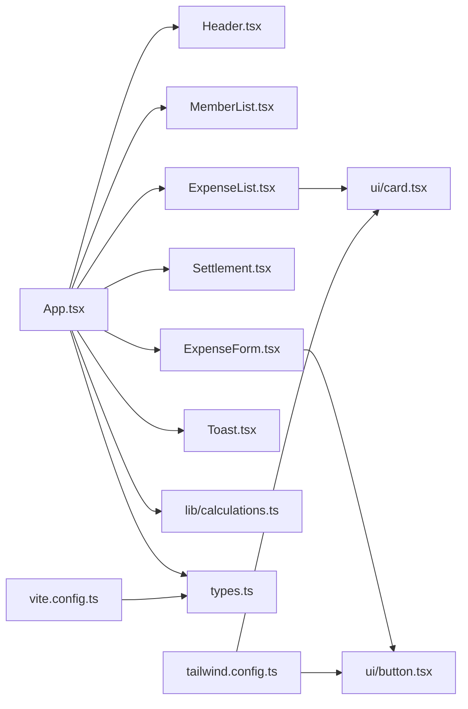

**Diagram sources**
- [App.tsx:4-16](file://src/App.tsx#L4-L16)
- [ExpenseForm.tsx:13-15](file://src/components/ExpenseForm.tsx#L13-L15)
- [ExpenseList.tsx:12](file://src/components/ExpenseList.tsx#L12)
- [vite.config.ts:7-11](file://vite.config.ts#L7-L11)
- [tailwind.config.ts:5-8](file://tailwind.config.ts#L5-L8)

**Section sources**
- [package.json:11-30](file://package.json#L11-L30)
- [vite.config.ts:1-13](file://vite.config.ts#L1-L13)
- [tailwind.config.ts:1-118](file://tailwind.config.ts#L1-L118)

## Performance Considerations
- Memoization: Derived values (totals and settlements) are recomputed only when their dependencies change, reducing unnecessary work.
- Local state batching: Updates to members, expenses, and currency are batched into a single persistence write.
- Minimal re-renders: Child components receive only the data they need via props, avoiding redundant re-computation.
- Currency conversion: Conversion and formatting occur during rendering and derivation, keeping the core calculation pure and efficient.

[No sources needed since this section provides general guidance]

## Troubleshooting Guide
- Data not persisting:
  - Verify localStorage availability and quota.
  - Confirm the effect writing to localStorage executes after state updates.
- Invalid state loaded:
  - The loader validates array shapes and normalizes missing currency values.
- Settlements not updating:
  - Ensure expenses and members arrays are fresh and currency is set.
- Form validation errors:
  - Check required fields and numeric constraints in the form component.
- Toast not dismissing:
  - Confirm the close callback is invoked after the exit animation completes.

**Section sources**
- [App.tsx:26-47](file://src/App.tsx#L26-L47)
- [App.tsx:67-69](file://src/App.tsx#L67-L69)
- [ExpenseForm.tsx:75-89](file://src/components/ExpenseForm.tsx#L75-L89)
- [Toast.tsx:13-20](file://src/components/Toast.tsx#L13-L20)

## Conclusion
Travel Splitter employs a clean separation of concerns: the App container manages global state and persistence, UI components focus on presentation and local interactions, and the calculation module encapsulates business logic. React hooks and memoization ensure efficient updates, while localStorage provides seamless persistence across sessions. The modular structure and typed contracts support maintainability and extensibility.