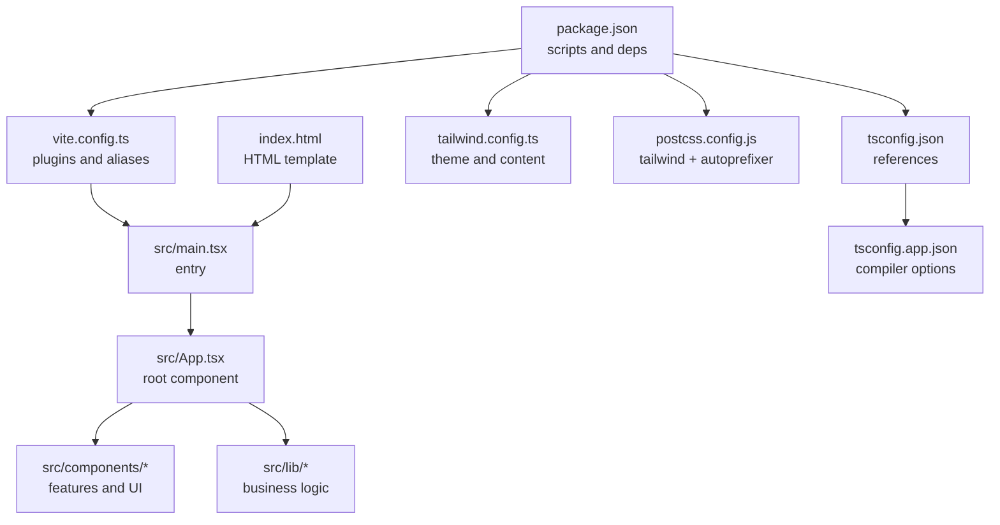
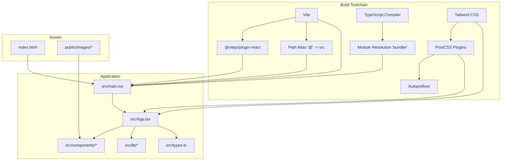
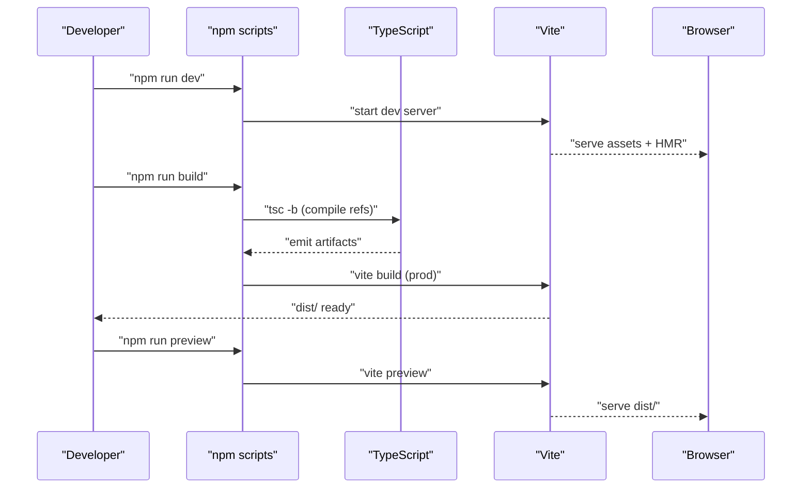
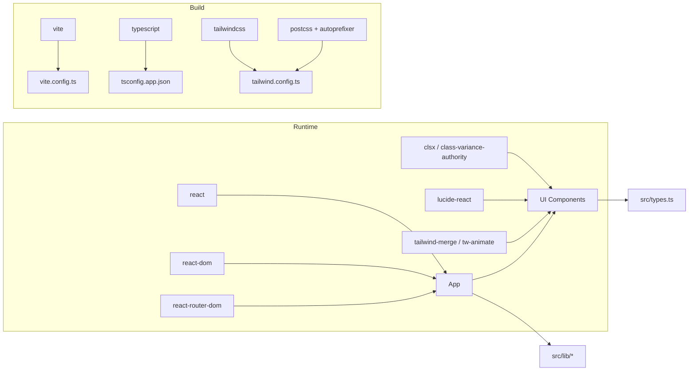

# Build Configuration & Deployment

<cite>
**Referenced Files in This Document**
- [package.json](file://travel-splitter/package.json)
- [vite.config.ts](file://travel-splitter/vite.config.ts)
- [tsconfig.json](file://travel-splitter/tsconfig.json)
- [tsconfig.app.json](file://travel-splitter/tsconfig.app.json)
- [tailwind.config.ts](file://travel-splitter/tailwind.config.ts)
- [postcss.config.js](file://travel-splitter/postcss.config.js)
- [index.html](file://travel-splitter/index.html)
- [src/main.tsx](file://travel-splitter/src/main.tsx)
- [src/App.tsx](file://travel-splitter/src/App.tsx)
- [src/types.ts](file://travel-splitter/src/types.ts)
- [src/lib/calculations.ts](file://travel-splitter/src/lib/calculations.ts)
- [src/components/Header.tsx](file://travel-splitter/src/components/Header.tsx)
- [src/components/ui/button.tsx](file://travel-splitter/src/components/ui/button.tsx)
</cite>

## Table of Contents
1. [Introduction](#introduction)
2. [Project Structure](#project-structure)
3. [Core Components](#core-components)
4. [Architecture Overview](#architecture-overview)
5. [Detailed Component Analysis](#detailed-component-analysis)
6. [Dependency Analysis](#dependency-analysis)
7. [Performance Considerations](#performance-considerations)
8. [Troubleshooting Guide](#troubleshooting-guide)
9. [Conclusion](#conclusion)
10. [Appendices](#appendices)

## Introduction
This document explains the build configuration and deployment process for the Travel Splitter application. It covers the Vite build tool setup, TypeScript compilation, path aliases, npm scripts, and production build optimization. It also outlines deployment considerations for static hosting platforms, CDN integration, and performance monitoring, along with troubleshooting tips and production optimization techniques.

## Project Structure
The project is organized around a React + TypeScript frontend with Tailwind CSS for styling and PostCSS for processing. Vite serves as the bundler and dev server, while TypeScript compiles the application. The build pipeline integrates Tailwind and PostCSS for CSS generation and optimization.

**Diagram sources**
- [package.json](file://travel-splitter/package.json)
- [vite.config.ts](file://travel-splitter/vite.config.ts)
- [tsconfig.json](file://travel-splitter/tsconfig.json)
- [tsconfig.app.json](file://travel-splitter/tsconfig.app.json)
- [tailwind.config.ts](file://travel-splitter/tailwind.config.ts)
- [postcss.config.js](file://travel-splitter/postcss.config.js)
- [index.html](file://travel-splitter/index.html)
- [src/main.tsx](file://travel-splitter/src/main.tsx)
- [src/App.tsx](file://travel-splitter/src/App.tsx)

**Section sources**
- [package.json](file://travel-splitter/package.json)
- [vite.config.ts](file://travel-splitter/vite.config.ts)
- [tsconfig.json](file://travel-splitter/tsconfig.json)
- [tsconfig.app.json](file://travel-splitter/tsconfig.app.json)
- [tailwind.config.ts](file://travel-splitter/tailwind.config.ts)
- [postcss.config.js](file://travel-splitter/postcss.config.js)
- [index.html](file://travel-splitter/index.html)
- [src/main.tsx](file://travel-splitter/src/main.tsx)
- [src/App.tsx](file://travel-splitter/src/App.tsx)

## Core Components
- Vite configuration defines the React plugin and path alias for imports.
- TypeScript configuration sets strict compiler options, ESNext module resolution, and path aliases.
- Tailwind CSS is configured to scan HTML and TS/TSX sources, with PostCSS applying Tailwind and Autoprefixer.
- The HTML template injects the module script and provides metadata for SEO and assets.

Key responsibilities:
- Vite: development server, HMR, production bundling, asset handling.
- TypeScript: type checking, emit strategy, and module resolution.
- Tailwind + PostCSS: CSS generation, purging unused styles, vendor prefixing.

**Section sources**
- [vite.config.ts](file://travel-splitter/vite.config.ts)
- [tsconfig.app.json](file://travel-splitter/tsconfig.app.json)
- [tailwind.config.ts](file://travel-splitter/tailwind.config.ts)
- [postcss.config.js](file://travel-splitter/postcss.config.js)
- [index.html](file://travel-splitter/index.html)

## Architecture Overview
The build and runtime architecture connects the entry point, components, libraries, and CSS pipeline through Vite and TypeScript.

**Diagram sources**
- [vite.config.ts](file://travel-splitter/vite.config.ts)
- [tsconfig.app.json](file://travel-splitter/tsconfig.app.json)
- [tailwind.config.ts](file://travel-splitter/tailwind.config.ts)
- [postcss.config.js](file://travel-splitter/postcss.config.js)
- [src/main.tsx](file://travel-splitter/src/main.tsx)
- [src/App.tsx](file://travel-splitter/src/App.tsx)
- [index.html](file://travel-splitter/index.html)

## Detailed Component Analysis

### Vite Configuration
- Plugin stack: React Fast Refresh and JSX transforms.
- Path alias: '@' resolves to the src directory for clean imports.
- Defaults: Vite’s built-in dev server, HMR, and production bundling.

Optimization hooks:
- Code splitting: automatic per-route and dynamic imports.
- Tree shaking: ES modules with strict mode and bundler module resolution.
- Minification: enabled by default in production.
- Asset handling: Vite optimizes images and assets; public assets under public are served as-is.

**Section sources**
- [vite.config.ts](file://travel-splitter/vite.config.ts)

### TypeScript Configuration
- Target and libs: ES2020 with DOM APIs.
- Module system: ESNext with bundler module resolution.
- Strictness: strict, unused checks, and noUncheckedSideEffectImports.
- Paths: '@/*' maps to 'src/*'.
- No emit: Vite handles emitting during dev/build.

Build targets:
- Application code compiled for modern browsers via ES2020 target and ESNext modules.

**Section sources**
- [tsconfig.app.json](file://travel-splitter/tsconfig.app.json)

### Tailwind and PostCSS Pipeline
- Tailwind scans index.html and src/**/*.ts, src/**/*.tsx for class usage.
- Theme customization includes color palettes, typography, shadows, animations, and spacing.
- PostCSS applies Tailwind directives followed by Autoprefixer for vendor prefixes.

Asset scanning:
- Content globs ensure only used CSS is generated and purged.

**Section sources**
- [tailwind.config.ts](file://travel-splitter/tailwind.config.ts)
- [postcss.config.js](file://travel-splitter/postcss.config.js)

### HTML Template and Entry Point
- index.html defines the root element and loads the module script pointing to the app entry.
- The entry bootstraps React and renders the root App component.

**Section sources**
- [index.html](file://travel-splitter/index.html)
- [src/main.tsx](file://travel-splitter/src/main.tsx)

### Application Modules and Imports
- Root component imports UI components and business logic via '@' alias.
- Business logic resides in src/lib and types in src/types.
- UI primitives use class variance authority and shared utilities.

**Section sources**
- [src/App.tsx](file://travel-splitter/src/App.tsx)
- [src/types.ts](file://travel-splitter/src/types.ts)
- [src/lib/calculations.ts](file://travel-splitter/src/lib/calculations.ts)
- [src/components/ui/button.tsx](file://travel-splitter/src/components/ui/button.tsx)
- [src/components/Header.tsx](file://travel-splitter/src/components/Header.tsx)

### Build Scripts and Workflow
- Development: runs Vite dev server with HMR.
- Production build: compiles TypeScript references, then bundles with Vite for production.
- Preview: serves the production build locally for testing.

**Diagram sources**
- [package.json](file://travel-splitter/package.json)
- [vite.config.ts](file://travel-splitter/vite.config.ts)

**Section sources**
- [package.json](file://travel-splitter/package.json)

## Dependency Analysis
- Runtime dependencies include React, React DOM, routing, UI primitives, and Tailwind-based styling helpers.
- Dev dependencies include Vite, React plugin, TypeScript, Tailwind CSS, PostCSS, and Autoprefixer.
- Vite relies on the React plugin and path alias configuration.
- TypeScript references tsconfig.app.json for application compilation.

**Diagram sources**
- [package.json](file://travel-splitter/package.json)
- [vite.config.ts](file://travel-splitter/vite.config.ts)
- [tsconfig.app.json](file://travel-splitter/tsconfig.app.json)
- [tailwind.config.ts](file://travel-splitter/tailwind.config.ts)
- [postcss.config.js](file://travel-splitter/postcss.config.js)
- [src/App.tsx](file://travel-splitter/src/App.tsx)

**Section sources**
- [package.json](file://travel-splitter/package.json)
- [vite.config.ts](file://travel-splitter/vite.config.ts)
- [tsconfig.app.json](file://travel-splitter/tsconfig.app.json)
- [tailwind.config.ts](file://travel-splitter/tailwind.config.ts)
- [postcss.config.js](file://travel-splitter/postcss.config.js)
- [src/App.tsx](file://travel-splitter/src/App.tsx)

## Performance Considerations
- Code splitting: leverage dynamic imports for routes and heavy components to reduce initial bundle size.
- Tree shaking: keep ES modules, avoid side effects, and enable bundler module resolution.
- Minification: enabled by default in production; ensure no accidental global polyfills.
- Asset compression: Vite compresses JS/CSS; configure image optimization via Vite plugins if needed.
- CSS optimization: Tailwind purges unused classes; ensure content globs cover all class usage.
- Lazy loading: defer non-critical resources; load images with lazy loading attributes.
- CDN: serve static assets from a CDN for improved global delivery.
- Bundle analysis: use Vite’s built-in reporter or external tools to inspect bundle composition.

[No sources needed since this section provides general guidance]

## Troubleshooting Guide
Common issues and resolutions:
- Missing path alias: ensure '@' alias is defined in Vite config and TypeScript paths match.
- Tailwind classes not applied: verify content globs include all templates and components; rebuild after changes.
- Type errors in dev: confirm strict TypeScript settings and bundler module resolution.
- Asset not found: place static assets under the public directory and reference them from public paths.
- Build fails unexpectedly: run TypeScript build separately to isolate issues, then retry Vite build.

Environment variables:
- Define environment variables with Vite’s convention (VITE_*) for client-side usage.
- Keep secrets out of the client bundle; avoid committing sensitive keys.

Production optimization techniques:
- Enable long-term caching with hashed filenames.
- Use HTTP/2 or HTTP/3 with CDN.
- Monitor Core Web Vitals and bundle sizes in production.

**Section sources**
- [vite.config.ts](file://travel-splitter/vite.config.ts)
- [tsconfig.app.json](file://travel-splitter/tsconfig.app.json)
- [tailwind.config.ts](file://travel-splitter/tailwind.config.ts)
- [postcss.config.js](file://travel-splitter/postcss.config.js)

## Conclusion
The Travel Splitter build system combines Vite, TypeScript, Tailwind CSS, and PostCSS to deliver a fast, maintainable, and optimized frontend. By leveraging path aliases, strict TypeScript settings, and Tailwind’s purge mechanism, the project achieves a lean bundle suitable for static hosting and CDN distribution. Following the recommended optimization and troubleshooting practices ensures smooth development and reliable production deployments.

[No sources needed since this section summarizes without analyzing specific files]

## Appendices

### Build Targets and Compilation Settings
- TypeScript target: ES2020
- Module resolution: bundler
- JSX transform: react-jsx
- Strictness: strict with unused checks and side-effect imports restrictions
- Paths: '@/*' mapped to 'src/*'

**Section sources**
- [tsconfig.app.json](file://travel-splitter/tsconfig.app.json)

### Development Workflow and HMR
- Start the dev server with the development script.
- HMR updates components without full reloads.
- Use browser devtools to debug React components and network requests.

**Section sources**
- [package.json](file://travel-splitter/package.json)
- [vite.config.ts](file://travel-splitter/vite.config.ts)

### Deployment Checklist
- Build: run the production build script.
- Preview: test the production build locally.
- Static host: upload the dist folder to your static hosting provider.
- CDN: configure CDN to cache static assets with appropriate headers.
- Monitoring: track page load metrics and bundle sizes.

**Section sources**
- [package.json](file://travel-splitter/package.json)