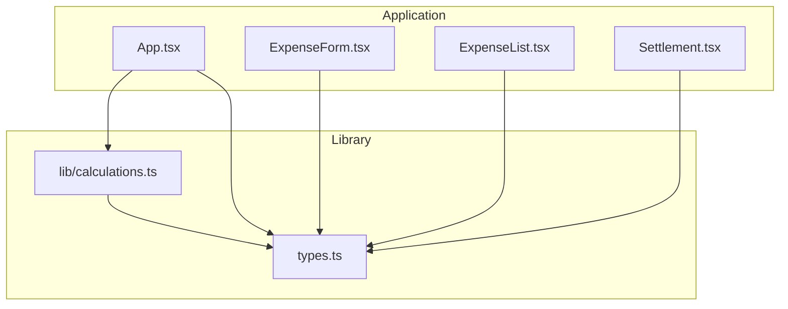
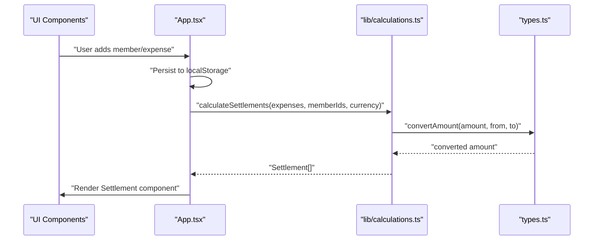
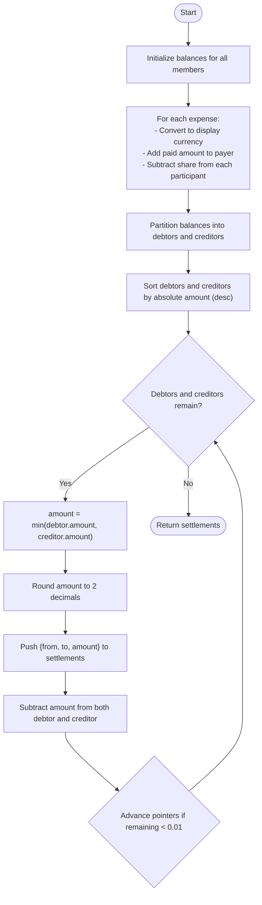
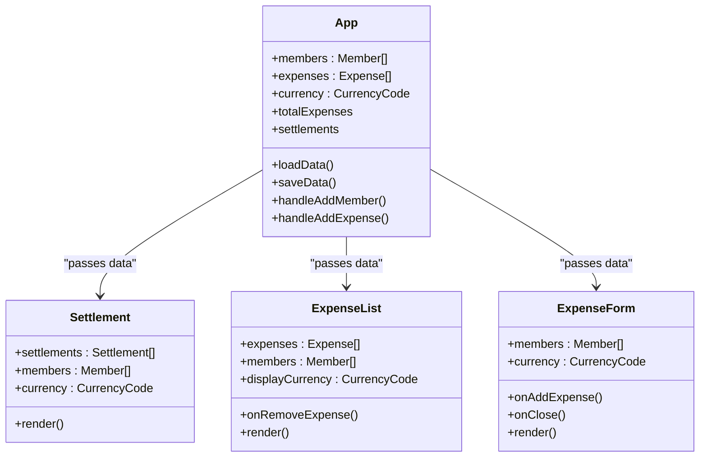
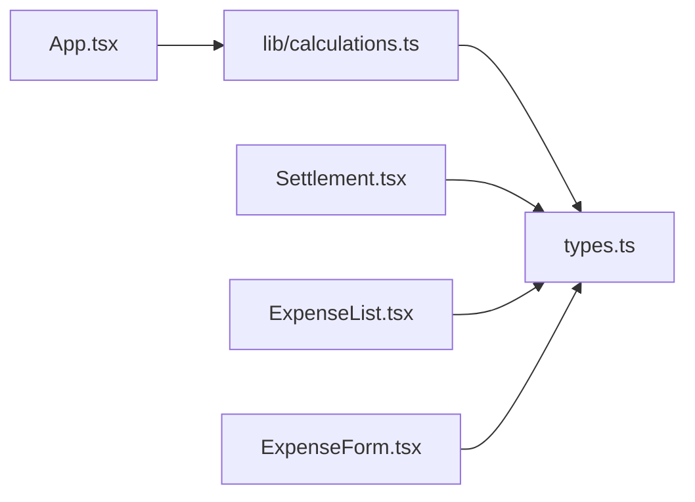

# Business Logic & Calculations

<cite>
**Referenced Files in This Document**
- [calculations.ts](file://travel-splitter/src/lib/calculations.ts)
- [types.ts](file://travel-splitter/src/types.ts)
- [App.tsx](file://travel-splitter/src/App.tsx)
- [Settlement.tsx](file://travel-splitter/src/components/Settlement.tsx)
- [ExpenseList.tsx](file://travel-splitter/src/components/ExpenseList.tsx)
- [ExpenseForm.tsx](file://travel-splitter/src/components/ExpenseForm.tsx)
</cite>

## Table of Contents
1. [Introduction](#introduction)
2. [Project Structure](#project-structure)
3. [Core Components](#core-components)
4. [Architecture Overview](#architecture-overview)
5. [Detailed Component Analysis](#detailed-component-analysis)
6. [Dependency Analysis](#dependency-analysis)
7. [Performance Considerations](#performance-considerations)
8. [Troubleshooting Guide](#troubleshooting-guide)
9. [Conclusion](#conclusion)

## Introduction
This document explains the business logic and calculation engine of the Travel Splitter application. It focuses on:
- Debt settlement calculation that minimizes transactions among group members
- Expense aggregation and total computation
- Currency conversion utilities for JPY/HKD with rounding and formatting
- Unique ID generation for stable references across sessions
- Edge cases, precision handling, and optimization strategies for large datasets

## Project Structure
The calculation engine resides primarily in the library module and is consumed by the main application and UI components.

**Diagram sources**
- [App.tsx:1-231](file://travel-splitter/src/App.tsx#L1-L231)
- [calculations.ts:1-85](file://travel-splitter/src/lib/calculations.ts#L1-L85)
- [types.ts:1-97](file://travel-splitter/src/types.ts#L1-L97)
- [ExpenseForm.tsx:1-274](file://travel-splitter/src/components/ExpenseForm.tsx#L1-L274)
- [ExpenseList.tsx:1-152](file://travel-splitter/src/components/ExpenseList.tsx#L1-L152)
- [Settlement.tsx:1-97](file://travel-splitter/src/components/Settlement.tsx#L1-L97)

**Section sources**
- [App.tsx:1-231](file://travel-splitter/src/App.tsx#L1-L231)
- [calculations.ts:1-85](file://travel-splitter/src/lib/calculations.ts#L1-L85)
- [types.ts:1-97](file://travel-splitter/src/types.ts#L1-L97)

## Core Components
- Settlement calculation engine: computes net balances and minimal transactions to settle debts
- Expense aggregation: sums expenses across members and groups
- Currency conversion and formatting: converts between JPY/HKD and formats display amounts
- Unique ID generator: creates short, stable identifiers for members and expenses

Key functions and their roles:
- calculateSettlements: core algorithm for debt resolution and transaction minimization
- getTotalExpenses: aggregates total group expenses in display currency
- convertAmount/formatMoney: currency conversion and display formatting
- generateId: unique identifier generation

**Section sources**
- [calculations.ts:4-85](file://travel-splitter/src/lib/calculations.ts#L4-L85)
- [types.ts:25-48](file://travel-splitter/src/types.ts#L25-L48)

## Architecture Overview
The application orchestrates data through React state, persists it to local storage, and recomputes settlements whenever inputs change. The calculation module encapsulates the financial logic.

**Diagram sources**
- [App.tsx:148-161](file://travel-splitter/src/App.tsx#L148-L161)
- [calculations.ts:4-70](file://travel-splitter/src/lib/calculations.ts#L4-L70)
- [types.ts:25-33](file://travel-splitter/src/types.ts#L25-L33)

## Detailed Component Analysis

### Settlement Calculation Engine
The settlement algorithm computes balances per member and produces a minimal set of transactions to zero out all debts.

Mathematical approach:
- Convert each expense to the display currency using fixed exchange rates
- Compute each member’s net balance: paid_in - owed_share
- Partition balances into debtors (negative) and creditors (positive)
- Greedily match largest debtor with largest creditor until balances settle
- Round each transaction amount to two decimal places for display

Processing logic:
- Initialize balances for all members
- Iterate over expenses to accumulate paid amounts and distribute shares
- Separate debtors and creditors and sort by descending absolute amount
- While both lists have entries, transfer the minimum of the current debtor/creditor amounts
- Round each transaction to two decimal places and push to results

Edge cases handled:
- Tolerance thresholds for near-zero balances (±0.01) to avoid floating-point noise
- Rounding to two decimals for monetary precision
- No transactions generated when all balances are within tolerance

Performance characteristics:
- Time complexity: O(n + m log m) where n is number of expenses and m is number of members
- Space complexity: O(m) for balances and auxiliary arrays

**Diagram sources**
- [calculations.ts:4-70](file://travel-splitter/src/lib/calculations.ts#L4-L70)

**Section sources**
- [calculations.ts:4-70](file://travel-splitter/src/lib/calculations.ts#L4-L70)

### Expense Aggregation and Total Computation
The total expenses are computed by converting each expense to the display currency and summing them up.

Key behaviors:
- Uses convertAmount for currency conversion
- Sums across all expenses

Performance:
- Linear in number of expenses
- Minimal memory overhead

**Section sources**
- [calculations.ts:72-80](file://travel-splitter/src/lib/calculations.ts#L72-L80)
- [types.ts:25-33](file://travel-splitter/src/types.ts#L25-L33)

### Currency Conversion and Formatting Utilities
Currency conversion:
- Fixed exchange rate: 1 HKD ≈ 19.2 JPY
- convertAmount handles identity conversion and cross-currency conversions

Formatting:
- formatMoney applies currency-specific decimals and locale formatting
- JPY: integer rounding; HKD: two-decimal rounding

Precision handling:
- Monetary values are rounded to 2 decimals for display
- Exchange rate is a constant approximation

**Section sources**
- [types.ts:17-23](file://travel-splitter/src/types.ts#L17-L23)
- [types.ts:25-33](file://travel-splitter/src/types.ts#L25-L33)
- [types.ts:35-48](file://travel-splitter/src/types.ts#L35-L48)

### Unique ID Generation
generateId creates short, random identifiers using base-36 encoding.

Behavior:
- Produces 8-character strings from random numbers
- Suitable for stable references across sessions when combined with persistence

Considerations:
- Probability of collision increases with dataset size; acceptable for small groups
- Not cryptographically secure; sufficient for UI identifiers

**Section sources**
- [calculations.ts:82-84](file://travel-splitter/src/lib/calculations.ts#L82-L84)
- [App.tsx:80-88](file://travel-splitter/src/App.tsx#L80-L88)
- [App.tsx:128-136](file://travel-splitter/src/App.tsx#L128-L136)

### UI Integration and Rendering
- App.tsx loads/saves data to localStorage and triggers recalculations via memoized selectors
- Settlement.tsx renders the minimal transaction list with avatars and formatted amounts
- ExpenseList.tsx displays individual expenses with currency conversion and share breakdown
- ExpenseForm.tsx collects user inputs and validates them before adding expenses

**Diagram sources**
- [App.tsx:58-228](file://travel-splitter/src/App.tsx#L58-L228)
- [Settlement.tsx:11-96](file://travel-splitter/src/components/Settlement.tsx#L11-L96)
- [ExpenseList.tsx:30-151](file://travel-splitter/src/components/ExpenseList.tsx#L30-L151)
- [ExpenseForm.tsx:49-273](file://travel-splitter/src/components/ExpenseForm.tsx#L49-L273)

**Section sources**
- [App.tsx:58-228](file://travel-splitter/src/App.tsx#L58-L228)
- [Settlement.tsx:11-96](file://travel-splitter/src/components/Settlement.tsx#L11-L96)
- [ExpenseList.tsx:30-151](file://travel-splitter/src/components/ExpenseList.tsx#L30-L151)
- [ExpenseForm.tsx:49-273](file://travel-splitter/src/components/ExpenseForm.tsx#L49-L273)

## Dependency Analysis
- App.tsx depends on calculations.ts for settlement and total computations
- UI components depend on types.ts for currency definitions, conversion, and formatting
- calculations.ts depends on types.ts for currency conversion and Settlement interface
- ExpenseForm.tsx and ExpenseList.tsx depend on types.ts for currency and formatting

**Diagram sources**
- [App.tsx:10-16](file://travel-splitter/src/App.tsx#L10-L16)
- [calculations.ts:1-2](file://travel-splitter/src/lib/calculations.ts#L1-L2)
- [types.ts:1-15](file://travel-splitter/src/types.ts#L1-L15)
- [Settlement.tsx:2-3](file://travel-splitter/src/components/Settlement.tsx#L2-L3)
- [ExpenseList.tsx:12-12](file://travel-splitter/src/components/ExpenseList.tsx#L12-L12)
- [ExpenseForm.tsx:14-15](file://travel-splitter/src/components/ExpenseForm.tsx#L14-L15)

**Section sources**
- [App.tsx:10-16](file://travel-splitter/src/App.tsx#L10-L16)
- [calculations.ts:1-2](file://travel-splitter/src/lib/calculations.ts#L1-L2)
- [types.ts:1-15](file://travel-splitter/src/types.ts#L1-L15)

## Performance Considerations
- Settlement algorithm:
  - Sorting debtors and creditors dominates runtime; acceptable for typical group sizes
  - Consider using a heap-based approach if performance becomes critical for very large groups
- Currency conversion:
  - Constant-time per expense; negligible cost compared to sorting
- Memoization:
  - App.tsx uses useMemo for totalExpenses and settlements to avoid recomputation on unrelated updates
- Rendering:
  - Settlement list is linear in number of transactions; keep under control via greedy minimization

[No sources needed since this section provides general guidance]

## Troubleshooting Guide
Common issues and resolutions:
- Floating-point precision:
  - Use tolerance thresholds (±0.01) to treat near-zero balances as settled
  - Round transaction amounts to two decimals for display consistency
- Exchange rate mismatches:
  - The fixed rate is an approximation; update EXCHANGE_RATE_HKD_TO_JPY if needed
- Empty or invalid inputs:
  - ExpenseForm validates non-empty description, positive amount, valid payer and participants
- Local storage corruption:
  - App.loadData includes defensive parsing and defaults to empty state on failure

**Section sources**
- [calculations.ts:36-41](file://travel-splitter/src/lib/calculations.ts#L36-L41)
- [calculations.ts:54-59](file://travel-splitter/src/lib/calculations.ts#L54-L59)
- [types.ts:22-23](file://travel-splitter/src/types.ts#L22-L23)
- [ExpenseForm.tsx:75-89](file://travel-splitter/src/components/ExpenseForm.tsx#L75-L89)
- [App.tsx:26-47](file://travel-splitter/src/App.tsx#L26-L47)

## Conclusion
The Travel Splitter application implements a robust, readable financial calculation engine:
- A greedy settlement algorithm that minimizes transactions and handles precision carefully
- Clear currency conversion and formatting utilities tailored to JPY/HKD
- Stable ID generation and persistent state management
- Well-separated concerns between UI and business logic, enabling maintainability and extensibility