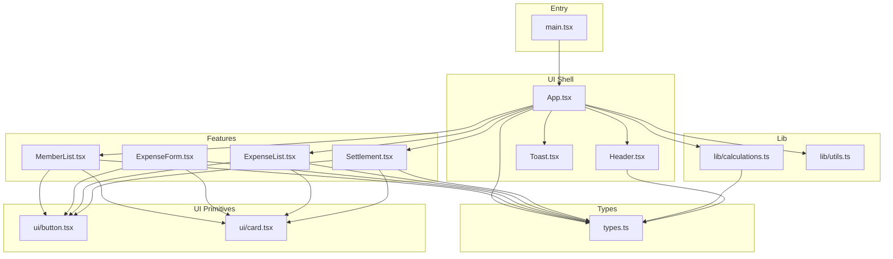
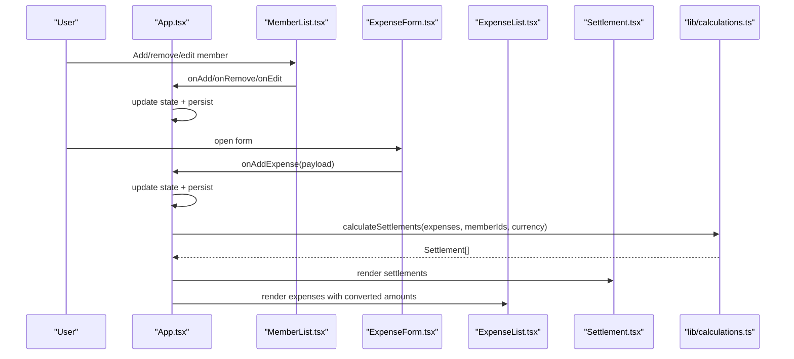
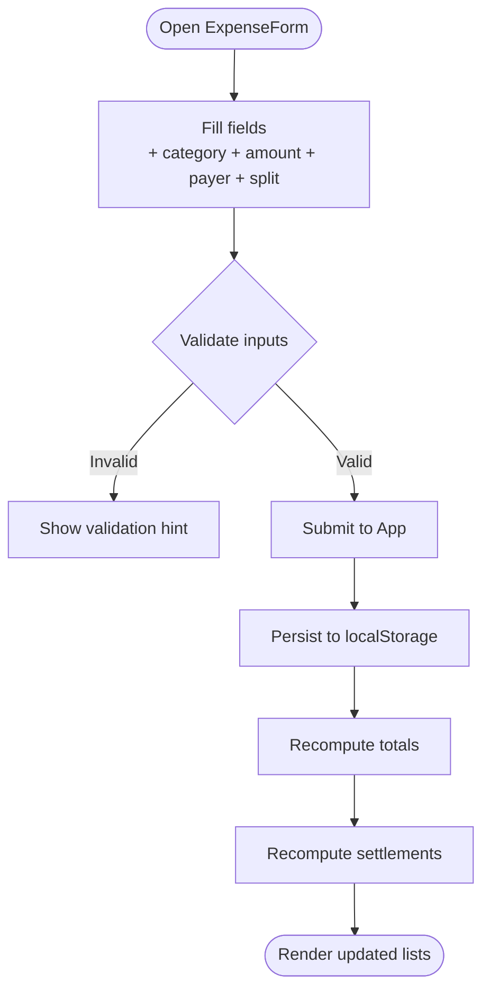
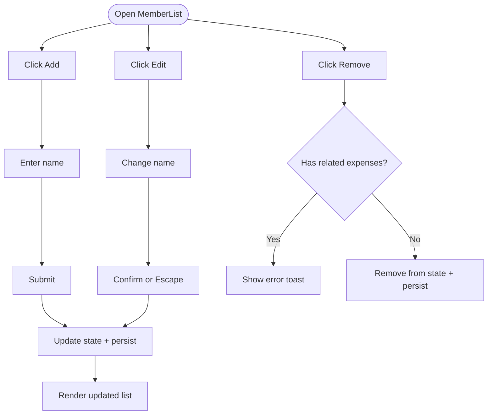
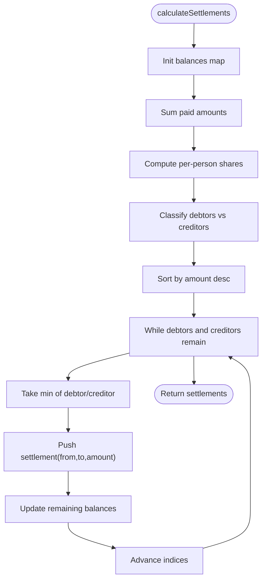
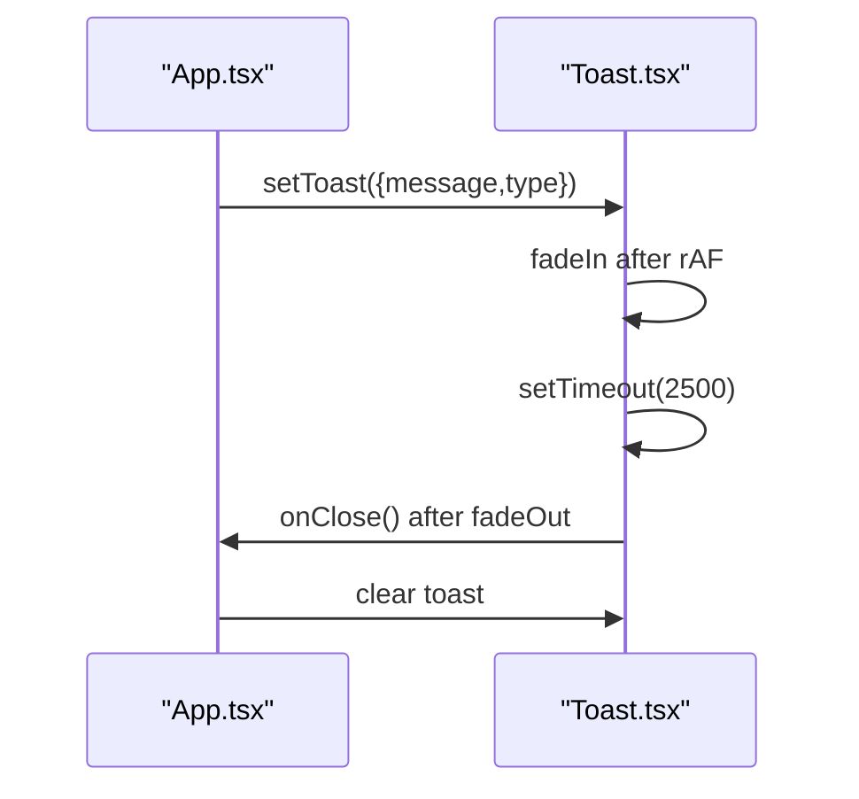
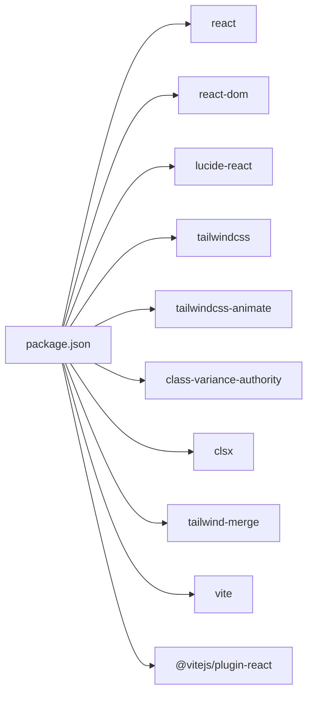

# Core Features

<cite>
**Referenced Files in This Document**
- [App.tsx](file://travel-splitter/src/App.tsx)
- [types.ts](file://travel-splitter/src/types.ts)
- [calculations.ts](file://travel-splitter/src/lib/calculations.ts)
- [utils.ts](file://travel-splitter/src/lib/utils.ts)
- [ExpenseForm.tsx](file://travel-splitter/src/components/ExpenseForm.tsx)
- [ExpenseList.tsx](file://travel-splitter/src/components/ExpenseList.tsx)
- [MemberList.tsx](file://travel-splitter/src/components/MemberList.tsx)
- [Settlement.tsx](file://travel-splitter/src/components/Settlement.tsx)
- [Toast.tsx](file://travel-splitter/src/components/Toast.tsx)
- [Header.tsx](file://travel-splitter/src/components/Header.tsx)
- [button.tsx](file://travel-splitter/src/components/ui/button.tsx)
- [card.tsx](file://travel-splitter/src/components/ui/card.tsx)
- [main.tsx](file://travel-splitter/src/main.tsx)
- [package.json](file://travel-splitter/package.json)
- [vite.config.ts](file://travel-splitter/vite.config.ts)
- [tailwind.config.ts](file://travel-splitter/tailwind.config.ts)
</cite>

## Table of Contents
1. [Introduction](#introduction)
2. [Project Structure](#project-structure)
3. [Core Components](#core-components)
4. [Architecture Overview](#architecture-overview)
5. [Detailed Component Analysis](#detailed-component-analysis)
6. [Dependency Analysis](#dependency-analysis)
7. [Performance Considerations](#performance-considerations)
8. [Troubleshooting Guide](#troubleshooting-guide)
9. [Conclusion](#conclusion)
10. [Appendices](#appendices)

## Introduction
This document explains the core features of the Travel Splitter application with a focus on:
- Expense Management: creation, editing, categorization, and multi-currency support
- Member Management: adding/removing/editing companions with an avatar system
- Settlement Calculation Engine: automated debt resolution and payment optimization
- User Interface Components: responsive design with toast notifications

It covers implementation approaches, user workflows, data models, integration points, practical examples, configuration options, performance considerations, error handling, and UX optimizations.

## Project Structure
Travel Splitter is a React + TypeScript application built with Vite and styled via Tailwind CSS. The app is organized by feature and cross-cutting concerns:
- Entry point initializes the React root and global styles
- App orchestrates state, persistence, and renders feature components
- Feature components encapsulate UI and user interactions
- Shared libraries provide calculation utilities and shared UI primitives
- Types define data contracts and currency/category metadata

**Diagram sources**
- [main.tsx:1-11](file://travel-splitter/src/main.tsx#L1-L11)
- [App.tsx:1-231](file://travel-splitter/src/App.tsx#L1-L231)
- [Header.tsx:1-93](file://travel-splitter/src/components/Header.tsx#L1-L93)
- [MemberList.tsx:1-180](file://travel-splitter/src/components/MemberList.tsx#L1-L180)
- [ExpenseForm.tsx:1-274](file://travel-splitter/src/components/ExpenseForm.tsx#L1-L274)
- [ExpenseList.tsx:1-152](file://travel-splitter/src/components/ExpenseList.tsx#L1-L152)
- [Settlement.tsx:1-97](file://travel-splitter/src/components/Settlement.tsx#L1-L97)
- [Toast.tsx:1-44](file://travel-splitter/src/components/Toast.tsx#L1-L44)
- [calculations.ts:1-85](file://travel-splitter/src/lib/calculations.ts#L1-L85)
- [utils.ts:1-7](file://travel-splitter/src/lib/utils.ts#L1-L7)
- [types.ts:1-97](file://travel-splitter/src/types.ts#L1-L97)
- [button.tsx:1-54](file://travel-splitter/src/components/ui/button.tsx#L1-L54)
- [card.tsx:1-79](file://travel-splitter/src/components/ui/card.tsx#L1-L79)

**Section sources**
- [main.tsx:1-11](file://travel-splitter/src/main.tsx#L1-L11)
- [vite.config.ts:1-13](file://travel-splitter/vite.config.ts#L1-L13)
- [tailwind.config.ts:1-118](file://travel-splitter/tailwind.config.ts#L1-L118)

## Core Components
This section outlines the four primary feature areas and their core building blocks.

- Expense Management
  - Creation: ExpenseForm captures description, amount, currency, payer, split participants, category, and date; validates inputs and emits normalized records
  - Editing: Not implemented in the current codebase; existing records can be removed via ExpenseList
  - Categorization: Six categories with localized labels and icons
  - Multi-currency: Per-expense currency with conversion to display currency for totals and per-member shares

- Member Management
  - Adding/Removing/Edit: MemberList supports add, inline edit, and remove actions; removal prevents deletion if member is linked to expenses
  - Avatar system: Deterministic color assignment based on index; avatars shown in lists and settlement steps

- Settlement Calculation Engine
  - Automated debt resolution: Balances are computed by converting all expenses to a display currency, splitting among participants, and generating minimal transfers to settle debts

- User Interface Components
  - Responsive layout: Tailwind utilities and animations provide adaptive spacing and transitions
  - Toast notifications: Non-blocking feedback with auto-dismiss and manual close

**Section sources**
- [ExpenseForm.tsx:1-274](file://travel-splitter/src/components/ExpenseForm.tsx#L1-L274)
- [ExpenseList.tsx:1-152](file://travel-splitter/src/components/ExpenseList.tsx#L1-L152)
- [MemberList.tsx:1-180](file://travel-splitter/src/components/MemberList.tsx#L1-L180)
- [Settlement.tsx:1-97](file://travel-splitter/src/components/Settlement.tsx#L1-L97)
- [Toast.tsx:1-44](file://travel-splitter/src/components/Toast.tsx#L1-L44)
- [calculations.ts:1-85](file://travel-splitter/src/lib/calculations.ts#L1-L85)
- [types.ts:1-97](file://travel-splitter/src/types.ts#L1-L97)

## Architecture Overview
The application follows a unidirectional data flow:
- App maintains global state (members, expenses, currency) and persists to localStorage
- Child components receive props and callbacks to mutate state
- Calculations are performed in a pure library module
- UI components rely on shared primitives and Tailwind theme tokens

**Diagram sources**
- [App.tsx:58-228](file://travel-splitter/src/App.tsx#L58-L228)
- [MemberList.tsx:14-179](file://travel-splitter/src/components/MemberList.tsx#L14-L179)
- [ExpenseForm.tsx:49-273](file://travel-splitter/src/components/ExpenseForm.tsx#L49-L273)
- [ExpenseList.tsx:30-151](file://travel-splitter/src/components/ExpenseList.tsx#L30-L151)
- [Settlement.tsx:11-96](file://travel-splitter/src/components/Settlement.tsx#L11-L96)
- [calculations.ts:4-70](file://travel-splitter/src/lib/calculations.ts#L4-L70)

## Detailed Component Analysis

### Expense Management
- Implementation approach
  - ExpenseForm handles creation with category selection, amount input, currency toggle, payer selection, and split participants
  - Validation ensures required fields are present and positive numeric amounts
  - ExpenseList displays entries with converted totals and per-person shares; shows original currency when different from display currency
  - App aggregates totals and triggers settlement computation

- User workflows
  - Add expense: Open floating add button → fill form → submit → toast confirmation
  - View expenses: Scroll through list; hover to reveal delete action
  - Currency awareness: Display currency can be toggled; per-record currency is preserved

- Data models involved
  - Expense: id, description, amount, currency, paidBy, splitAmong[], category, date
  - CurrencyCode: union of supported codes; conversion helpers and formatting utilities
  - ExpenseCategory: predefined categories with localized labels and icons

- Integration points
  - App state updates and persistence
  - calculations.calculateSettlements for derived settlement steps
  - types.convertAmount/formatMoney for currency handling

- Practical examples
  - Example 1: Add a ¥1200 meal paid by Alice and split among Alice, Bob, and Carol; display currency JPY
  - Example 2: Add a HK$100 train ticket paid by Bob; display currency JPY; conversion applied automatically
  - Example 3: Toggle display currency to HKD; totals and per-share amounts update accordingly

- Configuration options
  - Currency selection per expense and globally
  - Category icons and labels are centralized in types

- Customization possibilities
  - Extend ExpenseCategory and CATEGORY_CONFIG
  - Add new currencies by updating types and exchange rates

- Performance considerations
  - Memoized computations for total and settlements avoid recalculating on unrelated state changes
  - Efficient DOM rendering with small, focused components

- Error handling strategies
  - Form validation prevents invalid submissions
  - Removal guarded by checks against linked expenses

**Diagram sources**
- [ExpenseForm.tsx:75-89](file://travel-splitter/src/components/ExpenseForm.tsx#L75-L89)
- [App.tsx:119-146](file://travel-splitter/src/App.tsx#L119-L146)
- [calculations.ts:72-80](file://travel-splitter/src/lib/calculations.ts#L72-L80)

**Section sources**
- [ExpenseForm.tsx:1-274](file://travel-splitter/src/components/ExpenseForm.tsx#L1-L274)
- [ExpenseList.tsx:1-152](file://travel-splitter/src/components/ExpenseList.tsx#L1-L152)
- [App.tsx:119-151](file://travel-splitter/src/App.tsx#L119-L151)
- [types.ts:50-85](file://travel-splitter/src/types.ts#L50-L85)
- [calculations.ts:1-85](file://travel-splitter/src/lib/calculations.ts#L1-L85)

### Member Management
- Implementation approach
  - MemberList supports inline add, edit, and remove
  - Avatars are assigned deterministically by index using a palette
  - Remove guarded to prevent deleting members with related expenses

- User workflows
  - Add member: Click “新增” → enter name → submit
  - Edit member: Enter inline edit mode → confirm or escape
  - Remove member: Hover to reveal remove button → confirm if safe

- Data models involved
  - Member: id, name, avatar (derived color)

- Integration points
  - App state updates and persistence
  - Used across ExpenseForm (payer/split participants) and Settlement visuals

- Practical examples
  - Example 1: Add three companions; avatars cycle through the palette
  - Example 2: Rename a member mid-trip; downstream displays update immediately
  - Example 3: Attempt to remove a member who has pending expenses; show error toast

- Configuration options
  - AVATAR_COLORS array controls available avatar hues
  - Localized labels and icons are used in related components

- Customization possibilities
  - Adjust AVATAR_COLORS to change palette
  - Extend Member model if needed (not present in current types)

- Performance considerations
  - Minimal re-renders via controlled inputs and memoized callbacks
  - Avatar color recomputation is O(1) per member

- Error handling strategies
  - Prevent removal when member is linked to expenses; notify via toast

**Diagram sources**
- [MemberList.tsx:25-55](file://travel-splitter/src/components/MemberList.tsx#L25-L55)
- [App.tsx:78-117](file://travel-splitter/src/App.tsx#L78-L117)

**Section sources**
- [MemberList.tsx:1-180](file://travel-splitter/src/components/MemberList.tsx#L1-L180)
- [App.tsx:78-117](file://travel-splitter/src/App.tsx#L78-L117)
- [types.ts:1-97](file://travel-splitter/src/types.ts#L1-L97)

### Settlement Calculation Engine
- Implementation approach
  - compute balances per member by converting all expenses to the display currency and distributing shares
  - classify balances as debtor or creditor; sort by amount
  - iteratively match largest debtor with largest creditor to minimize transaction count

- User workflows
  - After adding expenses and members, settlements appear when conditions are met
  - Each settlement shows from/to members and the amount to transfer

- Data models involved
  - Settlement: from, to, amount
  - Expense and CurrencyCode for conversions

- Integration points
  - Called from App with current expenses, member IDs, and display currency
  - Drives Settlement component rendering

- Practical examples
  - Example 1: Three members with mixed currencies; engine produces minimal transfers
  - Example 2: Balanced trip with equal shares; no settlements generated

- Configuration options
  - Display currency affects conversion and formatting
  - Exchange rates are centralized for conversion

- Customization possibilities
  - Modify rounding thresholds or matching algorithm if needed

- Performance considerations
  - O(n + m) for n members and m expenses; sorting dominates cost
  - Memoization in App avoids recomputation when unrelated state changes

- Error handling strategies
  - No runtime errors; edge cases handled by zero-checks and rounding

**Diagram sources**
- [calculations.ts:4-70](file://travel-splitter/src/lib/calculations.ts#L4-L70)
- [App.tsx:153-161](file://travel-splitter/src/App.tsx#L153-L161)

**Section sources**
- [calculations.ts:1-85](file://travel-splitter/src/lib/calculations.ts#L1-L85)
- [App.tsx:153-161](file://travel-splitter/src/App.tsx#L153-L161)
- [types.ts:7-33](file://travel-splitter/src/types.ts#L7-L33)

### User Interface Components
- Implementation approach
  - Header displays hero image, currency toggle, and summary stats
  - Toast provides transient success/error messages with auto-dismiss and manual close
  - Shared UI primitives (Button, Card) offer consistent styling and variants
  - Responsive design leverages Tailwind utilities and custom animations

- User workflows
  - Toggle display currency to switch between JPY/HKD
  - Receive contextual toasts after add/remove operations
  - Navigate lists with hover states and smooth animations

- Data models involved
  - CurrencyCode and formatting helpers
  - Toast state with message and type

- Integration points
  - App manages toast visibility and lifecycle
  - Header receives currency change callback

- Practical examples
  - Example 1: Switch display currency; stats and lists update instantly
  - Example 2: Perform an action; success toast appears, auto-dismisses after delay

- Configuration options
  - Tailwind theme tokens for shadows, radii, and animation durations
  - Button variants and sizes for consistent affordances

- Customization possibilities
  - Extend Button/Card variants or add new primitive components
  - Tune animation durations and easing curves

- Performance considerations
  - requestAnimationFrame for smooth fade-in/out
  - Short timeouts for dismissal to keep UI responsive

- Error handling strategies
  - Immediate visual feedback via toast types
  - Manual close allows user control

**Diagram sources**
- [App.tsx:71-76](file://travel-splitter/src/App.tsx#L71-L76)
- [Toast.tsx:13-20](file://travel-splitter/src/components/Toast.tsx#L13-L20)

**Section sources**
- [Header.tsx:1-93](file://travel-splitter/src/components/Header.tsx#L1-L93)
- [Toast.tsx:1-44](file://travel-splitter/src/components/Toast.tsx#L1-L44)
- [button.tsx:1-54](file://travel-splitter/src/components/ui/button.tsx#L1-L54)
- [card.tsx:1-79](file://travel-splitter/src/components/ui/card.tsx#L1-L79)
- [tailwind.config.ts:18-115](file://travel-splitter/tailwind.config.ts#L18-L115)

## Dependency Analysis
External dependencies and build configuration:
- React and ReactDOM for UI runtime
- lucide-react for icons
- Tailwind CSS ecosystem for styling and animations
- Vite for dev/build toolchain with TypeScript and React plugin
- class-variance-authority, clsx, tailwind-merge for utility class composition

**Diagram sources**
- [package.json:11-30](file://travel-splitter/package.json#L11-L30)

**Section sources**
- [package.json:1-32](file://travel-splitter/package.json#L1-L32)
- [vite.config.ts:1-13](file://travel-splitter/vite.config.ts#L1-L13)

## Performance Considerations
- State normalization and persistence
  - App persists to localStorage on state changes; consider debouncing for heavy sessions
- Computation memoization
  - useMemo for total expenses and settlements prevents unnecessary recalculation
- Rendering efficiency
  - Small, focused components reduce re-render scope
  - Conditional rendering (e.g., Settlement only when eligible) avoids extra work
- Currency conversion
  - Convert only when display currency changes or new expenses arrive
- Animations and toasts
  - requestAnimationFrame and short timeouts keep UI snappy

[No sources needed since this section provides general guidance]

## Troubleshooting Guide
- Cannot remove a member
  - Cause: Member has related expenses
  - Behavior: Error toast indicates to delete expenses first
  - Resolution: Remove or adjust linked expenses, then retry

- Form submission does nothing
  - Cause: Missing or invalid inputs (empty description, non-positive amount, missing payer or split list)
  - Behavior: No error shown; form remains open
  - Resolution: Fix inputs; ensure amount > 0 and split list is non-empty

- Settlements not appearing
  - Cause: Insufficient conditions (fewer than two members or no expenses)
  - Behavior: Settlement section hidden
  - Resolution: Add at least two members and one expense

- Currency mismatch confusion
  - Cause: Mixing JPY/HKD; exchange rate applied during conversion
  - Behavior: Totals reflect display currency; per-record original currency shown when applicable
  - Resolution: Use Header currency toggle to switch display currency

**Section sources**
- [App.tsx:97-105](file://travel-splitter/src/App.tsx#L97-L105)
- [ExpenseForm.tsx:75-89](file://travel-splitter/src/components/ExpenseForm.tsx#L75-L89)
- [App.tsx:181-187](file://travel-splitter/src/App.tsx#L181-L187)
- [ExpenseList.tsx:68-110](file://travel-splitter/src/components/ExpenseList.tsx#L68-L110)

## Conclusion
Travel Splitter delivers a cohesive, efficient solution for travel accounting:
- Expense Management provides robust creation with multi-currency awareness and clear categorization
- Member Management offers simple add/edit/remove with a friendly avatar system
- The Settlement Calculation Engine minimizes transaction counts for fair, automated resolution
- UI Components emphasize responsiveness and clarity with toast-driven feedback

The modular architecture, memoized computations, and centralized types enable easy extension and maintenance.

[No sources needed since this section summarizes without analyzing specific files]

## Appendices
- Data Model Reference
  - Member: id, name, avatar
  - Expense: id, description, amount, currency, paidBy, splitAmong[], category, date
  - Settlement: from, to, amount
  - CurrencyCode: JPY | HKD
  - ExpenseCategory: food | transport | hotel | ticket | shopping | other

- Currency and Formatting
  - Supported currencies and flags
  - Conversion helpers and money formatting
  - Exchange rate constants

- UI Tokens and Animations
  - Tailwind theme tokens for colors, shadows, radii
  - Animation keyframes and durations

**Section sources**
- [types.ts:1-97](file://travel-splitter/src/types.ts#L1-L97)
- [tailwind.config.ts:18-115](file://travel-splitter/tailwind.config.ts#L18-L115)