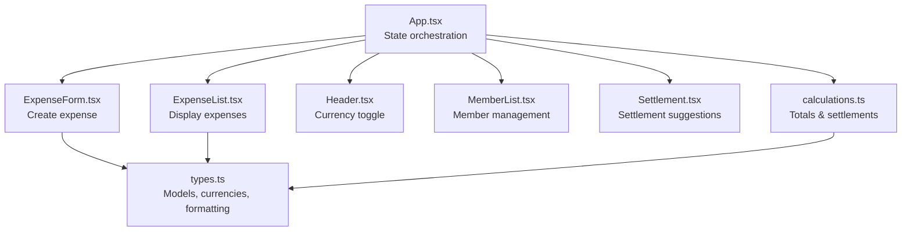
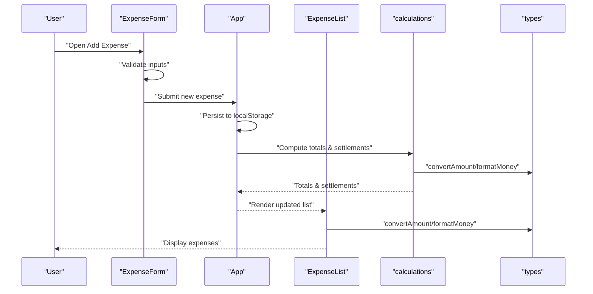
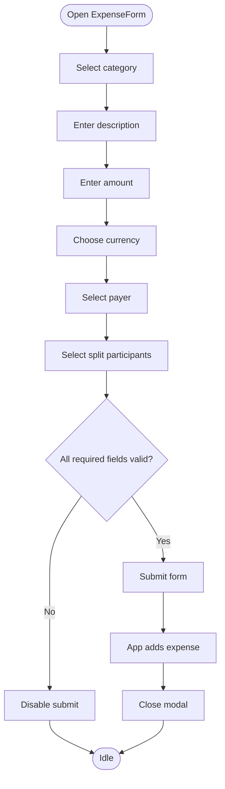
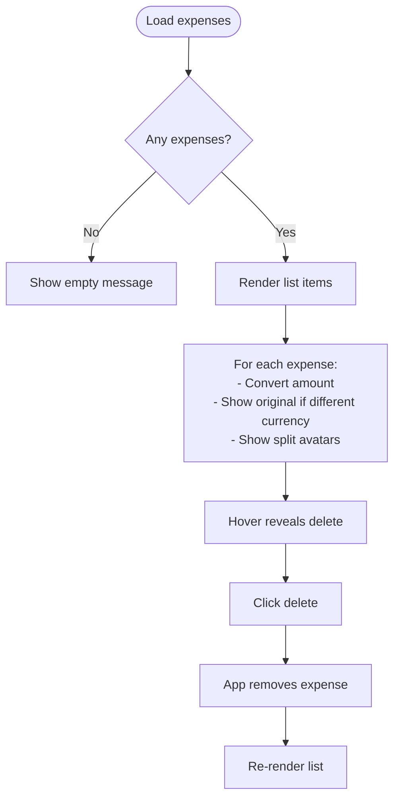
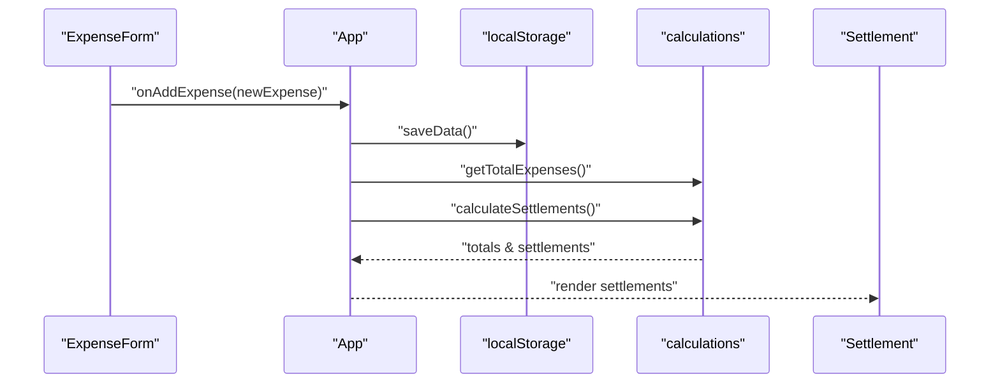
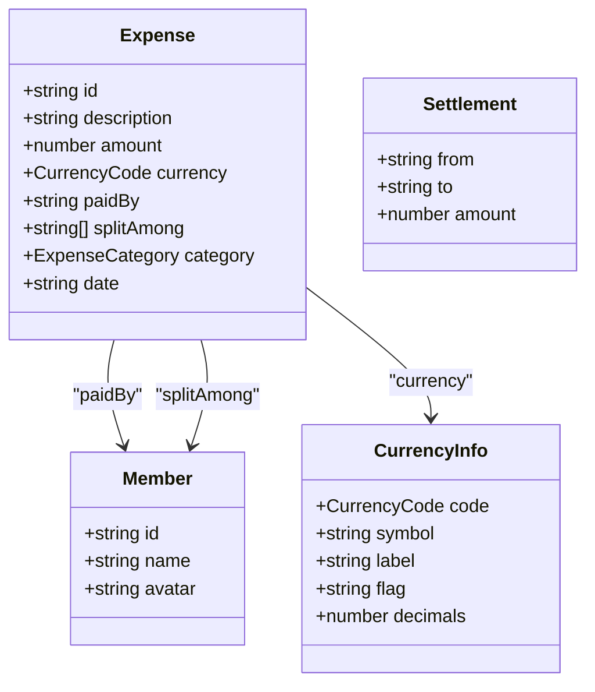
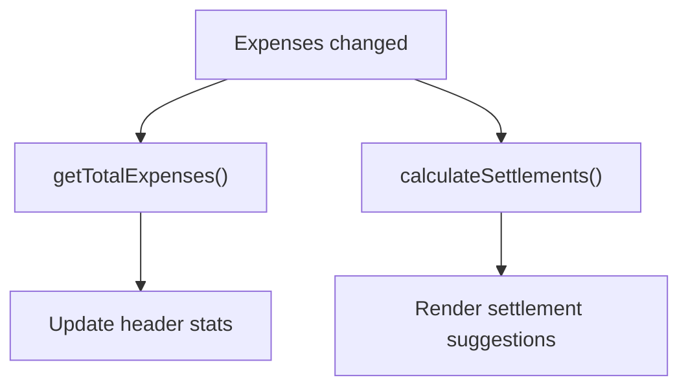
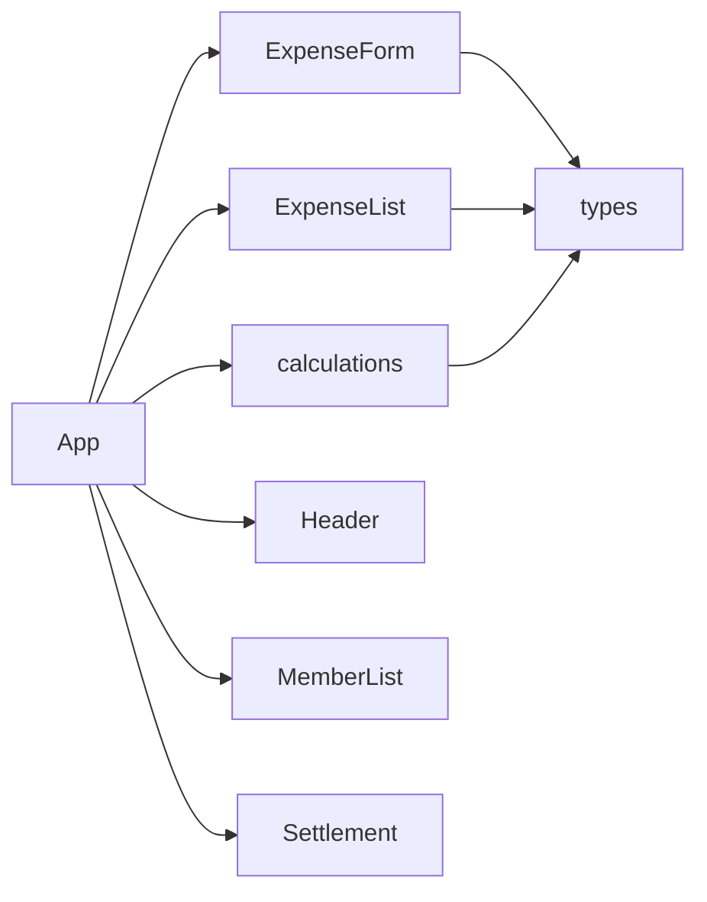

# Expense Management

<cite>
**Referenced Files in This Document**
- [ExpenseForm.tsx](file://travel-splitter/src/components/ExpenseForm.tsx)
- [ExpenseList.tsx](file://travel-splitter/src/components/ExpenseList.tsx)
- [App.tsx](file://travel-splitter/src/App.tsx)
- [types.ts](file://travel-splitter/src/types.ts)
- [calculations.ts](file://travel-splitter/src/lib/calculations.ts)
- [Header.tsx](file://travel-splitter/src/components/Header.tsx)
- [MemberList.tsx](file://travel-splitter/src/components/MemberList.tsx)
- [Settlement.tsx](file://travel-splitter/src/components/Settlement.tsx)
</cite>

## Table of Contents
1. [Introduction](#introduction)
2. [Project Structure](#project-structure)
3. [Core Components](#core-components)
4. [Architecture Overview](#architecture-overview)
5. [Detailed Component Analysis](#detailed-component-analysis)
6. [Dependency Analysis](#dependency-analysis)
7. [Performance Considerations](#performance-considerations)
8. [Troubleshooting Guide](#troubleshooting-guide)
9. [Conclusion](#conclusion)

## Introduction
This document explains the Expense Management feature of Travel Splitter, focusing on the end-to-end workflow for creating, validating, displaying, editing, and deleting expenses. It covers form validation, category selection, multi-currency support (JPY/HKD), real-time expense aggregation, and integration with the settlement calculation engine. Practical examples and UX optimizations are included to guide smooth expense management workflows.

## Project Structure
The expense management feature spans several components and shared utilities:
- ExpenseForm: captures new expense entries with validation and currency handling
- ExpenseList: renders the list of expenses with sorting-like grouping and deletion actions
- App: orchestrates state, persistence, and integration with calculations
- types: defines data models, currencies, categories, and formatting helpers
- calculations: computes totals and settlement suggestions
- Header, MemberList, Settlement: provide context and integration points

**Diagram sources**
- [App.tsx:58-228](file://travel-splitter/src/App.tsx#L58-L228)
- [ExpenseForm.tsx:49-273](file://travel-splitter/src/components/ExpenseForm.tsx#L49-L273)
- [ExpenseList.tsx:30-151](file://travel-splitter/src/components/ExpenseList.tsx#L30-L151)
- [types.ts:1-97](file://travel-splitter/src/types.ts#L1-L97)
- [calculations.ts:1-85](file://travel-splitter/src/lib/calculations.ts#L1-L85)
- [Header.tsx:12-78](file://travel-splitter/src/components/Header.tsx#L12-L78)
- [MemberList.tsx:14-179](file://travel-splitter/src/components/MemberList.tsx#L14-L179)
- [Settlement.tsx:11-96](file://travel-splitter/src/components/Settlement.tsx#L11-L96)

**Section sources**
- [App.tsx:58-228](file://travel-splitter/src/App.tsx#L58-L228)
- [ExpenseForm.tsx:49-273](file://travel-splitter/src/components/ExpenseForm.tsx#L49-L273)
- [ExpenseList.tsx:30-151](file://travel-splitter/src/components/ExpenseList.tsx#L30-L151)
- [types.ts:1-97](file://travel-splitter/src/types.ts#L1-L97)
- [calculations.ts:1-85](file://travel-splitter/src/lib/calculations.ts#L1-L85)
- [Header.tsx:12-78](file://travel-splitter/src/components/Header.tsx#L12-L78)
- [MemberList.tsx:14-179](file://travel-splitter/src/components/MemberList.tsx#L14-L179)
- [Settlement.tsx:11-96](file://travel-splitter/src/components/Settlement.tsx#L11-L96)

## Core Components
- ExpenseForm: Handles creation of new expenses with category selection, amount/currency input, payer selection, and split participants. Provides real-time per-person share display and validation feedback.
- ExpenseList: Renders expenses with currency conversion display, participant avatars, and delete actions. Supports different display currency via conversion.
- App: Manages persistent state, validates inputs, persists to local storage, and triggers settlement computation.
- types: Defines Expense, Member, CurrencyCode, categories, exchange rates, formatting, and conversion helpers.
- calculations: Computes total expenses and settlement suggestions using currency conversion.

**Section sources**
- [ExpenseForm.tsx:49-273](file://travel-splitter/src/components/ExpenseForm.tsx#L49-L273)
- [ExpenseList.tsx:30-151](file://travel-splitter/src/components/ExpenseList.tsx#L30-L151)
- [App.tsx:58-228](file://travel-splitter/src/App.tsx#L58-L228)
- [types.ts:1-97](file://travel-splitter/src/types.ts#L1-L97)
- [calculations.ts:1-85](file://travel-splitter/src/lib/calculations.ts#L1-L85)

## Architecture Overview
The expense lifecycle flows from user input to persistence and settlement:

**Diagram sources**
- [ExpenseForm.tsx:75-89](file://travel-splitter/src/components/ExpenseForm.tsx#L75-L89)
- [App.tsx:119-138](file://travel-splitter/src/App.tsx#L119-L138)
- [App.tsx:148-161](file://travel-splitter/src/App.tsx#L148-L161)
- [ExpenseList.tsx:46-49](file://travel-splitter/src/components/ExpenseList.tsx#L46-L49)
- [types.ts:25-48](file://travel-splitter/src/types.ts#L25-L48)
- [calculations.ts:4-80](file://travel-splitter/src/lib/calculations.ts#L4-L80)

## Detailed Component Analysis

### ExpenseForm: Creation Workflow and Validation
Key behaviors:
- Category selection: Grid of six categories with icons and labels; selection updates state and reflects active state.
- Description: Free text with trimming; required for submission.
- Amount: Numeric input with currency-dependent step and padding; validated to be numeric and positive.
- Currency: Toggle between JPY and HKD; symbol and decimal handling differ (JPY integer, HKD two decimals).
- Paid by: Dropdown of members; required.
- Split among: Multi-select chips; toggles selection; “Select all” helper; per-person share shown when amount and selection are valid.
- Validation: Form submission checks description presence, numeric amount > 0, paidBy present, and at least one split participant.
- Real-time aggregation: Per-person share computed and formatted immediately when amount and selection are valid.

**Diagram sources**
- [ExpenseForm.tsx:75-89](file://travel-splitter/src/components/ExpenseForm.tsx#L75-L89)
- [ExpenseForm.tsx:250-258](file://travel-splitter/src/components/ExpenseForm.tsx#L250-L258)

Practical examples:
- Scenario A: Adding a 1200 JPY meal paid by Alice and split among Alice, Bob, and Carol. The form validates amount > 0, ensures a payer, and requires at least one split participant. Per-person share displays as JPY 400.
- Scenario B: Adding a 100 HKD train ticket paid by Bob and split among all four members. The form validates numeric input and shows per-person share as HKD 25. After submission, the list updates and totals are recalculated.

Validation rules:
- Description must be non-empty after trimming.
- Amount must be a number greater than zero.
- Paid by must be selected.
- At least one split participant must be selected.

Error handling strategies:
- Disabled submit button until all validations pass.
- No explicit error messages; invalid states prevent submission.
- Currency step and padding reduce input errors for JPY vs HKD.

Integration with settlement:
- Newly added expenses trigger recalculation of totals and settlement suggestions in App.

**Section sources**
- [ExpenseForm.tsx:49-273](file://travel-splitter/src/components/ExpenseForm.tsx#L49-L273)
- [types.ts:17-48](file://travel-splitter/src/types.ts#L17-L48)

### ExpenseList: Display, Sorting, and Interaction
Key behaviors:
- Displays expenses with category icon, description, payer identity (with colored avatar), converted amount in display currency, original amount when currency differs, and split participant avatars.
- Hover actions reveal delete buttons.
- Empty state shows a friendly message.
- Sorting: Expenses are rendered in insertion order (most recent first). There is no explicit sort-by-date or sort-by-category UI in this component.

**Diagram sources**
- [ExpenseList.tsx:61-147](file://travel-splitter/src/components/ExpenseList.tsx#L61-L147)
- [ExpenseList.tsx:46-49](file://travel-splitter/src/components/ExpenseList.tsx#L46-L49)

Interaction patterns:
- Delete action triggers removal callback in App.
- Avatars reflect member indices for consistent color assignment.

Integration with settlement:
- ExpenseList participates in the overall state; settlement suggestions depend on the current expense dataset.

**Section sources**
- [ExpenseList.tsx:30-151](file://travel-splitter/src/components/ExpenseList.tsx#L30-L151)
- [types.ts:75-97](file://travel-splitter/src/types.ts#L75-L97)

### App: State Orchestration and Persistence
Responsibilities:
- Maintains members, expenses, and display currency in state.
- Persists data to localStorage on changes.
- Adds new expenses with generated IDs and timestamps.
- Removes expenses and shows toast notifications.
- Computes total expenses and settlement suggestions using calculations module.
- Integrates with Header for currency switching and with MemberList for member management.

**Diagram sources**
- [App.tsx:119-138](file://travel-splitter/src/App.tsx#L119-L138)
- [App.tsx:148-161](file://travel-splitter/src/App.tsx#L148-L161)
- [calculations.ts:72-80](file://travel-splitter/src/lib/calculations.ts#L72-L80)

**Section sources**
- [App.tsx:58-228](file://travel-splitter/src/App.tsx#L58-L228)
- [calculations.ts:1-85](file://travel-splitter/src/lib/calculations.ts#L1-L85)

### Supporting Types and Utilities
- Expense model: id, description, amount, currency, paidBy, splitAmong, category, date.
- CurrencyCode: JPY and HKD with symbol, label, flag, and decimals.
- Exchange rate: approximate conversion between HKD and JPY.
- Formatting: localized money formatting with currency symbol and fixed decimals.
- Categories: food, transport, hotel, ticket, shopping, other with labels and icons.
- Avatar colors: deterministic color palette for member avatars.

**Diagram sources**
- [types.ts:1-97](file://travel-splitter/src/types.ts#L1-L97)

**Section sources**
- [types.ts:1-97](file://travel-splitter/src/types.ts#L1-L97)

### Settlement Integration
- Totals and settlements are computed whenever expenses change.
- Settlement component displays simplified transfer instructions when imbalances exist.

**Diagram sources**
- [App.tsx:148-161](file://travel-splitter/src/App.tsx#L148-L161)
- [calculations.ts:4-80](file://travel-splitter/src/lib/calculations.ts#L4-L80)
- [Settlement.tsx:11-96](file://travel-splitter/src/components/Settlement.tsx#L11-L96)

**Section sources**
- [App.tsx:148-161](file://travel-splitter/src/App.tsx#L148-L161)
- [calculations.ts:4-80](file://travel-splitter/src/lib/calculations.ts#L4-L80)
- [Settlement.tsx:11-96](file://travel-splitter/src/components/Settlement.tsx#L11-L96)

## Dependency Analysis
- ExpenseForm depends on types for category icons, currency info, and formatting; it calls App’s onAddExpense prop.
- ExpenseList depends on types for currency conversion and formatting; it calls App’s onRemoveExpense prop.
- App composes all components and delegates calculations to calculations.ts; it persists state to localStorage.
- calculations.ts depends on types for currency conversion and formatting.

**Diagram sources**
- [ExpenseForm.tsx:14-15](file://travel-splitter/src/components/ExpenseForm.tsx#L14-L15)
- [ExpenseList.tsx:12-12](file://travel-splitter/src/components/ExpenseList.tsx#L12-L12)
- [types.ts:1-97](file://travel-splitter/src/types.ts#L1-L97)
- [calculations.ts:1-3](file://travel-splitter/src/lib/calculations.ts#L1-L3)
- [App.tsx:6-16](file://travel-splitter/src/App.tsx#L6-L16)

**Section sources**
- [ExpenseForm.tsx:14-15](file://travel-splitter/src/components/ExpenseForm.tsx#L14-L15)
- [ExpenseList.tsx:12-12](file://travel-splitter/src/components/ExpenseList.tsx#L12-L12)
- [types.ts:1-97](file://travel-splitter/src/types.ts#L1-L97)
- [calculations.ts:1-3](file://travel-splitter/src/lib/calculations.ts#L1-L3)
- [App.tsx:6-16](file://travel-splitter/src/App.tsx#L6-L16)

## Performance Considerations
- Rendering cost: ExpenseList maps over the entire expenses array on each render. For large datasets:
  - Memoize derived values (totals, settlements) using useMemo in App to avoid recomputation.
  - Consider virtualization for long lists if performance becomes an issue.
- Currency conversion: convertAmount is O(1); formatting is lightweight. Keep conversions centralized in types to minimize repeated logic.
- Local storage: Save only on significant changes to reduce write frequency.
- Validation: Keep client-side validation fast; avoid heavy computations in render paths.

[No sources needed since this section provides general guidance]

## Troubleshooting Guide
Common issues and resolutions:
- Form does not submit:
  - Ensure description is non-empty, amount is a positive number, payer is selected, and at least one split participant is chosen.
- Wrong per-person share:
  - Verify amount input and split count; per-person share is amount divided by split count.
- Currency mismatch in display:
  - ExpenseList converts amounts to the display currency; original amount is shown when currency differs.
- Settlement shows unexpected transfers:
  - Confirm all members are included in the settlement calculation and that totals are computed in the same display currency.
- Deleting an expense fails:
  - Ensure the expense list is updated after deletion; verify the remove callback is invoked.

**Section sources**
- [ExpenseForm.tsx:75-89](file://travel-splitter/src/components/ExpenseForm.tsx#L75-L89)
- [ExpenseList.tsx:46-49](file://travel-splitter/src/components/ExpenseList.tsx#L46-L49)
- [App.tsx:140-146](file://travel-splitter/src/App.tsx#L140-L146)

## Conclusion
The Expense Management feature provides a streamlined workflow for capturing expenses, validating inputs, and integrating with settlement calculations. ExpenseForm offers immediate feedback and real-time aggregation, while ExpenseList presents a clean, currency-aware display. Together with App’s orchestration and calculations, the system supports efficient expense tracking and balanced settlement suggestions. For large datasets, consider memoization and potential virtualization to maintain responsiveness.