# Member Management

<cite>
**Referenced Files in This Document**
- [App.tsx](file://travel-splitter/src/App.tsx)
- [MemberList.tsx](file://travel-splitter/src/components/MemberList.tsx)
- [ExpenseForm.tsx](file://travel-splitter/src/components/ExpenseForm.tsx)
- [ExpenseList.tsx](file://travel-splitter/src/components/ExpenseList.tsx)
- [Settlement.tsx](file://travel-splitter/src/components/Settlement.tsx)
- [calculations.ts](file://travel-splitter/src/lib/calculations.ts)
- [types.ts](file://travel-splitter/src/types.ts)
- [utils.ts](file://travel-splitter/src/lib/utils.ts)
</cite>

## Table of Contents
1. [Introduction](#introduction)
2. [Project Structure](#project-structure)
3. [Core Components](#core-components)
4. [Architecture Overview](#architecture-overview)
5. [Detailed Component Analysis](#detailed-component-analysis)
6. [Dependency Analysis](#dependency-analysis)
7. [Performance Considerations](#performance-considerations)
8. [Troubleshooting Guide](#troubleshooting-guide)
9. [Conclusion](#conclusion)

## Introduction
This document explains the Member Management feature of the travel expense splitter application. It covers how members are added, edited, and removed; how avatars are generated and used for visual identification; how the MemberList component supports member selection during expense creation; and how member changes integrate with expense splitting and settlement calculations. It also documents data persistence and user experience considerations for managing group dynamics.

## Project Structure
The Member Management feature spans several components and shared utilities:
- Application state and persistence live in the main app container
- MemberList renders and manages member entries
- ExpenseForm uses MemberList data to select who paid and who shares expenses
- ExpenseList and Settlement components visualize member participation and balances
- Shared types define Member, Expense, Settlement, and avatar color palette
- Calculations module computes totals and settlement steps

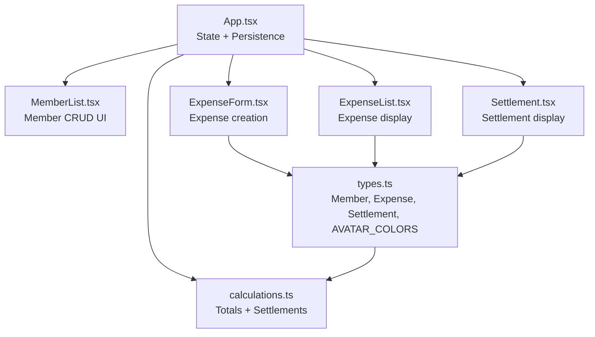

**Diagram sources**
- [App.tsx:58-228](file://travel-splitter/src/App.tsx#L58-L228)
- [MemberList.tsx:14-179](file://travel-splitter/src/components/MemberList.tsx#L14-L179)
- [ExpenseForm.tsx:49-273](file://travel-splitter/src/components/ExpenseForm.tsx#L49-L273)
- [ExpenseList.tsx:30-151](file://travel-splitter/src/components/ExpenseList.tsx#L30-L151)
- [Settlement.tsx:11-96](file://travel-splitter/src/components/Settlement.tsx#L11-L96)
- [calculations.ts:1-85](file://travel-splitter/src/lib/calculations.ts#L1-L85)
- [types.ts:1-97](file://travel-splitter/src/types.ts#L1-L97)

**Section sources**
- [App.tsx:58-228](file://travel-splitter/src/App.tsx#L58-L228)
- [types.ts:1-97](file://travel-splitter/src/types.ts#L1-L97)

## Core Components
- MemberList: Renders members with avatars, inline editing, and remove actions; triggers add/edit/remove callbacks.
- App: Manages members and expenses state, persists to localStorage, and orchestrates member lifecycle and settlement computation.
- ExpenseForm: Uses members to select payer and split participants; validates inputs and creates expenses.
- ExpenseList: Displays expenses with participant avatars and amounts; links to settlement logic.
- Settlement: Shows settlement steps using member avatars and names.
- calculations: Computes totals and settlement steps from expenses and member IDs.
- types: Defines Member, Expense, Settlement, categories, currencies, and avatar color palette.

**Section sources**
- [MemberList.tsx:14-179](file://travel-splitter/src/components/MemberList.tsx#L14-L179)
- [App.tsx:58-228](file://travel-splitter/src/App.tsx#L58-L228)
- [ExpenseForm.tsx:49-273](file://travel-splitter/src/components/ExpenseForm.tsx#L49-L273)
- [ExpenseList.tsx:30-151](file://travel-splitter/src/components/ExpenseList.tsx#L30-L151)
- [Settlement.tsx:11-96](file://travel-splitter/src/components/Settlement.tsx#L11-L96)
- [calculations.ts:1-85](file://travel-splitter/src/lib/calculations.ts#L1-L85)
- [types.ts:1-97](file://travel-splitter/src/types.ts#L1-L97)

## Architecture Overview
Member management is event-driven:
- MemberList emits add/edit/remove events
- App updates state and persists to localStorage
- ExpenseForm reads members to populate payer and split lists
- Settlement recomputes balances whenever members or expenses change

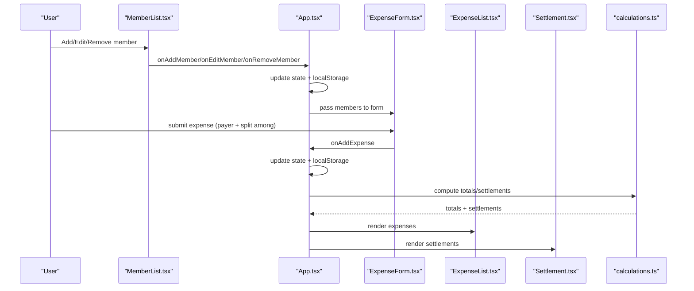

**Diagram sources**
- [MemberList.tsx:14-179](file://travel-splitter/src/components/MemberList.tsx#L14-L179)
- [App.tsx:58-228](file://travel-splitter/src/App.tsx#L58-L228)
- [ExpenseForm.tsx:49-273](file://travel-splitter/src/components/ExpenseForm.tsx#L49-L273)
- [ExpenseList.tsx:30-151](file://travel-splitter/src/components/ExpenseList.tsx#L30-L151)
- [Settlement.tsx:11-96](file://travel-splitter/src/components/Settlement.tsx#L11-L96)
- [calculations.ts:1-85](file://travel-splitter/src/lib/calculations.ts#L1-L85)

## Detailed Component Analysis

### MemberList Component
Responsibilities:
- Render a list of members with color-coded avatars derived from index
- Provide inline editing for member names
- Allow adding new members via a form
- Allow removing members with safety checks
- Expose callbacks for parent to manage state

Key behaviors:
- Avatar color assignment uses modulo over a fixed palette
- Inline edit mode toggles per member with Enter/Escape handling
- Add form trims whitespace and disables submission until valid
- Remove action checks whether the member appears in any expense records

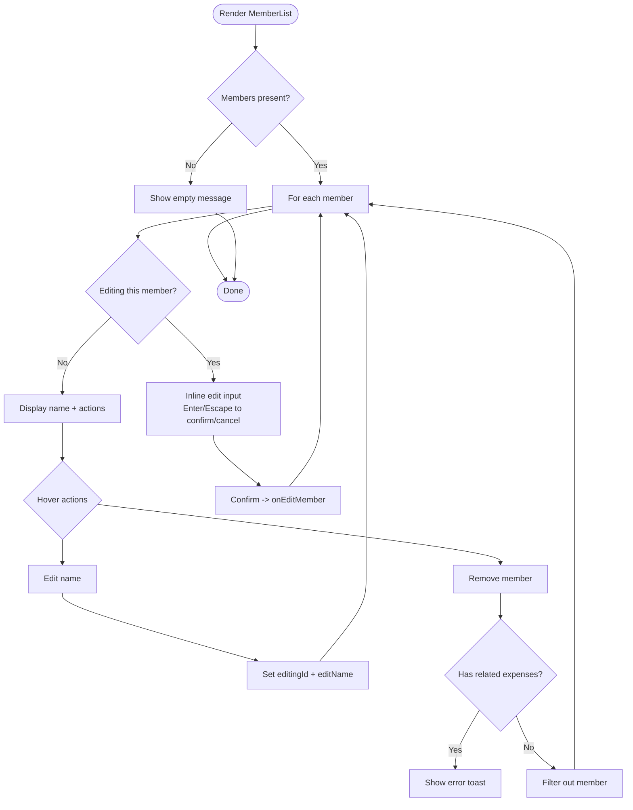

**Diagram sources**
- [MemberList.tsx:14-179](file://travel-splitter/src/components/MemberList.tsx#L14-L179)
- [App.tsx:91-117](file://travel-splitter/src/App.tsx#L91-L117)

**Section sources**
- [MemberList.tsx:14-179](file://travel-splitter/src/components/MemberList.tsx#L14-L179)
- [App.tsx:78-117](file://travel-splitter/src/App.tsx#L78-L117)

### Member Addition Workflow
- User clicks “新增” in MemberList
- Form becomes visible with an input field
- On submit, the parent App handles the add operation by generating a unique ID, assigning an avatar color based on current member count, and updating state
- A success toast confirms the addition

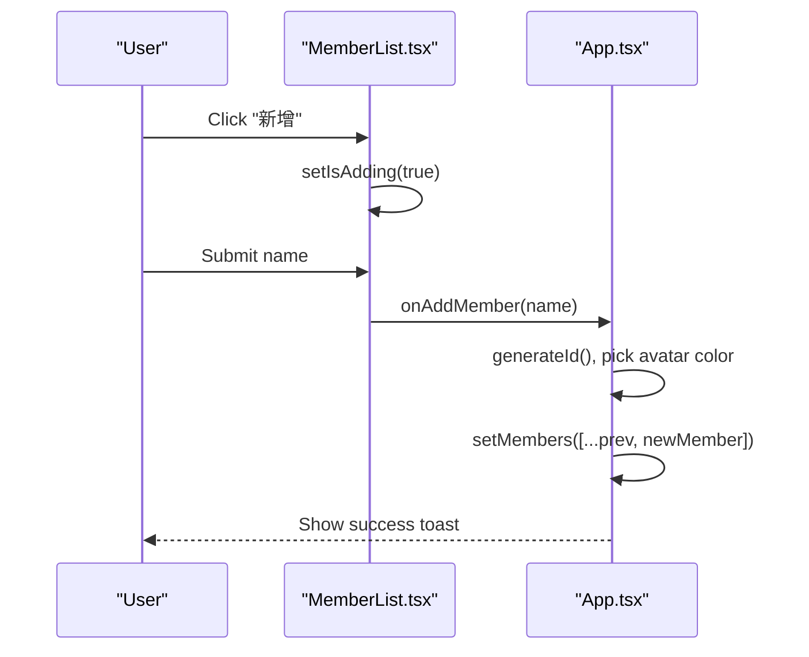

**Diagram sources**
- [MemberList.tsx:66-102](file://travel-splitter/src/components/MemberList.tsx#L66-L102)
- [App.tsx:78-89](file://travel-splitter/src/App.tsx#L78-L89)
- [types.ts:87-96](file://travel-splitter/src/types.ts#L87-L96)
- [calculations.ts:82-84](file://travel-splitter/src/lib/calculations.ts#L82-L84)

**Section sources**
- [MemberList.tsx:25-32](file://travel-splitter/src/components/MemberList.tsx#L25-L32)
- [App.tsx:78-89](file://travel-splitter/src/App.tsx#L78-L89)
- [types.ts:87-96](file://travel-splitter/src/types.ts#L87-L96)

### Name Editing Capabilities
- Hover over a member to reveal edit/remove controls
- Click edit to enter inline edit mode
- Press Enter to confirm or Escape to cancel
- Parent App updates the member’s name and shows a success toast

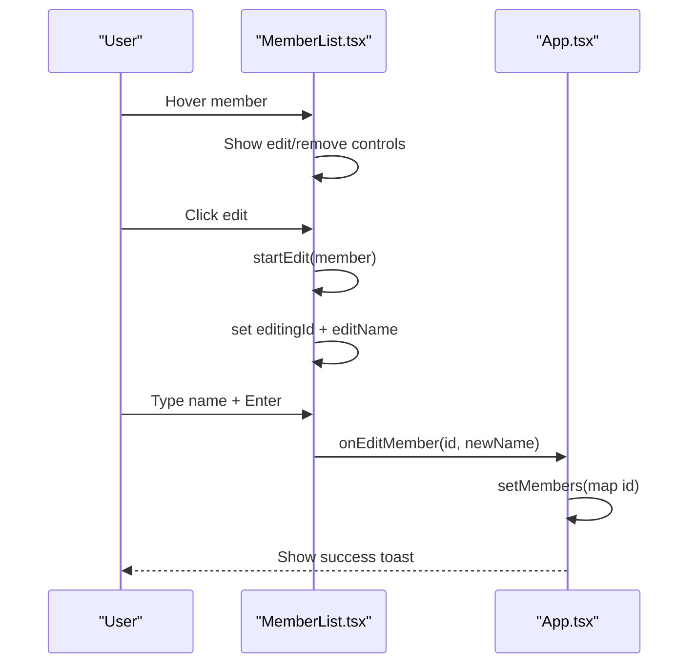

**Diagram sources**
- [MemberList.tsx:34-55](file://travel-splitter/src/components/MemberList.tsx#L34-L55)
- [App.tsx:109-117](file://travel-splitter/src/App.tsx#L109-L117)

**Section sources**
- [MemberList.tsx:34-55](file://travel-splitter/src/components/MemberList.tsx#L34-L55)
- [App.tsx:109-117](file://travel-splitter/src/App.tsx#L109-L117)

### Member Removal Processes
- Hover over a member to reveal remove control
- Click remove to trigger App handler
- Safety check: if the member appears as payer or in splitAmong for any expense, show an error toast and prevent removal
- Otherwise, filter the member from state and show success toast

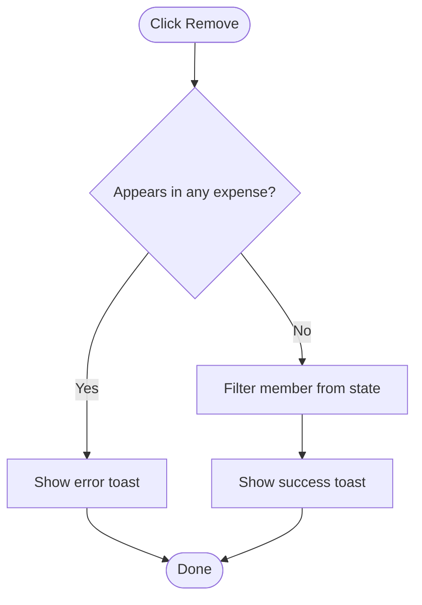

**Diagram sources**
- [MemberList.tsx:163-169](file://travel-splitter/src/components/MemberList.tsx#L163-L169)
- [App.tsx:91-107](file://travel-splitter/src/App.tsx#L91-L107)

**Section sources**
- [MemberList.tsx:163-169](file://travel-splitter/src/components/MemberList.tsx#L163-L169)
- [App.tsx:91-107](file://travel-splitter/src/App.tsx#L91-L107)

### Avatar System and Visual Identification
- Avatars are small colored circles displaying the first letter of the member’s name
- Colors cycle through a predefined palette based on member index
- Used consistently across MemberList, ExpenseList, and Settlement components for quick visual recognition

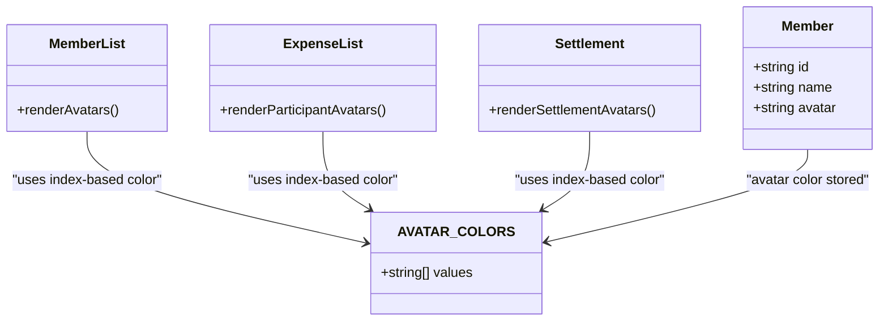

**Diagram sources**
- [types.ts:1-5](file://travel-splitter/src/types.ts#L1-L5)
- [types.ts:87-96](file://travel-splitter/src/types.ts#L87-L96)
- [MemberList.tsx:110-125](file://travel-splitter/src/components/MemberList.tsx#L110-L125)
- [ExpenseList.tsx:118-133](file://travel-splitter/src/components/ExpenseList.tsx#L118-L133)
- [Settlement.tsx:45-84](file://travel-splitter/src/components/Settlement.tsx#L45-L84)

**Section sources**
- [types.ts:87-96](file://travel-splitter/src/types.ts#L87-L96)
- [MemberList.tsx:110-125](file://travel-splitter/src/components/MemberList.tsx#L110-L125)
- [ExpenseList.tsx:118-133](file://travel-splitter/src/components/ExpenseList.tsx#L118-L133)
- [Settlement.tsx:45-84](file://travel-splitter/src/components/Settlement.tsx#L45-L84)

### MemberList Integration with Expense Splitting
- MemberList provides members to ExpenseForm for payer selection and split participant selection
- ExpenseForm maintains splitAmong as a list of selected member IDs
- When submitting an expense, the selected payer and split participants are included in the new expense record

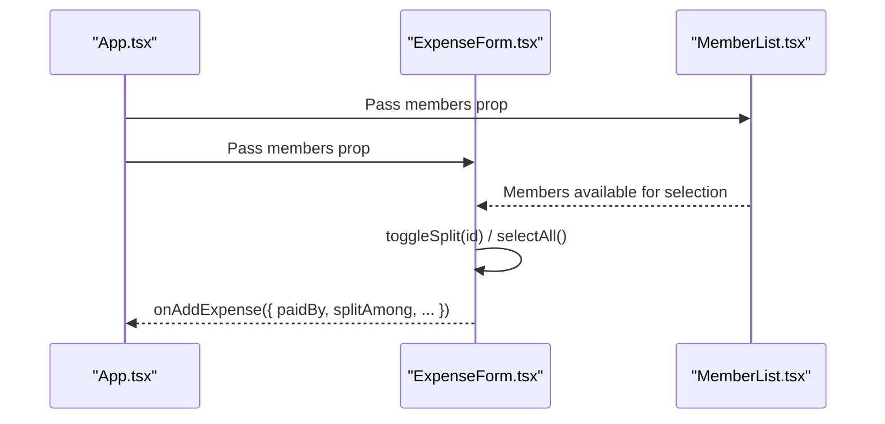

**Diagram sources**
- [App.tsx:174-179](file://travel-splitter/src/App.tsx#L174-L179)
- [ExpenseForm.tsx:57-69](file://travel-splitter/src/components/ExpenseForm.tsx#L57-L69)
- [ExpenseForm.tsx:232-248](file://travel-splitter/src/components/ExpenseForm.tsx#L232-L248)

**Section sources**
- [ExpenseForm.tsx:57-69](file://travel-splitter/src/components/ExpenseForm.tsx#L57-L69)
- [ExpenseForm.tsx:232-248](file://travel-splitter/src/components/ExpenseForm.tsx#L232-L248)

### Participation Tracking and Dynamic Updates
- ExpenseList displays each expense with participant avatars and counts
- Settlement computes balances and settlement steps based on current members and expenses
- When members change, recalculating settlements ensures accurate representation of who owes whom

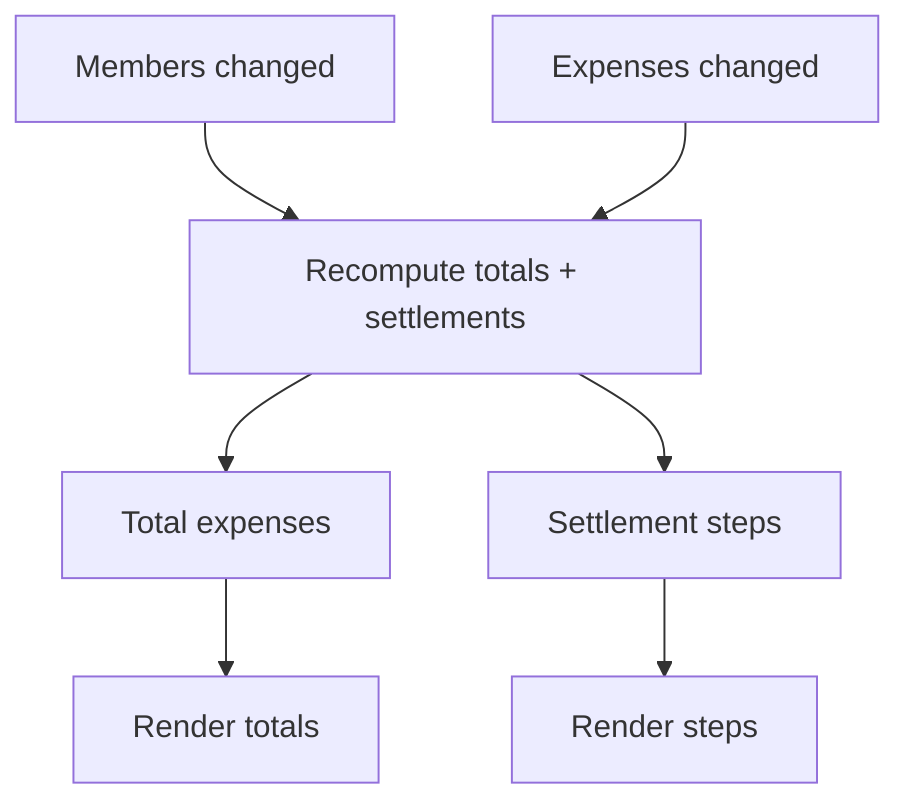

**Diagram sources**
- [App.tsx:148-161](file://travel-splitter/src/App.tsx#L148-L161)
- [calculations.ts:4-70](file://travel-splitter/src/lib/calculations.ts#L4-L70)
- [ExpenseList.tsx:30-151](file://travel-splitter/src/components/ExpenseList.tsx#L30-L151)
- [Settlement.tsx:11-96](file://travel-splitter/src/components/Settlement.tsx#L11-L96)

**Section sources**
- [App.tsx:148-161](file://travel-splitter/src/App.tsx#L148-L161)
- [calculations.ts:4-70](file://travel-splitter/src/lib/calculations.ts#L4-L70)

### Common Scenarios

#### Adding companions mid-trip
- Use MemberList “新增” to add a new member
- The new member receives an avatar color based on current position in the list
- They immediately appear in ExpenseForm for future expense splits

**Section sources**
- [MemberList.tsx:66-102](file://travel-splitter/src/components/MemberList.tsx#L66-L102)
- [App.tsx:78-89](file://travel-splitter/src/App.tsx#L78-L89)

#### Editing member names
- Hover over a member and click the edit icon
- Enter the new name and press Enter to confirm
- The change propagates across the UI (avatars, expense lists, settlements)

**Section sources**
- [MemberList.tsx:34-55](file://travel-splitter/src/components/MemberList.tsx#L34-L55)
- [App.tsx:109-117](file://travel-splitter/src/App.tsx#L109-L117)

#### Removing participants who leave early
- Attempting to remove a member who appears in existing expenses shows an error
- After deleting all related expenses, removal succeeds and a success toast confirms

**Section sources**
- [MemberList.tsx:163-169](file://travel-splitter/src/components/MemberList.tsx#L163-L169)
- [App.tsx:91-107](file://travel-splitter/src/App.tsx#L91-L107)

### Integration with Expense Splitting Logic
- Member IDs are stored in Expense.paidBy and Expense.splitAmong
- Settlements are computed against current member IDs, ensuring only active members participate in balancing
- ExpenseList and Settlement components rely on member index to render consistent avatar colors

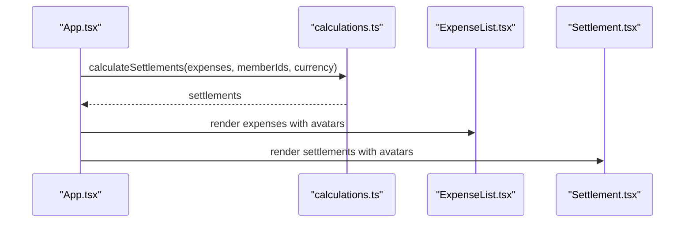

**Diagram sources**
- [App.tsx:153-161](file://travel-splitter/src/App.tsx#L153-L161)
- [calculations.ts:4-70](file://travel-splitter/src/lib/calculations.ts#L4-L70)
- [ExpenseList.tsx:30-151](file://travel-splitter/src/components/ExpenseList.tsx#L30-L151)
- [Settlement.tsx:11-96](file://travel-splitter/src/components/Settlement.tsx#L11-L96)

**Section sources**
- [App.tsx:153-161](file://travel-splitter/src/App.tsx#L153-L161)
- [calculations.ts:4-70](file://travel-splitter/src/lib/calculations.ts#L4-L70)

## Dependency Analysis
- MemberList depends on types.ts for AVATAR_COLORS and on App callbacks for member operations
- App depends on calculations.ts for totals and settlements and on localStorage for persistence
- ExpenseForm depends on members from App to populate payer and split selections
- ExpenseList and Settlement depend on members and AVATAR_COLORS for rendering

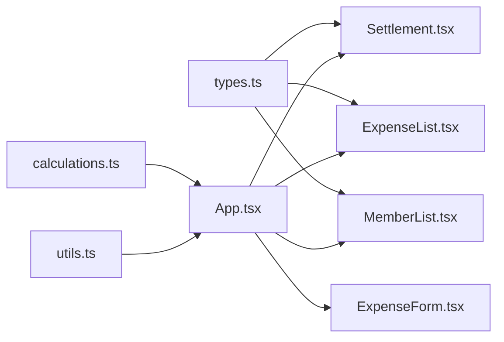

**Diagram sources**
- [types.ts:1-97](file://travel-splitter/src/types.ts#L1-L97)
- [MemberList.tsx:14-179](file://travel-splitter/src/components/MemberList.tsx#L14-L179)
- [ExpenseForm.tsx:49-273](file://travel-splitter/src/components/ExpenseForm.tsx#L49-L273)
- [ExpenseList.tsx:30-151](file://travel-splitter/src/components/ExpenseList.tsx#L30-L151)
- [Settlement.tsx:11-96](file://travel-splitter/src/components/Settlement.tsx#L11-L96)
- [calculations.ts:1-85](file://travel-splitter/src/lib/calculations.ts#L1-L85)
- [utils.ts:1-7](file://travel-splitter/src/lib/utils.ts#L1-L7)

**Section sources**
- [types.ts:1-97](file://travel-splitter/src/types.ts#L1-L97)
- [calculations.ts:1-85](file://travel-splitter/src/lib/calculations.ts#L1-L85)

## Performance Considerations
- MemberList renders avatars using index-based color assignment; this is O(n) per render
- ExpenseForm maintains splitAmong as a simple array; toggling membership is O(n) for includes/filter/map
- Settlement computation iterates over expenses and members; complexity is O(e + m) for balances plus sorting
- Local storage writes occur on state changes; batching expensive operations can reduce write frequency

[No sources needed since this section provides general guidance]

## Troubleshooting Guide
- Cannot remove a member: The system prevents removal if the member appears in any expense’s payer or split list. Delete related expenses first.
- Duplicate or empty names: MemberList trims input and disallows empty submissions during add.
- Inline edit not saving: Press Enter to confirm; press Escape to cancel without changes.
- Avatar color mismatch: Avatar colors are index-based; reordering members changes their colors.

**Section sources**
- [App.tsx:91-107](file://travel-splitter/src/App.tsx#L91-L107)
- [MemberList.tsx:25-32](file://travel-splitter/src/components/MemberList.tsx#L25-L32)
- [MemberList.tsx:47-55](file://travel-splitter/src/components/MemberList.tsx#L47-L55)

## Conclusion
Member Management integrates tightly with expense creation and settlement computation. The system provides immediate visual feedback via avatars, robust member lifecycle controls, and safe guards against inconsistent state. By persisting data to localStorage and recomputing totals and settlements on changes, the application remains consistent and user-friendly even as group dynamics evolve.