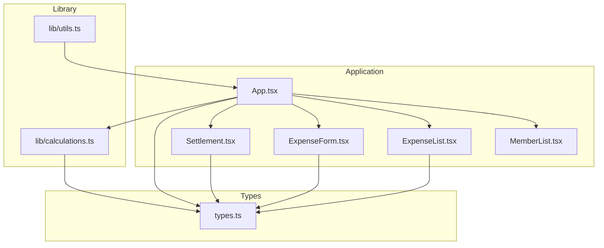
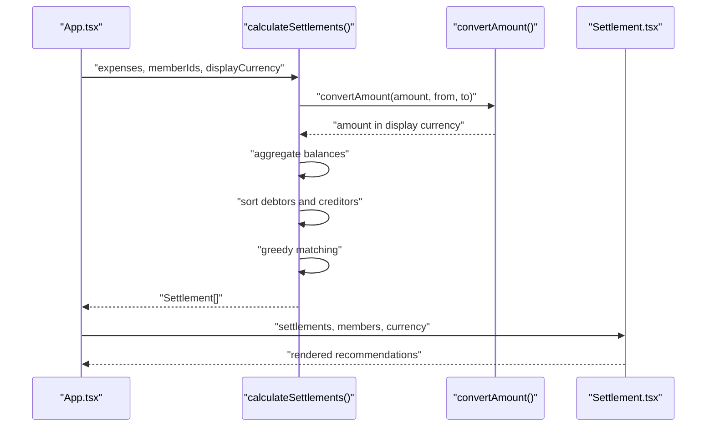
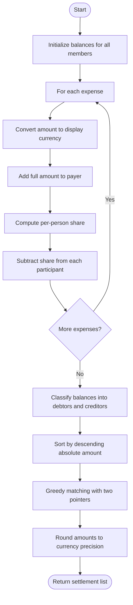
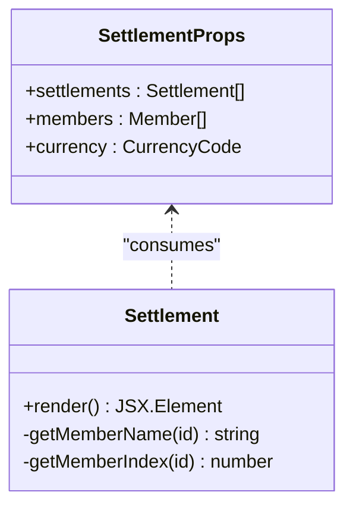
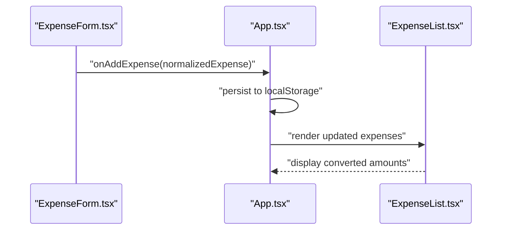
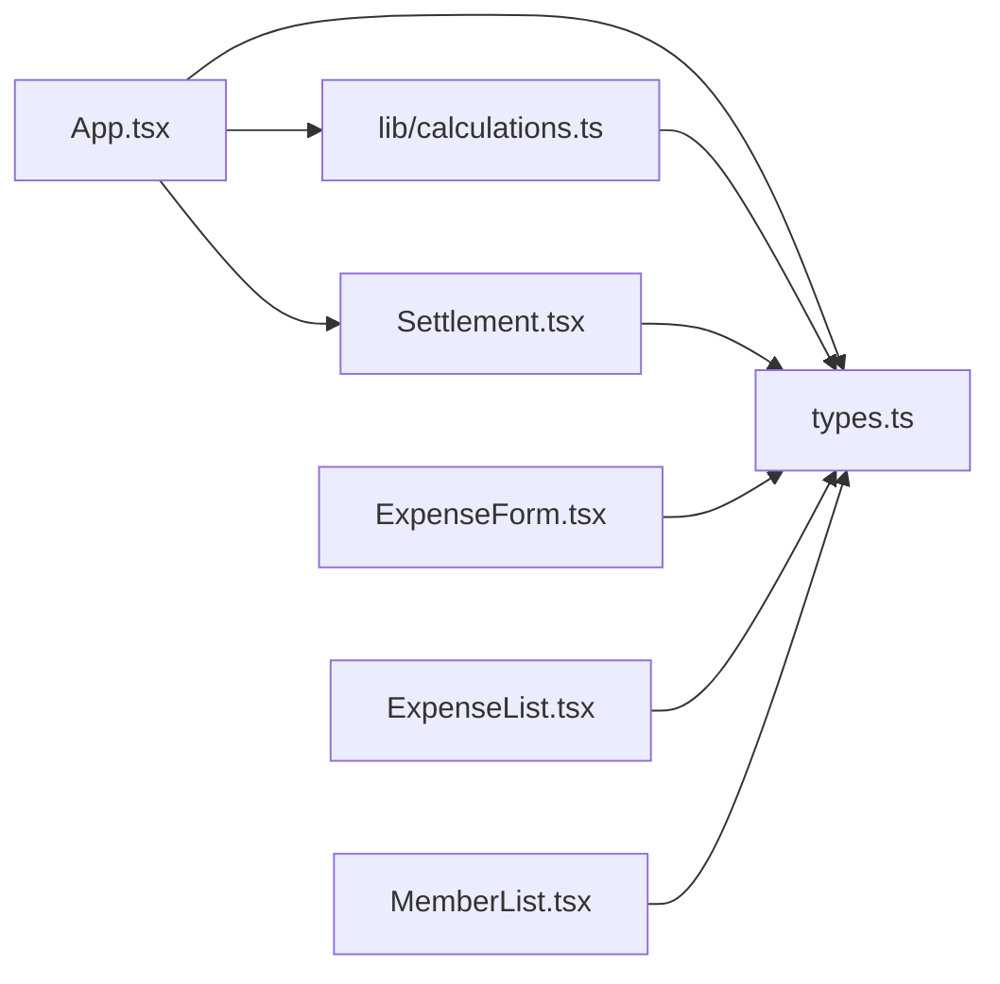

# Settlement Calculation Engine

<cite>
**Referenced Files in This Document**
- [calculations.ts](file://travel-splitter/src/lib/calculations.ts)
- [types.ts](file://travel-splitter/src/types.ts)
- [Settlement.tsx](file://travel-splitter/src/components/Settlement.tsx)
- [App.tsx](file://travel-splitter/src/App.tsx)
- [ExpenseForm.tsx](file://travel-splitter/src/components/ExpenseForm.tsx)
- [ExpenseList.tsx](file://travel-splitter/src/components/ExpenseList.tsx)
- [MemberList.tsx](file://travel-splitter/src/components/MemberList.tsx)
- [utils.ts](file://travel-splitter/src/lib/utils.ts)
- [main.tsx](file://travel-splitter/src/main.tsx)
- [package.json](file://travel-splitter/package.json)
</cite>

## Table of Contents
1. [Introduction](#introduction)
2. [Project Structure](#project-structure)
3. [Core Components](#core-components)
4. [Architecture Overview](#architecture-overview)
5. [Detailed Component Analysis](#detailed-component-analysis)
6. [Dependency Analysis](#dependency-analysis)
7. [Performance Considerations](#performance-considerations)
8. [Troubleshooting Guide](#troubleshooting-guide)
9. [Conclusion](#conclusion)
10. [Appendices](#appendices)

## Introduction
This document describes the Settlement Calculation Engine used to compute and visualize debt settlements among travel companions. It explains how the system:
- Calculates who owes what to whom based on shared expenses
- Handles partial payments and multi-currency conversions
- Optimizes the number of transactions required to settle debts
- Visualizes settlement recommendations with clear from-to relationships and amounts
- Integrates with expense data and member information to produce accurate recommendations

The engine is implemented as a pure calculation module with a React-based UI that renders settlement recommendations and manages user interactions.

## Project Structure
The project is organized around a React application with a clear separation between business logic and presentation:
- Business logic resides in a dedicated library module
- Presentation components render UI and orchestrate user interactions
- Types define shared interfaces and currency conversion utilities
- Local storage persists application state



**Diagram sources**
- [App.tsx:1-231](file://travel-splitter/src/App.tsx#L1-L231)
- [calculations.ts:1-85](file://travel-splitter/src/lib/calculations.ts#L1-L85)
- [types.ts:1-97](file://travel-splitter/src/types.ts#L1-L97)
- [Settlement.tsx:1-97](file://travel-splitter/src/components/Settlement.tsx#L1-L97)
- [ExpenseForm.tsx:1-274](file://travel-splitter/src/components/ExpenseForm.tsx#L1-L274)
- [ExpenseList.tsx:1-152](file://travel-splitter/src/components/ExpenseList.tsx#L1-L152)
- [MemberList.tsx:1-180](file://travel-splitter/src/components/MemberList.tsx#L1-L180)
- [utils.ts:1-7](file://travel-splitter/src/lib/utils.ts#L1-L7)

**Section sources**
- [package.json:1-32](file://travel-splitter/package.json#L1-L32)
- [main.tsx:1-11](file://travel-splitter/src/main.tsx#L1-L11)

## Core Components
- Settlement calculation engine: Computes balances and generates minimal transaction recommendations
- Currency conversion utilities: Converts between supported currencies using fixed exchange rates
- UI components: Render settlement recommendations, manage expenses, and handle member lists
- Type definitions: Define interfaces for members, expenses, settlements, categories, and currencies

Key responsibilities:
- Balance computation: Summarizes each member’s net contribution across all expenses
- Debt resolution: Matches debtors and creditors to minimize transaction count
- Visualization: Presents settlement steps with clear from-to relationships and formatted amounts
- Integration: Connects expense entries and member identities to produce actionable recommendations

**Section sources**
- [calculations.ts:4-85](file://travel-splitter/src/lib/calculations.ts#L4-L85)
- [types.ts:1-97](file://travel-splitter/src/types.ts#L1-L97)
- [Settlement.tsx:11-97](file://travel-splitter/src/components/Settlement.tsx#L11-L97)

## Architecture Overview
The settlement engine follows a functional architecture:
- Inputs: Expense records, member identifiers, and display currency
- Processing: Balance aggregation, sorting, and greedy matching
- Output: Settlement recommendations with minimal transaction count



**Diagram sources**
- [calculations.ts:4-70](file://travel-splitter/src/lib/calculations.ts#L4-L70)
- [types.ts:25-33](file://travel-splitter/src/types.ts#L25-L33)
- [App.tsx:153-161](file://travel-splitter/src/App.tsx#L153-L161)
- [Settlement.tsx:11-97](file://travel-splitter/src/components/Settlement.tsx#L11-L97)

## Detailed Component Analysis

### Settlement Calculation Engine
The engine computes balances and resolves debts using a two-pointer greedy algorithm:
- Balance aggregation: For each expense, convert to the display currency and distribute shares among participants
- Debtor/Creditor classification: Members with negative balances owe money; positive balances are owed to them
- Sorting and matching: Sort by descending absolute amounts and iteratively match smallest remaining amounts
- Transaction rounding: Round to the smallest currency unit to avoid floating-point precision issues



**Diagram sources**
- [calculations.ts:4-70](file://travel-splitter/src/lib/calculations.ts#L4-L70)

**Section sources**
- [calculations.ts:4-85](file://travel-splitter/src/lib/calculations.ts#L4-L85)

### Currency Conversion and Formatting
The system supports two currencies with fixed exchange rates:
- Conversion: Converts amounts between JPY and HKD using a constant rate
- Formatting: Formats amounts according to currency decimal rules and locale-aware display

```mermaid
classDiagram
class CurrencyCode {
<<enumeration>>
"JPY"
"HKD"
}
class CurrencyInfo {
+code : CurrencyCode
+symbol : string
+label : string
+flag : string
+decimals : number
}
class ExchangeRate {
+HKD_TO_JPY : number
}
class convertAmount {
+call(amount, from, to) number
}
class formatMoney {
+call(amount, currency) string
}
CurrencyInfo <.. convertAmount : "uses"
CurrencyInfo <.. formatMoney : "uses"
ExchangeRate <.. convertAmount : "used by"
```

**Diagram sources**
- [types.ts:7-48](file://travel-splitter/src/types.ts#L7-L48)

**Section sources**
- [types.ts:7-48](file://travel-splitter/src/types.ts#L7-L48)

### Settlement Visualization Component
The Settlement component renders recommendations with:
- From and to member avatars and names
- Clear directional arrow and formatted amount
- Minimal transaction count indicator
- Graceful handling when no settlement is needed



**Diagram sources**
- [Settlement.tsx:5-97](file://travel-splitter/src/components/Settlement.tsx#L5-L97)
- [types.ts:1-97](file://travel-splitter/src/types.ts#L1-L97)

**Section sources**
- [Settlement.tsx:11-97](file://travel-splitter/src/components/Settlement.tsx#L11-L97)

### Expense and Member Management
- ExpenseForm: Collects expense metadata, validates inputs, and emits normalized records
- ExpenseList: Displays expense history with currency conversion and participant avatars
- MemberList: Manages member identities and provides inline editing capabilities



**Diagram sources**
- [ExpenseForm.tsx:75-89](file://travel-splitter/src/components/ExpenseForm.tsx#L75-L89)
- [App.tsx:119-138](file://travel-splitter/src/App.tsx#L119-L138)
- [ExpenseList.tsx:30-152](file://travel-splitter/src/components/ExpenseList.tsx#L30-L152)

**Section sources**
- [ExpenseForm.tsx:49-274](file://travel-splitter/src/components/ExpenseForm.tsx#L49-L274)
- [ExpenseList.tsx:30-152](file://travel-splitter/src/components/ExpenseList.tsx#L30-L152)
- [MemberList.tsx:14-180](file://travel-splitter/src/components/MemberList.tsx#L14-L180)

## Dependency Analysis
The system exhibits low coupling and clear separation of concerns:
- App orchestrates state and passes data to components
- calculations.ts depends on types.ts for currency conversion and interfaces
- UI components depend on types.ts for rendering and formatting
- No circular dependencies observed



**Diagram sources**
- [App.tsx:10-16](file://travel-splitter/src/App.tsx#L10-L16)
- [calculations.ts:1-3](file://travel-splitter/src/lib/calculations.ts#L1-L3)
- [types.ts:1-97](file://travel-splitter/src/types.ts#L1-L97)
- [Settlement.tsx:2-4](file://travel-splitter/src/components/Settlement.tsx#L2-L4)
- [ExpenseForm.tsx:14-15](file://travel-splitter/src/components/ExpenseForm.tsx#L14-L15)
- [ExpenseList.tsx:12](file://travel-splitter/src/components/ExpenseList.tsx#L12)

**Section sources**
- [App.tsx:10-16](file://travel-splitter/src/App.tsx#L10-L16)
- [calculations.ts:1-3](file://travel-splitter/src/lib/calculations.ts#L1-L3)
- [types.ts:1-97](file://travel-splitter/src/types.ts#L1-L97)

## Performance Considerations
- Complexity: Balance aggregation is O(E + M) where E is the number of expenses and M is the number of members; sorting and matching are O(M log M) plus O(M) for two-pointer traversal
- Precision: Rounding to the smallest currency unit prevents accumulation of floating-point errors
- Real-time responsiveness: Memoization of derived values (total expenses and settlements) ensures efficient re-renders
- Storage: Local storage persistence avoids recomputation overhead across sessions

[No sources needed since this section provides general guidance]

## Troubleshooting Guide
Common issues and resolutions:
- No settlement recommendations appear:
  - Ensure there are at least two members and one expense recorded
  - Verify that expenses were added with valid amounts and participants
- Unexpected amounts:
  - Confirm the display currency setting and that all expenses are converted consistently
  - Check that rounding rules align with the chosen currency’s decimal precision
- Member removal blocked:
  - Remove associated expenses before deleting a member to prevent inconsistent state
- Multi-currency discrepancies:
  - Use the display currency selector to unify amounts for settlement calculations

**Section sources**
- [App.tsx:91-107](file://travel-splitter/src/App.tsx#L91-L107)
- [types.ts:25-48](file://travel-splitter/src/types.ts#L25-L48)

## Conclusion
The Settlement Calculation Engine provides a robust, mathematically sound solution for resolving shared travel expenses. By converting all amounts to a single display currency, computing net balances, and applying a greedy two-pointer matching algorithm, it minimizes transaction counts while maintaining clarity. The accompanying UI components present recommendations intuitively, integrating seamlessly with expense and member management.

[No sources needed since this section summarizes without analyzing specific files]

## Appendices

### Mathematical Foundations
- Balance computation: Each expense contributes to the payer’s balance and subtracts equally from each participant’s balance
- Debt resolution: The algorithm sorts debtors and creditors by absolute amounts and matches the smaller remaining balance at each step
- Transaction minimization: Greedy matching guarantees the minimal number of transactions required to settle all debts

**Section sources**
- [calculations.ts:15-30](file://travel-splitter/src/lib/calculations.ts#L15-L30)
- [calculations.ts:32-67](file://travel-splitter/src/lib/calculations.ts#L32-L67)

### Edge Cases and Handling
- Zero or near-zero balances: Threshold comparisons prevent negligible amounts from generating transactions
- Partial payments: The algorithm treats any positive balance as an amount owed; partial payments require separate accounting outside this module
- Multi-currency: All amounts are converted to the display currency before balance aggregation
- Equal splits: Even distribution is computed by dividing the converted amount by the number of participants
- Complex scenarios: The greedy approach remains optimal for minimizing transactions under the assumption of fixed exchange rates

**Section sources**
- [calculations.ts:36-41](file://travel-splitter/src/lib/calculations.ts#L36-L41)
- [calculations.ts:21](file://travel-splitter/src/lib/calculations.ts#L21)
- [types.ts:25-33](file://travel-splitter/src/types.ts#L25-L33)

### Integration with Expense Data and Members
- Expense ingestion: ExpenseForm normalizes inputs and appends records to the list
- Settlement computation: App computes total expenses and settlement recommendations using current member and expense sets
- Visualization: Settlement component receives member and currency context to render avatars and formatted amounts

**Section sources**
- [ExpenseForm.tsx:75-89](file://travel-splitter/src/components/ExpenseForm.tsx#L75-L89)
- [App.tsx:148-161](file://travel-splitter/src/App.tsx#L148-L161)
- [Settlement.tsx:11-97](file://travel-splitter/src/components/Settlement.tsx#L11-L97)