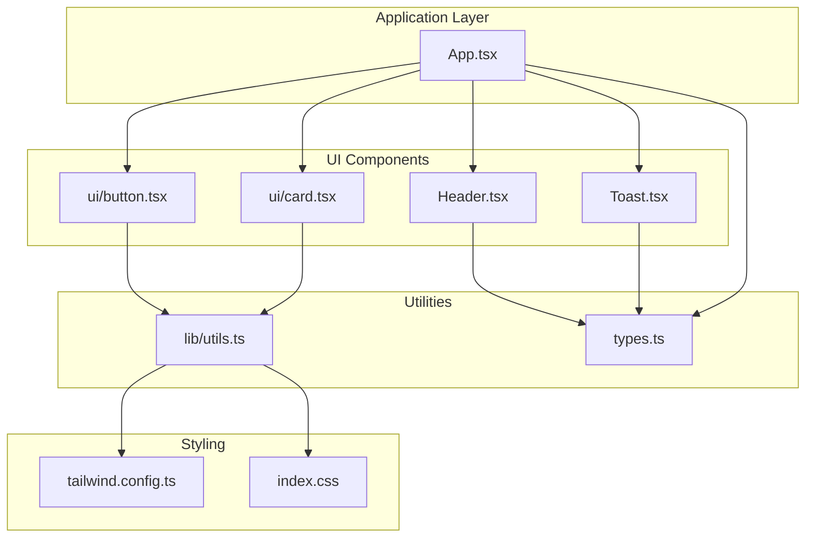
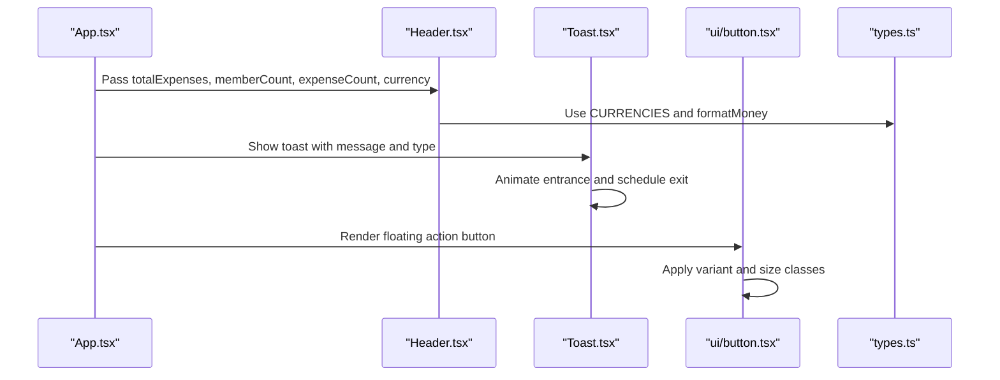
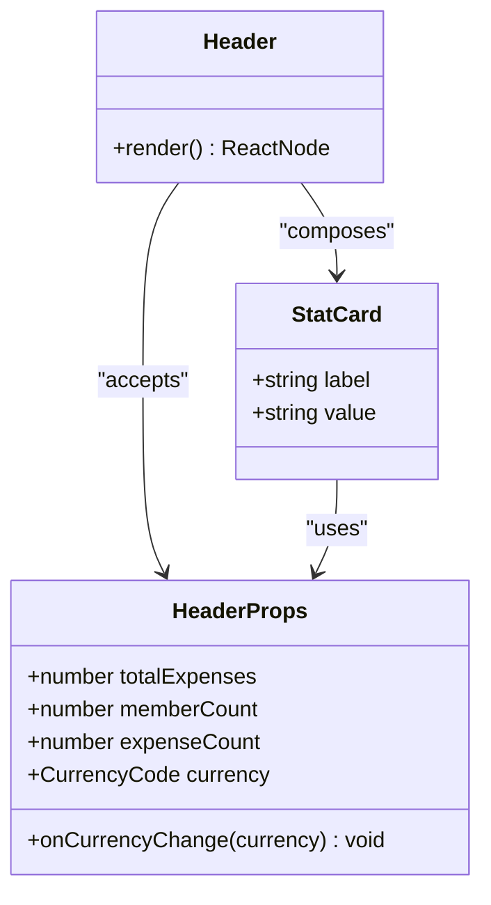
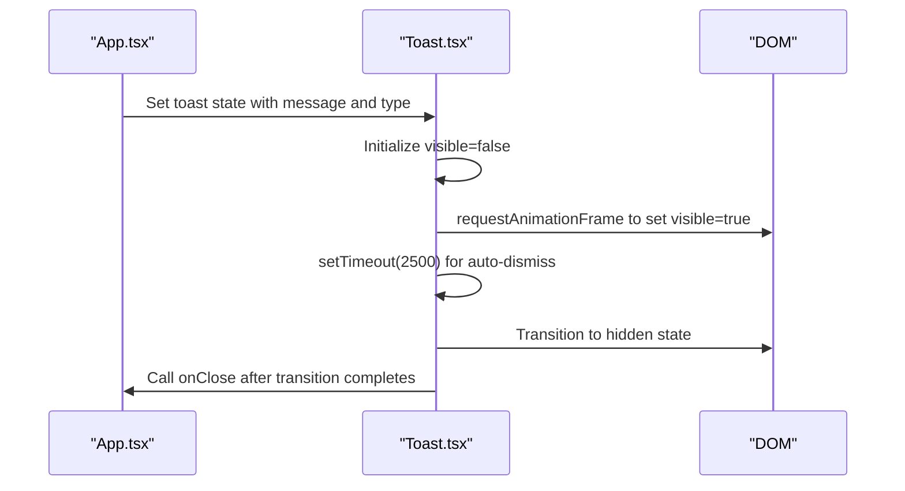
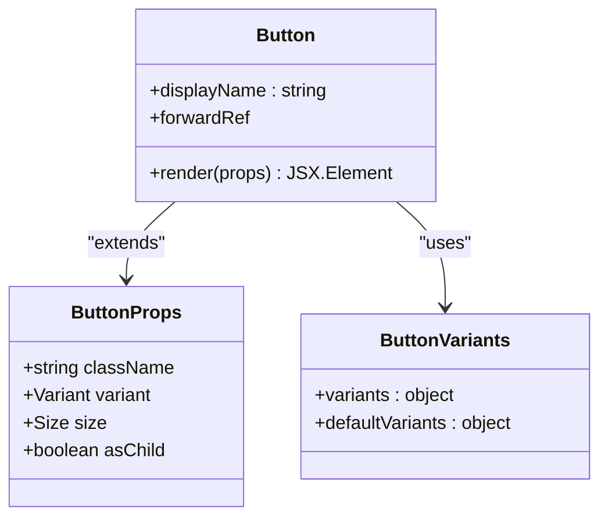
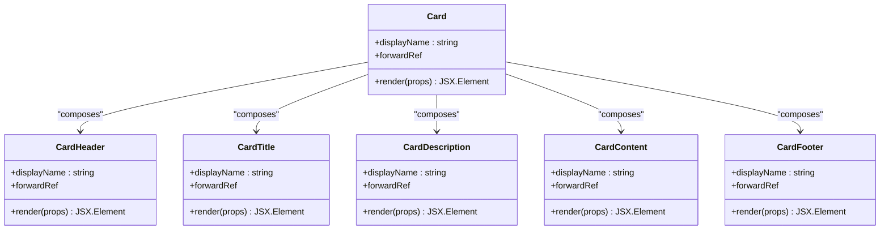
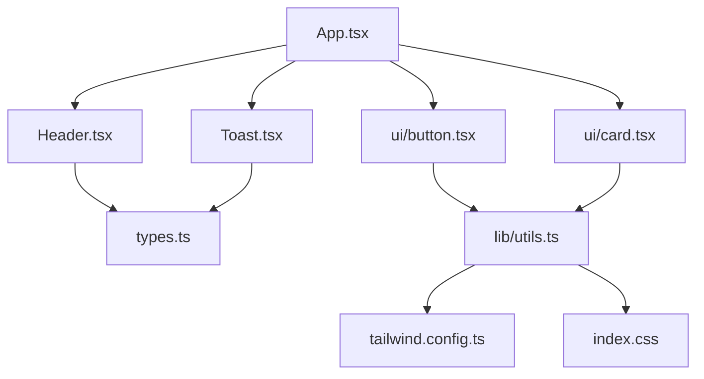

# User Interface Components

<cite>
**Referenced Files in This Document**
- [Header.tsx](file://travel-splitter/src/components/Header.tsx)
- [Toast.tsx](file://travel-splitter/src/components/Toast.tsx)
- [button.tsx](file://travel-splitter/src/components/ui/button.tsx)
- [card.tsx](file://travel-splitter/src/components/ui/card.tsx)
- [utils.ts](file://travel-splitter/src/lib/utils.ts)
- [App.tsx](file://travel-splitter/src/App.tsx)
- [types.ts](file://travel-splitter/src/types.ts)
- [tailwind.config.ts](file://travel-splitter/tailwind.config.ts)
- [index.css](file://travel-splitter/src/index.css)
</cite>

## Table of Contents
1. [Introduction](#introduction)
2. [Project Structure](#project-structure)
3. [Core Components](#core-components)
4. [Architecture Overview](#architecture-overview)
5. [Detailed Component Analysis](#detailed-component-analysis)
6. [Dependency Analysis](#dependency-analysis)
7. [Performance Considerations](#performance-considerations)
8. [Accessibility and Responsive Design](#accessibility-and-responsive-design)
9. [Animation and Motion](#animation-and-motion)
10. [Utility Functions and Design System](#utility-functions-and-design-system)
11. [Best Practices and Extension Guidelines](#best-practices-and-extension-guidelines)
12. [Troubleshooting Guide](#troubleshooting-guide)
13. [Conclusion](#conclusion)

## Introduction
This document provides comprehensive documentation for the User Interface Components system in the travel-splitter application. It focuses on three core areas:
- Header component: Navigation and branding with dynamic statistics and currency switching
- Toast notification system: User feedback with animations and dismiss controls
- Reusable UI primitives: Button and Card components built with Tailwind CSS utilities and a consistent design system

The documentation explains component composition patterns, prop interfaces, styling approaches, responsive design considerations, accessibility features, animation implementations, and utility functions that support component styling. It also outlines best practices for extending the component library while maintaining design consistency.

## Project Structure
The UI components are organized under the src/components directory, with dedicated subdirectories for primitive components. The main application orchestrates these components and manages global state and styling.

**Diagram sources**
- [App.tsx:58-228](file://travel-splitter/src/App.tsx#L58-L228)
- [Header.tsx:12-78](file://travel-splitter/src/components/Header.tsx#L12-L78)
- [Toast.tsx:10-43](file://travel-splitter/src/components/Toast.tsx#L10-L43)
- [button.tsx:1-54](file://travel-splitter/src/components/ui/button.tsx#L1-L54)
- [card.tsx:1-79](file://travel-splitter/src/components/ui/card.tsx#L1-L79)
- [utils.ts:1-7](file://travel-splitter/src/lib/utils.ts#L1-L7)
- [types.ts:1-97](file://travel-splitter/src/types.ts#L1-L97)
- [tailwind.config.ts:1-118](file://travel-splitter/tailwind.config.ts#L1-L118)
- [index.css:1-114](file://travel-splitter/src/index.css#L1-L114)

**Section sources**
- [App.tsx:58-228](file://travel-splitter/src/App.tsx#L58-L228)
- [Header.tsx:12-78](file://travel-splitter/src/components/Header.tsx#L12-L78)
- [Toast.tsx:10-43](file://travel-splitter/src/components/Toast.tsx#L10-L43)
- [button.tsx:1-54](file://travel-splitter/src/components/ui/button.tsx#L1-L54)
- [card.tsx:1-79](file://travel-splitter/src/components/ui/card.tsx#L1-L79)
- [utils.ts:1-7](file://travel-splitter/src/lib/utils.ts#L1-L7)
- [types.ts:1-97](file://travel-splitter/src/types.ts#L1-L97)
- [tailwind.config.ts:1-118](file://travel-splitter/tailwind.config.ts#L1-L118)
- [index.css:1-114](file://travel-splitter/src/index.css#L1-L114)

## Core Components
This section documents the three primary UI systems and their roles within the application.

### Header Component
The Header component serves as the application's branding and navigation hub. It displays:
- Brand identity with a travel-themed logo and tagline
- Currency selection controls for multi-currency support
- Dynamic statistics cards showing total expenses, member count, and expense count
- Background imagery with gradient overlays for visual appeal

Key features:
- Props-driven rendering with typed currency codes
- Interactive currency toggle with visual state indicators
- Statistic cards with localized money formatting
- Responsive layout adjustments for mobile and tablet screens

**Section sources**
- [Header.tsx:4-10](file://travel-splitter/src/components/Header.tsx#L4-L10)
- [Header.tsx:12-78](file://travel-splitter/src/components/Header.tsx#L12-L78)
- [Header.tsx:81-92](file://travel-splitter/src/components/Header.tsx#L81-L92)
- [types.ts:7-48](file://travel-splitter/src/types.ts#L7-L48)

### Toast Notification System
The Toast component provides non-blocking user feedback with:
- Animated entrance and exit transitions
- Type-specific styling (success/error)
- Auto-dismiss after a timeout period
- Manual dismissal option
- Icon indicators for feedback types

Implementation highlights:
- State management with visibility control
- Animation orchestration using CSS transforms and opacity
- Timeout-based lifecycle management
- Accessible close button with hover states

**Section sources**
- [Toast.tsx:4-8](file://travel-splitter/src/components/Toast.tsx#L4-L8)
- [Toast.tsx:10-43](file://travel-splitter/src/components/Toast.tsx#L10-L43)

### Reusable UI Primitives
The primitive components form the foundation of the design system:
- Button: Variants and sizes with consistent focus states and disabled handling
- Card: Semantic composition with header, title, description, content, and footer slots

Both components leverage Tailwind CSS utilities and a centralized utility function for class merging.

**Section sources**
- [button.tsx:5-32](file://travel-splitter/src/components/ui/button.tsx#L5-L32)
- [button.tsx:34-51](file://travel-splitter/src/components/ui/button.tsx#L34-L51)
- [card.tsx:4-78](file://travel-splitter/src/components/ui/card.tsx#L4-L78)
- [utils.ts:4-6](file://travel-splitter/src/lib/utils.ts#L4-L6)

## Architecture Overview
The UI components integrate with the main application through props and state management. The application maintains global state for members, expenses, currency, and toast notifications, passing relevant data down to components.

**Diagram sources**
- [App.tsx:163-228](file://travel-splitter/src/App.tsx#L163-L228)
- [Header.tsx:12-78](file://travel-splitter/src/components/Header.tsx#L12-L78)
- [Toast.tsx:10-43](file://travel-splitter/src/components/Toast.tsx#L10-L43)
- [button.tsx:40-50](file://travel-splitter/src/components/ui/button.tsx#L40-L50)
- [types.ts:17-48](file://travel-splitter/src/types.ts#L17-L48)

**Section sources**
- [App.tsx:58-228](file://travel-splitter/src/App.tsx#L58-L228)
- [Header.tsx:12-78](file://travel-splitter/src/components/Header.tsx#L12-L78)
- [Toast.tsx:10-43](file://travel-splitter/src/components/Toast.tsx#L10-L43)
- [button.tsx:40-50](file://travel-splitter/src/components/ui/button.tsx#L40-L50)
- [types.ts:17-48](file://travel-splitter/src/types.ts#L17-L48)

## Detailed Component Analysis

### Header Component Analysis
The Header component demonstrates composition patterns with internal helper components and external type utilities.

**Diagram sources**
- [Header.tsx:4-10](file://travel-splitter/src/components/Header.tsx#L4-L10)
- [Header.tsx:81-92](file://travel-splitter/src/components/Header.tsx#L81-L92)

Key implementation patterns:
- Composition with internal StatCard component
- Currency toggle using Object.keys iteration over CurrencyCode keys
- Money formatting through external utility functions
- Responsive spacing and typography scaling

**Section sources**
- [Header.tsx:4-10](file://travel-splitter/src/components/Header.tsx#L4-L10)
- [Header.tsx:12-78](file://travel-splitter/src/components/Header.tsx#L12-L78)
- [Header.tsx:81-92](file://travel-splitter/src/components/Header.tsx#L81-L92)
- [types.ts:17-48](file://travel-splitter/src/types.ts#L17-L48)

### Toast Component Analysis
The Toast component implements a controlled animation lifecycle with state management.

**Diagram sources**
- [App.tsx:71-76](file://travel-splitter/src/App.tsx#L71-L76)
- [Toast.tsx:10-43](file://travel-splitter/src/components/Toast.tsx#L10-L43)

Animation and timing:
- Smooth opacity and transform transitions
- 2.5-second display duration with 300ms fade-out delay
- Icon differentiation between success and error states

**Section sources**
- [Toast.tsx:10-43](file://travel-splitter/src/components/Toast.tsx#L10-L43)
- [App.tsx:71-76](file://travel-splitter/src/App.tsx#L71-L76)

### Button Component Analysis
The Button component uses the class-variance-authority library to define variant and size combinations with consistent focus and disabled states.

**Diagram sources**
- [button.tsx:34-38](file://travel-splitter/src/components/ui/button.tsx#L34-L38)
- [button.tsx:5-32](file://travel-splitter/src/components/ui/button.tsx#L5-L32)
- [button.tsx:40-50](file://travel-splitter/src/components/ui/button.tsx#L40-L50)

Design system integration:
- Consistent ring focus styles and disabled state handling
- Variant-based color schemes aligned with theme tokens
- Size presets for uniform spacing and proportions

**Section sources**
- [button.tsx:5-32](file://travel-splitter/src/components/ui/button.tsx#L5-L32)
- [button.tsx:34-51](file://travel-splitter/src/components/ui/button.tsx#L34-L51)
- [utils.ts:4-6](file://travel-splitter/src/lib/utils.ts#L4-L6)

### Card Component Analysis
The Card component provides a semantic composition pattern with multiple sub-components for structured layouts.

**Diagram sources**
- [card.tsx:4-17](file://travel-splitter/src/components/ui/card.tsx#L4-L17)
- [card.tsx:19-29](file://travel-splitter/src/components/ui/card.tsx#L19-L29)
- [card.tsx:31-44](file://travel-splitter/src/components/ui/card.tsx#L31-L44)
- [card.tsx:46-56](file://travel-splitter/src/components/ui/card.tsx#L46-L56)
- [card.tsx:58-76](file://travel-splitter/src/components/ui/card.tsx#L58-L76)

Layout and typography:
- Consistent spacing and typography scales
- Semantic heading levels for accessibility
- Flexible content containers for various use cases

**Section sources**
- [card.tsx:4-78](file://travel-splitter/src/components/ui/card.tsx#L4-L78)

## Dependency Analysis
The UI components rely on a cohesive dependency chain connecting application state, utilities, and styling.

**Diagram sources**
- [App.tsx:1-17](file://travel-splitter/src/App.tsx#L1-L17)
- [Header.tsx:1-2](file://travel-splitter/src/components/Header.tsx#L1-L2)
- [Toast.tsx:1-2](file://travel-splitter/src/components/Toast.tsx#L1-L2)
- [button.tsx:1-3](file://travel-splitter/src/components/ui/button.tsx#L1-L3)
- [card.tsx:1-2](file://travel-splitter/src/components/ui/card.tsx#L1-L2)
- [utils.ts:1-2](file://travel-splitter/src/lib/utils.ts#L1-L2)
- [tailwind.config.ts:1-118](file://travel-splitter/tailwind.config.ts#L1-L118)
- [index.css:1-114](file://travel-splitter/src/index.css#L1-L114)

Key dependency patterns:
- Header and Toast depend on shared type definitions for currency and formatting
- Button and Card depend on the centralized cn utility for class merging
- All components inherit styling from the global Tailwind configuration and CSS variables

**Section sources**
- [App.tsx:1-17](file://travel-splitter/src/App.tsx#L1-L17)
- [Header.tsx:1-2](file://travel-splitter/src/components/Header.tsx#L1-L2)
- [Toast.tsx:1-2](file://travel-splitter/src/components/Toast.tsx#L1-L2)
- [button.tsx:1-3](file://travel-splitter/src/components/ui/button.tsx#L1-L3)
- [card.tsx:1-2](file://travel-splitter/src/components/ui/card.tsx#L1-L2)
- [utils.ts:1-2](file://travel-splitter/src/lib/utils.ts#L1-L2)
- [tailwind.config.ts:1-118](file://travel-splitter/tailwind.config.ts#L1-L118)
- [index.css:1-114](file://travel-splitter/src/index.css#L1-L114)

## Performance Considerations
- Memoization: The application uses useMemo for derived calculations (total expenses, settlements) to prevent unnecessary re-renders.
- Local storage persistence: Data is persisted to localStorage to avoid expensive recomputation on reload.
- Animation performance: CSS transitions and transforms are used for smooth animations without triggering layout thrashing.
- Lazy loading: Header background images use lazy loading to improve initial page load performance.

## Accessibility and Responsive Design
Responsive design considerations:
- Mobile-first approach with breakpoint-aware spacing and typography
- Flexible grid layouts for statistics cards
- Adaptive button sizing and touch targets
- Proper contrast ratios maintained through theme tokens

Accessibility features:
- Focus management with ring focus styles on interactive elements
- Semantic HTML structure with proper heading hierarchy
- Sufficient color contrast for text and interactive elements
- Keyboard navigable components with appropriate focus states

## Animation and Motion
The application implements several motion patterns:
- Entrance animations for modals and forms using fade-in and slide-in effects
- Hover states with subtle shadows and transforms for interactive elements
- Smooth transitions for state changes and component mounting
- Pulse animations for emphasis and visual interest

Animation configuration is centralized in the Tailwind configuration, enabling consistent motion across components.

**Section sources**
- [tailwind.config.ts:78-111](file://travel-splitter/tailwind.config.ts#L78-L111)
- [index.css:73-97](file://travel-splitter/src/index.css#L73-L97)

## Utility Functions and Design System
The design system is built around several key utilities and configurations:

### cn Utility Function
The cn function combines and merges Tailwind CSS classes using clsx and tailwind-merge, preventing conflicting classes and ensuring predictable styling.

### Theme Tokens and Variables
The CSS variables define a cohesive color palette and gradient scheme:
- Warm Japanese-inspired color scheme with terracotta and matcha accents
- Gradient backgrounds for visual depth
- Shadow configurations for layered depth perception
- Transition timing functions for smooth motion

### Tailwind Configuration
The Tailwind configuration extends the base theme with:
- Custom color tokens mapped to CSS variables
- Border radius presets for consistent corner radii
- Box shadow presets for consistent elevation
- Keyframe animations for reusable motion effects
- Animation utilities for component-level motion

**Section sources**
- [utils.ts:4-6](file://travel-splitter/src/lib/utils.ts#L4-L6)
- [index.css:6-61](file://travel-splitter/src/index.css#L6-L61)
- [tailwind.config.ts:18-111](file://travel-splitter/tailwind.config.ts#L18-L111)

## Best Practices and Extension Guidelines
Guidelines for extending the component library:

### Component Composition
- Prefer composition over inheritance; use children props and render props patterns
- Maintain consistent prop interfaces across similar components
- Use forwardRef for components that need to expose DOM references

### Styling Consistency
- Always use the cn utility for class merging to prevent conflicts
- Leverage theme tokens and CSS variables for consistent styling
- Follow established variant and size patterns for new components

### State Management
- Keep components stateless when possible; pass data and callbacks via props
- Centralize shared state in the application layer
- Use memoization for expensive computations

### Accessibility
- Ensure keyboard navigation support
- Maintain sufficient color contrast
- Use semantic HTML elements appropriately
- Provide focus management for interactive components

### Performance
- Use React.memo for components with expensive renders
- Implement virtualization for large lists
- Optimize animations to use transform and opacity properties

## Troubleshooting Guide
Common issues and solutions:

### Button Variant Issues
Problem: Button variants not applying correctly
Solution: Verify variant and size combinations match the defined variants in button.tsx

### Toast Animation Problems
Problem: Toast does not animate or dismiss properly
Solution: Check that the visible state transitions and timeout handlers are functioning correctly

### Header Currency Display
Problem: Currency formatting incorrect
Solution: Verify currency conversion rates and formatting functions in types.ts

### Styling Conflicts
Problem: Unexpected styling overrides
Solution: Use the cn utility to merge classes and avoid inline styles that conflict with Tailwind utilities

**Section sources**
- [button.tsx:5-32](file://travel-splitter/src/components/ui/button.tsx#L5-L32)
- [Toast.tsx:10-43](file://travel-splitter/src/components/Toast.tsx#L10-L43)
- [types.ts:25-48](file://travel-splitter/src/types.ts#L25-L48)
- [utils.ts:4-6](file://travel-splitter/src/lib/utils.ts#L4-L6)

## Conclusion
The User Interface Components system demonstrates a well-architected approach to building reusable, accessible, and performant UI elements. The Header component effectively communicates branding and provides essential navigation controls, while the Toast system delivers timely user feedback through smooth animations. The Button and Card primitives establish a consistent design system that can be extended safely.

The integration with the application state ensures that components remain focused on presentation while delegating data management to higher-order components. The centralized utility functions and Tailwind configuration provide a solid foundation for maintaining design consistency across the application.

Future enhancements could include adding more sophisticated animation controls, expanding the component library with additional primitives, and implementing design system documentation with visual examples and usage guidelines.