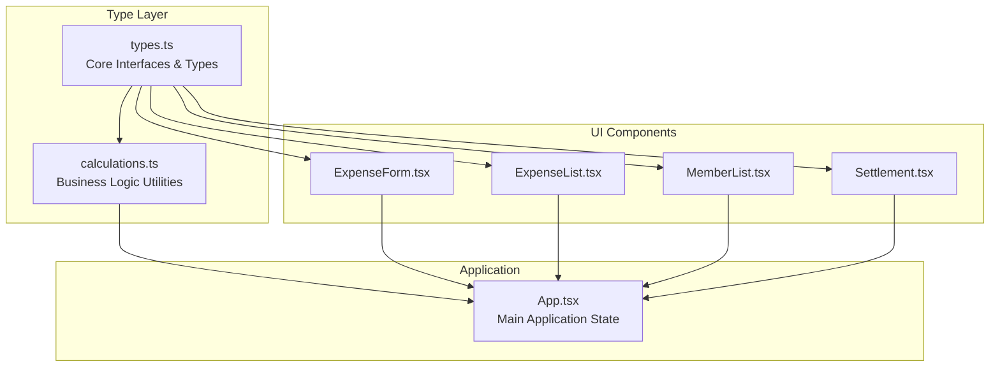
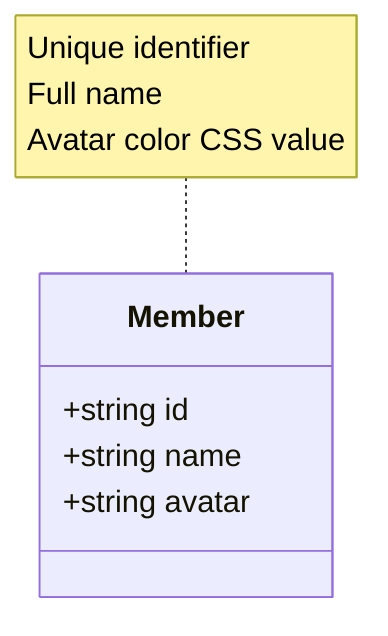
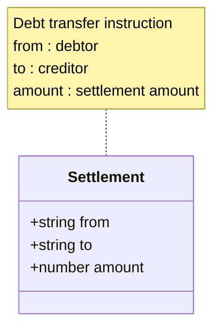
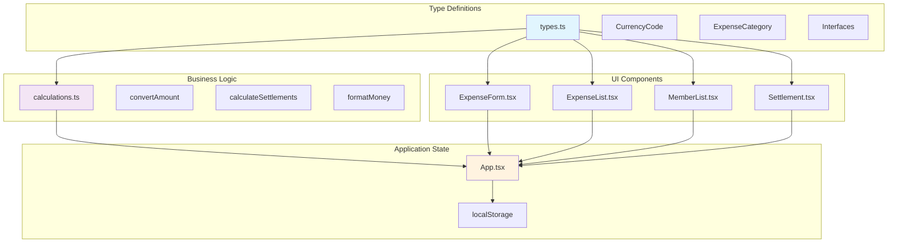
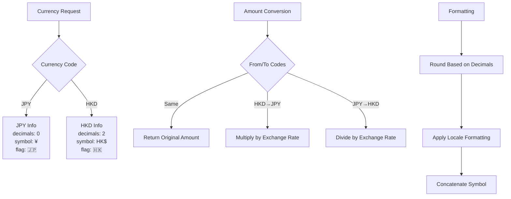
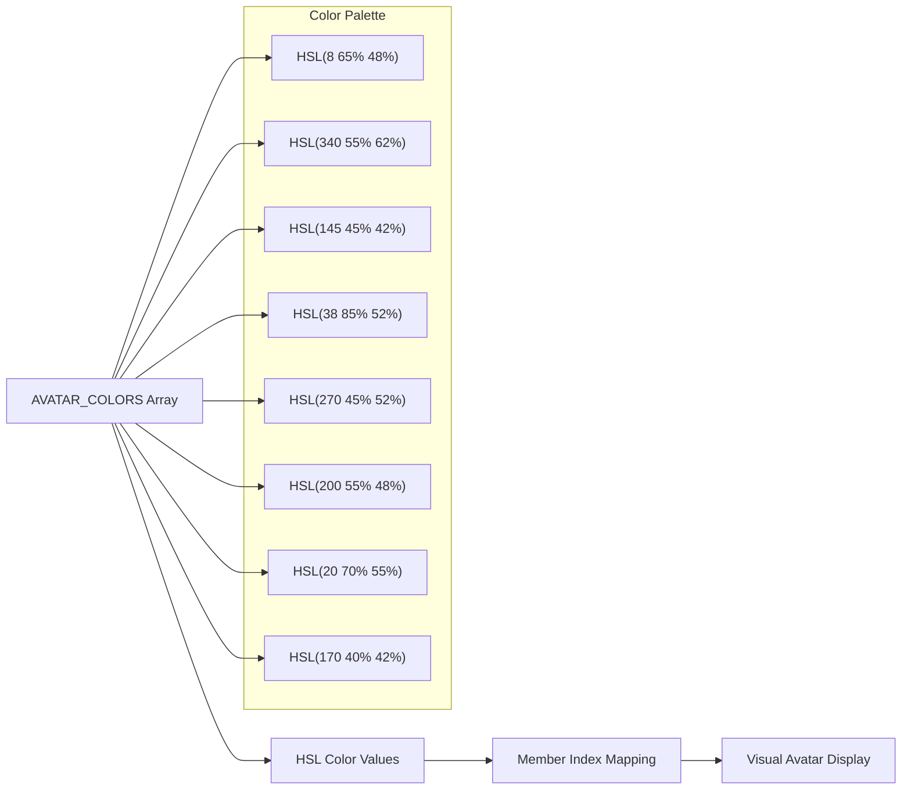
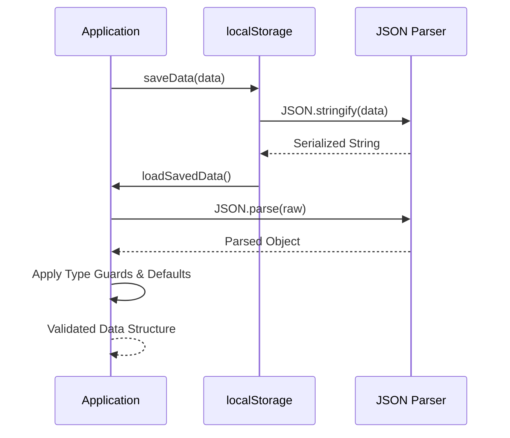
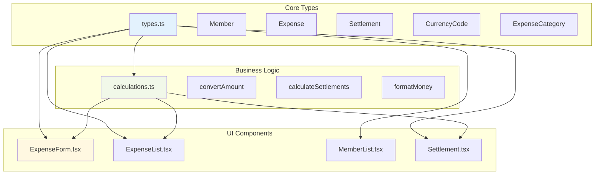

# Data Models & Type System

<cite>
**Referenced Files in This Document**
- [types.ts](file://travel-splitter/src/types.ts)
- [calculations.ts](file://travel-splitter/src/lib/calculations.ts)
- [App.tsx](file://travel-splitter/src/App.tsx)
- [ExpenseForm.tsx](file://travel-splitter/src/components/ExpenseForm.tsx)
- [ExpenseList.tsx](file://travel-splitter/src/components/ExpenseList.tsx)
- [MemberList.tsx](file://travel-splitter/src/components/MemberList.tsx)
- [Settlement.tsx](file://travel-splitter/src/components/Settlement.tsx)
- [package.json](file://travel-splitter/package.json)
</cite>

## Table of Contents
1. [Introduction](#introduction)
2. [Project Structure](#project-structure)
3. [Core Components](#core-components)
4. [Architecture Overview](#architecture-overview)
5. [Detailed Component Analysis](#detailed-component-analysis)
6. [Dependency Analysis](#dependency-analysis)
7. [Performance Considerations](#performance-considerations)
8. [Troubleshooting Guide](#troubleshooting-guide)
9. [Conclusion](#conclusion)

## Introduction
This document provides comprehensive data model documentation for the Travel Splitter application's TypeScript type system. It details the core data structures, currency handling, category classification, and avatar color scheme used throughout the application. The documentation covers type safety mechanisms, validation rules, serialization patterns, and type transformation utilities that ensure data integrity and consistency across the application.

## Project Structure
The Travel Splitter application follows a modular architecture with distinct layers for types, business logic, and UI components. The type system is centralized in a dedicated module that defines interfaces, enums, and utility functions used throughout the application.



**Diagram sources**
- [types.ts:1-97](file://travel-splitter/src/types.ts#L1-L97)
- [calculations.ts:1-85](file://travel-splitter/src/lib/calculations.ts#L1-L85)
- [App.tsx:1-231](file://travel-splitter/src/App.tsx#L1-L231)

**Section sources**
- [types.ts:1-97](file://travel-splitter/src/types.ts#L1-L97)
- [package.json:1-32](file://travel-splitter/package.json#L1-L32)

## Core Components

### Member Interface
The Member interface represents travel companions with essential identification properties:



**Diagram sources**
- [types.ts:1-5](file://travel-splitter/src/types.ts#L1-L5)

Key characteristics:
- **id**: Unique string identifier generated using cryptographic random generation
- **name**: Full name of the travel companion
- **avatar**: CSS color value used for visual identification

**Section sources**
- [types.ts:1-5](file://travel-splitter/src/types.ts#L1-L5)
- [App.tsx:80-84](file://travel-splitter/src/App.tsx#L80-L84)

### Expense Interface
The Expense interface captures spending records with comprehensive financial and categorical information:

```mermaid
classDiagram
class Expense {
+string id
+string description
+number amount
+CurrencyCode currency
+string paidBy
+string[] splitAmong
+ExpenseCategory category
+string date
}
class CurrencyCode {
<<enumeration>>
"JPY"
"HKD"
}
class ExpenseCategory {
<<enumeration>>
"food"
"transport"
"hotel"
"ticket"
"shopping"
"other"
}
Expense --> CurrencyCode
Expense --> ExpenseCategory
```

**Diagram sources**
- [types.ts:50-59](file://travel-splitter/src/types.ts#L50-L59)
- [types.ts:7-7](file://travel-splitter/src/types.ts#L7-L7)
- [types.ts:61-68](file://travel-splitter/src/types.ts#L61-L68)

Core fields and constraints:
- **id**: Generated unique identifier
- **description**: Non-empty string describing the expense
- **amount**: Positive numeric value representing the cost
- **currency**: Strictly one of supported currency codes
- **paidBy**: Identifier of the member who paid
- **splitAmong**: Array of member identifiers sharing the cost
- **category**: One of six predefined expense categories
- **date**: ISO string format timestamp

**Section sources**
- [types.ts:50-59](file://travel-splitter/src/types.ts#L50-L59)
- [ExpenseForm.tsx:75-89](file://travel-splitter/src/components/ExpenseForm.tsx#L75-L89)

### Settlement Interface
The Settlement interface represents debt resolution results between members:



**Diagram sources**
- [types.ts:69-73](file://travel-splitter/src/types.ts#L69-L73)

Properties:
- **from**: Debtor member identifier
- **to**: Creditor member identifier  
- **amount**: Settlement amount in display currency

**Section sources**
- [types.ts:69-73](file://travel-splitter/src/types.ts#L69-L73)
- [calculations.ts:4-70](file://travel-splitter/src/lib/calculations.ts#L4-L70)

## Architecture Overview

The type system architecture ensures strong typing across all application layers through centralized definitions and consistent usage patterns:



**Diagram sources**
- [types.ts:1-97](file://travel-splitter/src/types.ts#L1-L97)
- [calculations.ts:1-85](file://travel-splitter/src/lib/calculations.ts#L1-L85)
- [App.tsx:18-51](file://travel-splitter/src/App.tsx#L18-L51)

## Detailed Component Analysis

### Currency Handling System

The currency system provides comprehensive support for Japanese Yen (JPY) and Hong Kong Dollar (HKD) with robust conversion and formatting capabilities:



**Diagram sources**
- [types.ts:7-23](file://travel-splitter/src/types.ts#L7-L23)
- [types.ts:35-48](file://travel-splitter/src/types.ts#L35-L48)

#### Currency Configuration
The system maintains detailed currency metadata:
- **JPY**: Zero decimal places, Japanese yen symbol, Japan flag emoji
- **HKD**: Two decimal places, Hong Kong dollar symbol, Hong Kong flag emoji
- **Exchange Rate**: 1 HKD ≈ 19.2 JPY for approximate conversions

#### Conversion Utilities
The `convertAmount` function handles bidirectional currency conversion with type-safe exchange rates and preserves precision for different decimal requirements.

#### Formatting Functions
The `formatMoney` function provides localized currency formatting with appropriate decimal handling and symbol placement.

**Section sources**
- [types.ts:7-23](file://travel-splitter/src/types.ts#L7-L23)
- [types.ts:35-48](file://travel-splitter/src/types.ts#L35-L48)
- [ExpenseList.tsx:46-49](file://travel-splitter/src/components/ExpenseList.tsx#L46-L49)

### Category Enumeration System

The expense categorization system provides structured classification for financial tracking:

```mermaid
classDiagram
class ExpenseCategory {
<<enumeration>>
"food"
"transport"
"hotel"
"ticket"
"shopping"
"other"
}
class CategoryConfig {
+Record~ExpenseCategory, Config~
+label : string
+icon : string
}
class Icons {
+UtensilsCrossed
+Car
+Hotel
+Ticket
+ShoppingBag
+MoreHorizontal
}
CategoryConfig --> ExpenseCategory
CategoryConfig --> Icons
```

**Diagram sources**
- [types.ts:61-68](file://travel-splitter/src/types.ts#L61-L68)
- [types.ts:75-85](file://travel-splitter/src/types.ts#L75-L85)

Category definitions and their associated UI elements:
- **food**: Meal expenses with utensil icon
- **transport**: Transportation costs with car icon
- **hotel**: Accommodation expenses with hotel icon
- **ticket**: Admission fees with ticket icon
- **shopping**: Retail purchases with shopping bag icon
- **other**: Miscellaneous expenses with ellipsis icon

**Section sources**
- [types.ts:61-68](file://travel-splitter/src/types.ts#L61-L68)
- [types.ts:75-85](file://travel-splitter/src/types.ts#L75-L85)
- [ExpenseForm.tsx:17-24](file://travel-splitter/src/components/ExpenseForm.tsx#L17-L24)

### Avatar Color Scheme

The avatar system provides visual identification through a carefully curated palette of 8 distinct colors:



**Diagram sources**
- [types.ts:87-96](file://travel-splitter/src/types.ts#L87-L96)

The color scheme ensures:
- **Distinctiveness**: 8 different colors prevent visual confusion
- **Accessibility**: Sufficient contrast ratios for readability
- **Consistency**: Fixed palette guarantees uniform appearance
- **Scalability**: Modular arithmetic ensures consistent assignment

**Section sources**
- [types.ts:87-96](file://travel-splitter/src/types.ts#L87-L96)
- [MemberList.tsx:112](file://travel-splitter/src/components/MemberList.tsx#L112)
- [ExpenseList.tsx:90-94](file://travel-splitter/src/components/ExpenseList.tsx#L90-L94)

### Type Safety Mechanisms

The application implements comprehensive type safety through several mechanisms:

#### Strict Enumerations
- Currency codes are strictly typed with union types
- Expense categories use discriminated unions
- No implicit string coercion allowed

#### Validation Rules
- Expense amounts validated as positive numbers
- Descriptions require non-empty strings
- Member arrays validated for emptiness
- Currency conversion prevents invalid operations

#### Serialization Patterns
- Local storage uses JSON serialization with type guards
- Default value handling for missing properties
- Type assertion patterns for runtime data validation

**Section sources**
- [ExpenseForm.tsx:75-89](file://travel-splitter/src/components/ExpenseForm.tsx#L75-L89)
- [App.tsx:26-47](file://travel-splitter/src/App.tsx#L26-L47)

### Data Integrity Constraints

The type system enforces several critical integrity constraints:

#### Required Field Validation
- All interfaces require mandatory fields
- Arrays validated for non-empty membership
- Identifiers must be present and unique

#### Range and Format Constraints
- Amounts must be greater than zero
- Dates must be valid ISO strings
- Categories must match predefined enumerations
- Currency codes must be supported values

#### Cross-Field Dependencies
- `paidBy` must reference existing member
- `splitAmong` must contain valid member identifiers
- `date` field automatically generated on creation

**Section sources**
- [ExpenseForm.tsx:75-89](file://travel-splitter/src/components/ExpenseForm.tsx#L75-L89)
- [App.tsx:119-136](file://travel-splitter/src/App.tsx#L119-L136)

### Serialization and Deserialization Patterns

The application handles data persistence through structured serialization:



**Diagram sources**
- [App.tsx:49-51](file://travel-splitter/src/App.tsx#L49-L51)
- [App.tsx:26-47](file://travel-splitter/src/App.tsx#L26-L47)

#### Persistence Strategy
- Complete app state serialized to JSON
- Default currency fallback to JPY
- Missing property handling with defaults
- Type assertion patterns for runtime validation

#### Type Coercion Handling
- Amount parsing with parseFloat validation
- Currency code normalization
- Date string validation and conversion
- Array membership verification

**Section sources**
- [App.tsx:49-51](file://travel-splitter/src/App.tsx#L49-L51)
- [App.tsx:26-47](file://travel-splitter/src/App.tsx#L26-L47)

## Dependency Analysis

The type system exhibits well-structured dependencies across the application:



**Diagram sources**
- [types.ts:1-97](file://travel-splitter/src/types.ts#L1-L97)
- [calculations.ts:1-85](file://travel-splitter/src/lib/calculations.ts#L1-L85)
- [ExpenseForm.tsx:14](file://travel-splitter/src/components/ExpenseForm.tsx#L14)

### Coupling Analysis
- **Low Coupling**: Components depend only on type definitions
- **High Cohesion**: Related functionality grouped in single modules
- **Interface Segregation**: Components import only required types

### External Dependencies
- **React**: Component framework with TypeScript support
- **Lucide React**: Icon library with TypeScript definitions
- **Tailwind CSS**: Utility-first CSS framework

**Section sources**
- [package.json:11-30](file://travel-splitter/package.json#L11-L30)

## Performance Considerations

The type system is designed with performance optimization in mind:

### Memory Efficiency
- Immutable data structures prevent unnecessary mutations
- Efficient array operations for member and expense lists
- Minimal object creation during rendering cycles

### Computation Optimization
- Currency conversion cached through constant exchange rates
- Pre-computed category icons reduce runtime computation
- Efficient avatar color mapping using modulo arithmetic

### Rendering Performance
- Memoized calculations prevent redundant computations
- Conditional rendering based on data availability
- Efficient DOM updates through React's virtual DOM

## Troubleshooting Guide

Common type-related issues and their solutions:

### Currency Conversion Errors
**Issue**: Incorrect exchange rate handling
**Solution**: Verify exchange rate constants and conversion logic
**Prevention**: Use strict type checking for currency parameters

### Validation Failures
**Issue**: Expense form validation errors
**Solution**: Check amount parsing and member selection validation
**Prevention**: Implement comprehensive input sanitization

### Serialization Problems
**Issue**: Data corruption during persistence
**Solution**: Validate JSON structure and apply default values
**Prevention**: Use type guards for runtime validation

### Type Assertion Issues
**Issue**: Runtime type mismatches
**Solution**: Review type assertion patterns and error handling
**Prevention**: Implement comprehensive error boundaries

**Section sources**
- [ExpenseForm.tsx:75-89](file://travel-splitter/src/components/ExpenseForm.tsx#L75-L89)
- [App.tsx:26-47](file://travel-splitter/src/App.tsx#L26-L47)

## Conclusion

The Travel Splitter application demonstrates a robust and comprehensive TypeScript type system that ensures data integrity, type safety, and maintainable code architecture. The centralized type definitions provide clear contracts between components while the business logic utilities encapsulate complex financial calculations. The currency handling system offers internationalization support with precise formatting, and the category system enables structured expense tracking. The avatar color scheme provides intuitive visual identification, while the serialization patterns ensure reliable data persistence. Together, these components create a solid foundation for scalable development and reliable user experience.