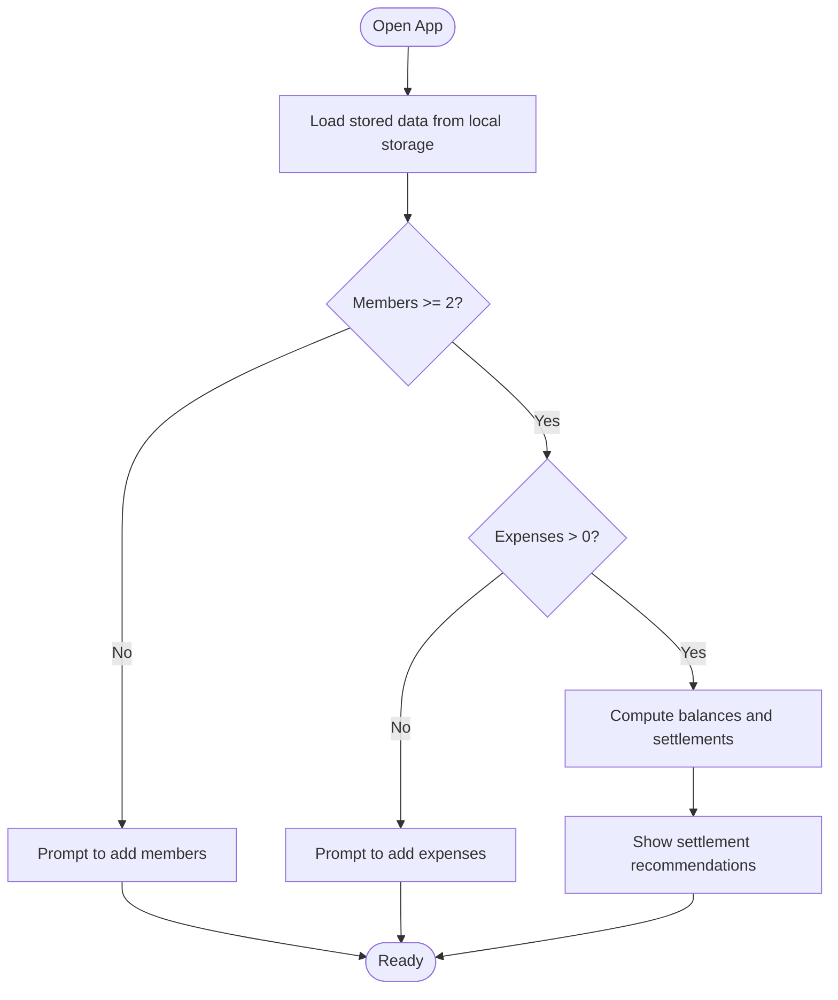

# Getting Started

<cite>
**Referenced Files in This Document**
- [package.json](file://travel-splitter/package.json)
- [vite.config.ts](file://travel-splitter/vite.config.ts)
- [tailwind.config.ts](file://travel-splitter/tailwind.config.ts)
- [tsconfig.json](file://travel-splitter/tsconfig.json)
- [src/main.tsx](file://travel-splitter/src/main.tsx)
- [src/App.tsx](file://travel-splitter/src/App.tsx)
- [src/index.css](file://travel-splitter/src/index.css)
- [src/types.ts](file://travel-splitter/src/types.ts)
- [src/lib/calculations.ts](file://travel-splitter/src/lib/calculations.ts)
- [src/components/Header.tsx](file://travel-splitter/src/components/Header.tsx)
- [src/components/MemberList.tsx](file://travel-splitter/src/components/MemberList.tsx)
- [src/components/ExpenseForm.tsx](file://travel-splitter/src/components/ExpenseForm.tsx)
- [src/components/ExpenseList.tsx](file://travel-splitter/src/components/ExpenseList.tsx)
- [src/components/Settlement.tsx](file://travel-splitter/src/components/Settlement.tsx)
</cite>

## Table of Contents
1. [Introduction](#introduction)
2. [Prerequisites](#prerequisites)
3. [Installation](#installation)
4. [Basic Usage](#basic-usage)
5. [Main Interface Overview](#main-interface-overview)
6. [How It Works](#how-it-works)
7. [Troubleshooting](#troubleshooting)
8. [Next Steps](#next-steps)

## Introduction
Travel Splitter helps you track shared travel expenses and compute fair settlement recommendations. It runs in the browser, stores data locally, and supports multiple expense categories and currencies.

## Prerequisites
- Operating system: Windows, macOS, or Linux
- Web browser: Latest Chrome, Edge, Firefox, or Safari
- Node.js: Version matching the project’s lock file requirements
  - The project uses Vite and TypeScript; ensure your Node.js version is compatible with the pinned toolchain
- Package manager: npm or yarn
  - The project includes a lock file; either npm or yarn can be used, but pick one and stick with it to avoid conflicts

Notes:
- The project uses Vite for dev/build and Tailwind CSS for styling. These tools require a supported Node.js runtime.
- If you encounter permission errors during installation, ensure your user account has write permissions to the project directory.

**Section sources**
- [package.json:1-32](file://travel-splitter/package.json#L1-L32)
- [vite.config.ts:1-13](file://travel-splitter/vite.config.ts#L1-L13)
- [tailwind.config.ts:1-118](file://travel-splitter/tailwind.config.ts#L1-L118)
- [tsconfig.json:1-7](file://travel-splitter/tsconfig.json#L1-L7)

## Installation
Follow these steps to set up the project locally:

1. **Clone the repository**
   - Use your preferred Git client or command line to clone the repository to your machine.

2. **Open the project folder**
   - Navigate into the travel-splitter directory.

3. **Install dependencies**
   - Choose one of the following commands:
     - npm: npm install
     - yarn: yarn install
   - This installs all runtime and development dependencies defined in the project manifest.

4. **Start the development server**
   - Run the development script:
     - npm: npm run dev
     - yarn: yarn dev
   - The app opens automatically in your default browser at the local development URL shown in the terminal.

What you get:
- Live-reload development server
- TypeScript compilation
- Tailwind CSS styling applied

**Section sources**
- [package.json:6-10](file://travel-splitter/package.json#L6-L10)
- [vite.config.ts:5-12](file://travel-splitter/vite.config.ts#L5-L12)
- [src/main.tsx:1-11](file://travel-splitter/src/main.tsx#L1-L11)

## Basic Usage
Complete this quick workflow to get started:

1. **Add travel members**
   - Open the Members section.
   - Enter names and click Add.
   - You need at least two members to enable expense recording and settlement calculation.

2. **Record an expense**
   - Tap the floating “Add Expense” button.
   - Select a category, enter a description and amount, choose who paid, and pick who shares the cost.
   - Submit to add the expense.

3. **View settlement recommendations**
   - Once there are members and expenses, the Settlement section appears.
   - It lists who should pay whom and how much to settle all balances.

4. **Review expense history**
   - Use the Expenses section to see all recorded items, amounts, and who paid.

Screenshot descriptions:
- Members section: A list of avatars and editable names with add/edit/remove controls.
- Expense form: A modal with category chips, amount/currency selector, payer dropdown, split selection, and submit button.
- Settlement section: A scrollable list of transfer instructions with avatars and amounts.
- Expenses section: A list of past expenses with icons, descriptions, totals, and per-person shares.

**Section sources**
- [src/components/MemberList.tsx:14-179](file://travel-splitter/src/components/MemberList.tsx#L14-L179)
- [src/components/ExpenseForm.tsx:49-273](file://travel-splitter/src/components/ExpenseForm.tsx#L49-L273)
- [src/components/Settlement.tsx:11-96](file://travel-splitter/src/components/Settlement.tsx#L11-L96)
- [src/components/ExpenseList.tsx:30-151](file://travel-splitter/src/components/ExpenseList.tsx#L30-L151)
- [src/App.tsx:174-194](file://travel-splitter/src/App.tsx#L174-L194)

## Main Interface Overview
The app is organized into focused sections:

- Header
  - Shows total expenses, member count, expense count, and a currency switcher.
- Members
  - Add/remove/edit members; avatars are auto-assigned.
- Settlement
  - Recommendations for who should pay whom to settle balances.
- Expenses
  - List of recorded expenses with category icons, totals, and per-person shares.
- Floating Add Expense Button
  - Opens the expense entry form when there are at least two members.

UI highlights:
- Consistent color palette and gradients themed to a warm, travel-friendly aesthetic.
- Smooth animations and responsive layout.

**Section sources**
- [src/components/Header.tsx:12-92](file://travel-splitter/src/components/Header.tsx#L12-L92)
- [src/components/MemberList.tsx:58-178](file://travel-splitter/src/components/MemberList.tsx#L58-L178)
- [src/components/Settlement.tsx:23-95](file://travel-splitter/src/components/Settlement.tsx#L23-L95)
- [src/components/ExpenseList.tsx:52-149](file://travel-splitter/src/components/ExpenseList.tsx#L52-L149)
- [src/index.css:5-114](file://travel-splitter/src/index.css#L5-L114)

## How It Works
- Local storage
  - All data is saved in your browser’s local storage under a dedicated key.
- Currency support
  - Supports JPY and HKD with fixed exchange rate conversion for display.
- Settlement algorithm
  - Computes balances per person, then matches debtors with creditors to minimize transaction count.

**Diagram sources**
- [src/App.tsx:26-51](file://travel-splitter/src/App.tsx#L26-L51)
- [src/lib/calculations.ts:4-85](file://travel-splitter/src/lib/calculations.ts#L4-L85)

**Section sources**
- [src/App.tsx:26-51](file://travel-splitter/src/App.tsx#L26-L51)
- [src/lib/calculations.ts:4-85](file://travel-splitter/src/lib/calculations.ts#L4-L85)
- [src/types.ts:7-48](file://travel-splitter/src/types.ts#L7-L48)

## Troubleshooting
Common issues and fixes:

- Cannot start dev server
  - Ensure Node.js is installed and compatible with the project’s toolchain.
  - Clear the node_modules cache and reinstall dependencies if needed.
  - Try running the dev script again.

- Port already in use
  - The dev server typically runs on a default port. Close other apps using that port or configure a different port in your environment.

- Styles not applying
  - Confirm Tailwind is scanning the correct paths and that PostCSS plugins are present.
  - Reinstall dependencies to restore missing build-time packages.

- Unexpected currency behavior
  - The display currency affects how totals and per-person shares are shown.
  - Exchange rates are fixed for demo purposes; amounts are converted for display only.

- Data not persisting
  - The app saves to local storage automatically. If data resets unexpectedly, check browser privacy settings or storage quotas.

- Adding/removing members fails
  - You cannot remove a member if they have related expenses. Remove or reassign those expenses first.

**Section sources**
- [package.json:21-30](file://travel-splitter/package.json#L21-L30)
- [tailwind.config.ts:5-8](file://travel-splitter/tailwind.config.ts#L5-L8)
- [src/App.tsx:91-107](file://travel-splitter/src/App.tsx#L91-L107)

## Next Steps
- Customize the UI
  - Adjust Tailwind theme variables and CSS to match your brand.
- Extend functionality
  - Add new expense categories, export/import data, or integrate real-time collaboration.
- Deploy
  - Build for production using the provided build script and host the static output on your preferred platform.