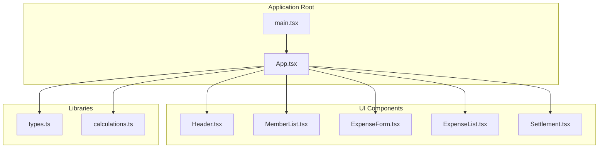
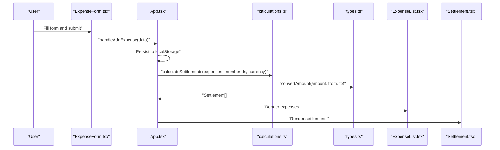
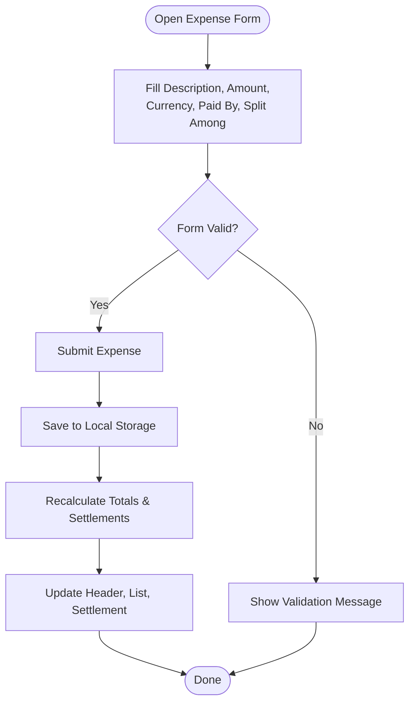
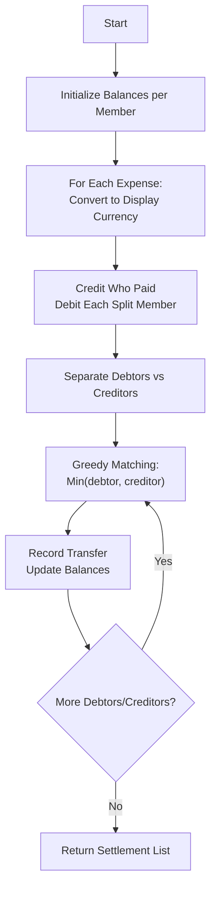
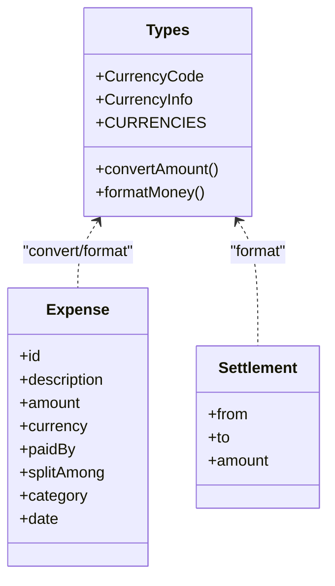
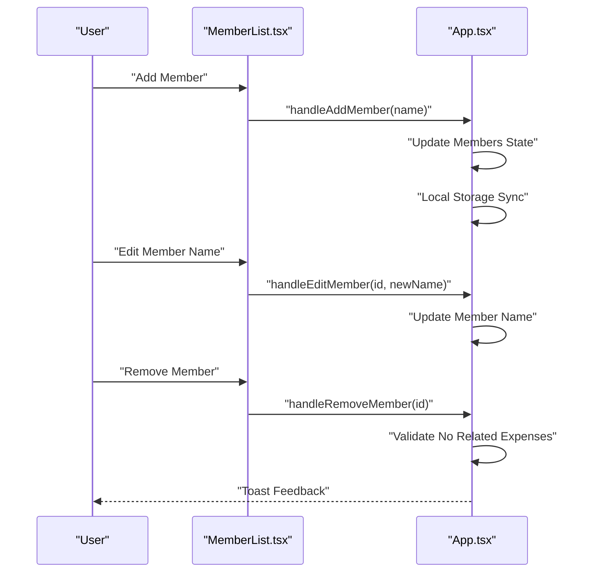
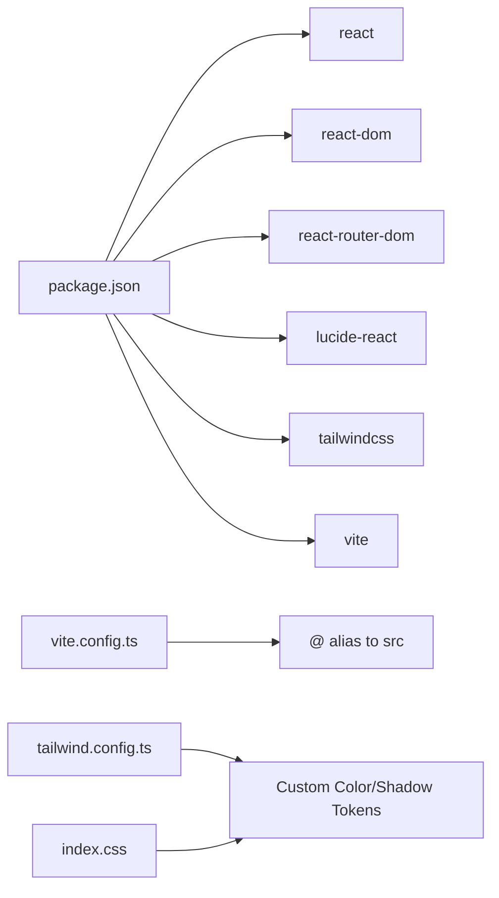

# Project Overview

<cite>
**Referenced Files in This Document**
- [App.tsx](file://src/App.tsx)
- [types.ts](file://src/types.ts)
- [calculations.ts](file://src/lib/calculations.ts)
- [ExpenseForm.tsx](file://src/components/ExpenseForm.tsx)
- [MemberList.tsx](file://src/components/MemberList.tsx)
- [ExpenseList.tsx](file://src/components/ExpenseList.tsx)
- [Settlement.tsx](file://src/components/Settlement.tsx)
- [Header.tsx](file://src/components/Header.tsx)
- [main.tsx](file://src/main.tsx)
- [package.json](file://package.json)
- [vite.config.ts](file://vite.config.ts)
- [tailwind.config.ts](file://tailwind.config.ts)
- [index.css](file://src/index.css)
</cite>

## Table of Contents
1. [Introduction](#introduction)
2. [Project Structure](#project-structure)
3. [Core Components](#core-components)
4. [Architecture Overview](#architecture-overview)
5. [Detailed Component Analysis](#detailed-component-analysis)
6. [Dependency Analysis](#dependency-analysis)
7. [Performance Considerations](#performance-considerations)
8. [Troubleshooting Guide](#troubleshooting-guide)
9. [Conclusion](#conclusion)

## Introduction
Travel Splitter is a travel expense management tool designed to help groups split costs fairly during trips. It simplifies the process of recording shared expenses, managing group members, and calculating automated settlements so everyone pays only what they owe. The application supports multiple currencies and provides a clean, mobile-friendly interface for quick data entry and real-time financial insights.

Key value proposition:
- Fair cost distribution among group members
- Automated settlement computation minimizing the number of transactions
- Multi-currency support with conversion and display flexibility
- Persistent local storage for seamless session continuity
- Intuitive UI enabling fast expense logging and member management

Target audience:
- Travelers and groups sharing expenses (e.g., friends, families, work colleagues)
- Anyone organizing trips where costs are paid by one person but shared by multiple participants

Real-world use cases:
- Group backpacking across countries with mixed currencies
- Family vacations where parents pay for various services and items
- Work-related business trips with shared meal and transport costs

## Project Structure
The application follows a React-based architecture with TypeScript, organized into:
- UI components under src/components
- Shared types and utilities under src/types and src/lib
- Application entry point and rendering in src/main.tsx
- Build configuration via Vite and Tailwind CSS for styling

**Diagram sources**
- [main.tsx:1-11](file://src/main.tsx#L1-L11)
- [App.tsx:1-231](file://src/App.tsx#L1-L231)
- [Header.tsx:1-93](file://src/components/Header.tsx#L1-L93)
- [MemberList.tsx:1-180](file://src/components/MemberList.tsx#L1-L180)
- [ExpenseForm.tsx:1-274](file://src/components/ExpenseForm.tsx#L1-L274)
- [ExpenseList.tsx:1-152](file://src/components/ExpenseList.tsx#L1-L152)
- [Settlement.tsx:1-97](file://src/components/Settlement.tsx#L1-L97)
- [types.ts:1-97](file://src/types.ts#L1-L97)
- [calculations.ts:1-85](file://src/lib/calculations.ts#L1-L85)

**Section sources**
- [main.tsx:1-11](file://src/main.tsx#L1-L11)
- [App.tsx:1-231](file://src/App.tsx#L1-L231)
- [package.json:1-32](file://package.json#L1-L32)
- [vite.config.ts:1-13](file://vite.config.ts#L1-L13)
- [tailwind.config.ts:1-118](file://tailwind.config.ts#L1-L118)
- [index.css:1-114](file://src/index.css#L1-L114)

## Core Components
- Expense tracking: Add, categorize, and review expenses with per-member splits and optional currency conversion.
- Member management: Add/remove/edit group members with visual avatars and inline editing.
- Automated settlement calculation: Compute minimal transfers needed to settle balances across members.
- Multi-currency support: Define display currency, record expenses in different currencies, and show converted totals.

These capabilities are orchestrated by the central App component, which manages state for members, expenses, and display currency, and persists data locally.

**Section sources**
- [App.tsx:58-228](file://src/App.tsx#L58-L228)
- [types.ts:1-97](file://src/types.ts#L1-L97)
- [calculations.ts:1-85](file://src/lib/calculations.ts#L1-L85)

## Architecture Overview
The application uses a unidirectional data flow:
- User inputs are captured by UI components (e.g., ExpenseForm, MemberList).
- App state updates trigger recalculations for totals and settlements.
- Calculations are performed in dedicated libraries (calculations.ts).
- Results are rendered in components (ExpenseList, Settlement, Header).

**Diagram sources**
- [ExpenseForm.tsx:75-89](file://src/components/ExpenseForm.tsx#L75-L89)
- [App.tsx:119-138](file://src/App.tsx#L119-L138)
- [calculations.ts:4-70](file://src/lib/calculations.ts#L4-L70)
- [types.ts:25-33](file://src/types.ts#L25-L33)
- [ExpenseList.tsx:30-152](file://src/components/ExpenseList.tsx#L30-L152)
- [Settlement.tsx:11-97](file://src/components/Settlement.tsx#L11-L97)

## Detailed Component Analysis

### Expense Tracking Workflow
The workflow captures user input, validates it, stores the expense, and updates derived metrics and settlement suggestions.

**Diagram sources**
- [ExpenseForm.tsx:54-89](file://src/components/ExpenseForm.tsx#L54-L89)
- [App.tsx:119-138](file://src/App.tsx#L119-L138)
- [App.tsx:148-161](file://src/App.tsx#L148-L161)

**Section sources**
- [ExpenseForm.tsx:1-274](file://src/components/ExpenseForm.tsx#L1-L274)
- [ExpenseList.tsx:1-152](file://src/components/ExpenseList.tsx#L1-L152)
- [Header.tsx:1-93](file://src/components/Header.tsx#L1-L93)

### Settlement Calculation Logic
Settlements are computed by balancing each member’s “paid” versus “owed” amounts across all expenses, converting to the selected display currency, and generating minimal transfer instructions.

**Diagram sources**
- [calculations.ts:4-70](file://src/lib/calculations.ts#L4-L70)
- [types.ts:25-33](file://src/types.ts#L25-L33)

**Section sources**
- [calculations.ts:1-85](file://src/lib/calculations.ts#L1-L85)
- [Settlement.tsx:1-97](file://src/components/Settlement.tsx#L1-L97)

### Multi-Currency Support
The system defines supported currencies, exchange rates, and formatting helpers. Users can:
- Set a display currency
- Record expenses in different currencies
- See converted totals and per-expense breakdowns

**Diagram sources**
- [types.ts:7-48](file://src/types.ts#L7-L48)
- [types.ts:50-73](file://src/types.ts#L50-L73)

**Section sources**
- [types.ts:1-97](file://src/types.ts#L1-L97)
- [Header.tsx:46-61](file://src/components/Header.tsx#L46-L61)
- [ExpenseList.tsx:46-49](file://src/components/ExpenseList.tsx#L46-L49)

### Member Management
Members can be added, edited inline, and removed. The system prevents removal of members who still have associated expenses.

**Diagram sources**
- [MemberList.tsx:14-179](file://src/components/MemberList.tsx#L14-L179)
- [App.tsx:78-117](file://src/App.tsx#L78-L117)

**Section sources**
- [MemberList.tsx:1-180](file://src/components/MemberList.tsx#L1-L180)
- [App.tsx:78-117](file://src/App.tsx#L78-L117)

## Dependency Analysis
- Runtime dependencies include React, React DOM, routing, icons, and styling utilities.
- Build toolchain uses Vite with React plugin and TypeScript compilation.
- Styling leverages Tailwind CSS with custom theme tokens for a warm, travel-inspired palette.

**Diagram sources**
- [package.json:11-29](file://package.json#L11-L29)
- [vite.config.ts:5-12](file://vite.config.ts#L5-L12)
- [tailwind.config.ts:18-114](file://tailwind.config.ts#L18-L114)
- [index.css:5-61](file://src/index.css#L5-L61)

**Section sources**
- [package.json:1-32](file://package.json#L1-L32)
- [vite.config.ts:1-13](file://vite.config.ts#L1-L13)
- [tailwind.config.ts:1-118](file://tailwind.config.ts#L1-L118)
- [index.css:1-114](file://src/index.css#L1-L114)

## Performance Considerations
- Memoization: Totals and settlements are recomputed using memoized selectors to avoid unnecessary recalculation on minor UI updates.
- Local persistence: Data is saved to localStorage after state changes, ensuring minimal re-computation on reload.
- Rendering: Components render lists efficiently and conditionally show settlement suggestions only when applicable.

[No sources needed since this section provides general guidance]

## Troubleshooting Guide
Common scenarios and resolutions:
- Cannot remove a member: The system prevents removal if the member has related expenses. Delete or adjust those expenses first.
- Settlement shows zero: Occurs when balances are perfectly even; no transfers are needed.
- Currency mismatch: Ensure the correct display currency is selected; per-expense amounts are shown alongside converted totals.

**Section sources**
- [App.tsx:91-107](file://src/App.tsx#L91-L107)
- [Settlement.tsx:29-36](file://src/components/Settlement.tsx#L29-L36)
- [ExpenseList.tsx:105-110](file://src/components/ExpenseList.tsx#L105-L110)

## Conclusion
Travel Splitter streamlines group travel accounting by combining intuitive input forms, robust calculations, and a polished UI. Its multi-currency support and automated settlement engine reduce friction for travelers, while the persistent state ensures continuity across sessions. The modular component architecture and clear separation of concerns make the codebase maintainable and extensible.