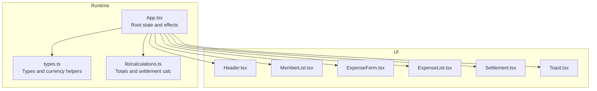
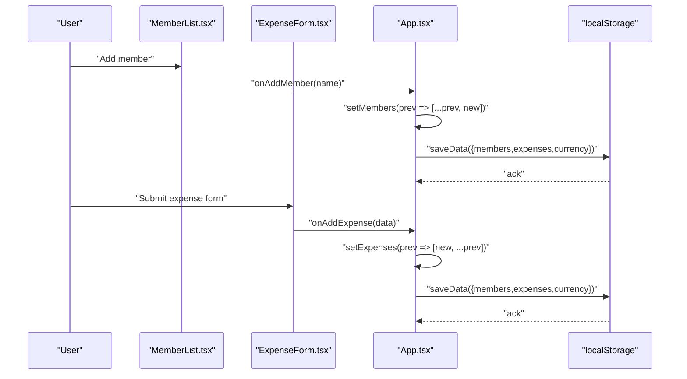
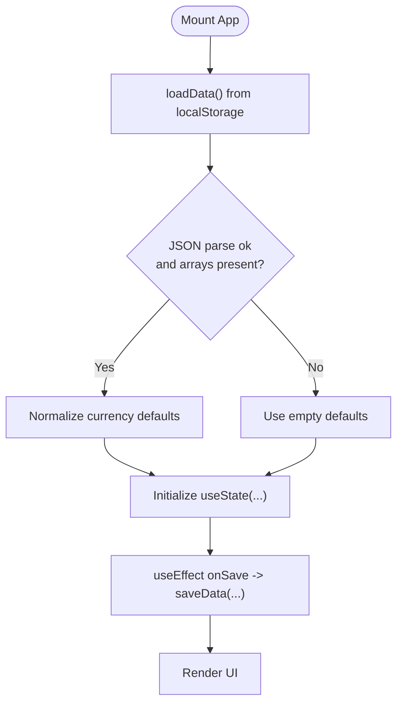
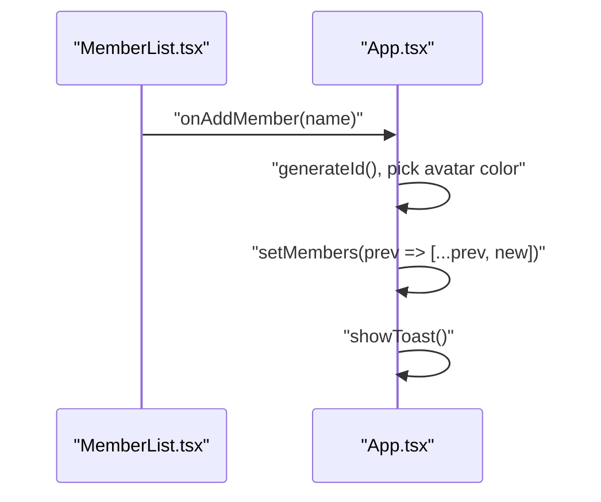
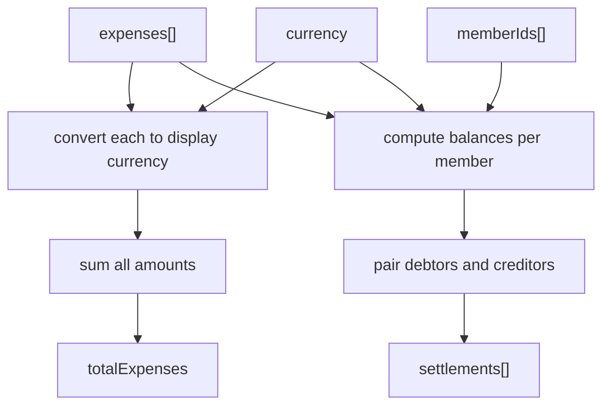
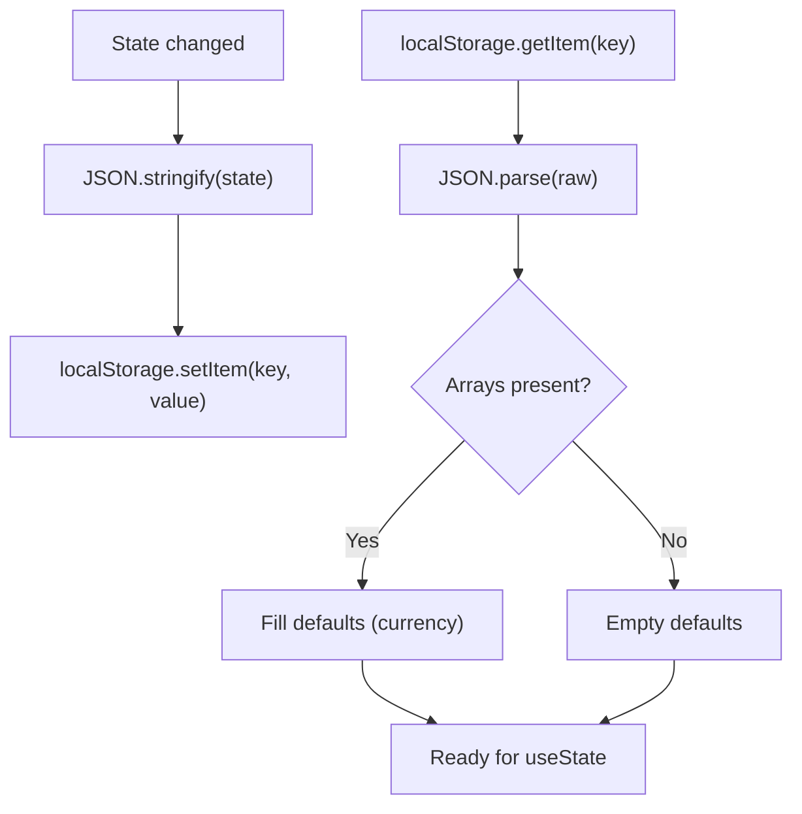
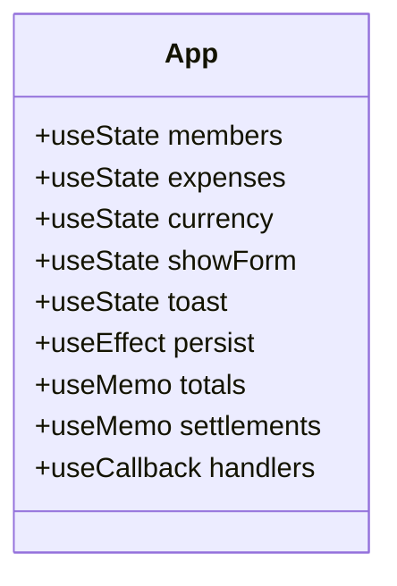
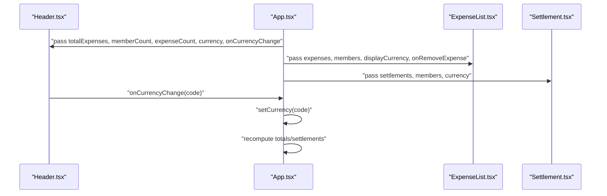
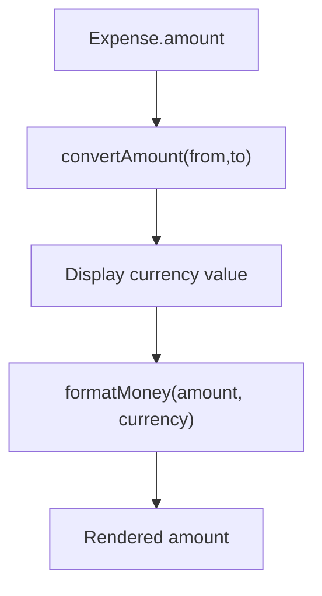
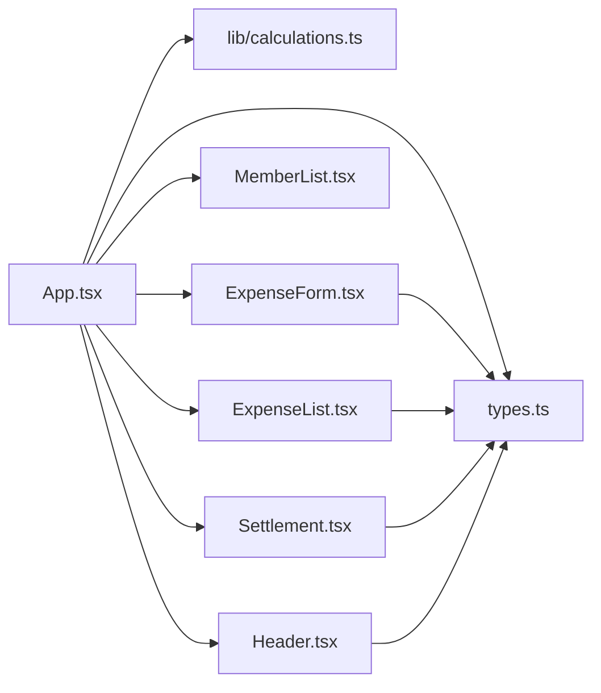

# State Management

<cite>
**Referenced Files in This Document**
- [App.tsx](file://src/App.tsx)
- [types.ts](file://src/types.ts)
- [calculations.ts](file://src/lib/calculations.ts)
- [ExpenseForm.tsx](file://src/components/ExpenseForm.tsx)
- [ExpenseList.tsx](file://src/components/ExpenseList.tsx)
- [MemberList.tsx](file://src/components/MemberList.tsx)
- [Settlement.tsx](file://src/components/Settlement.tsx)
- [Header.tsx](file://src/components/Header.tsx)
- [Toast.tsx](file://src/components/Toast.tsx)
- [main.tsx](file://src/main.tsx)
</cite>

## Table of Contents
1. [Introduction](#introduction)
2. [Project Structure](#project-structure)
3. [Core Components](#core-components)
4. [Architecture Overview](#architecture-overview)
5. [Detailed Component Analysis](#detailed-component-analysis)
6. [Dependency Analysis](#dependency-analysis)
7. [Performance Considerations](#performance-considerations)
8. [Troubleshooting Guide](#troubleshooting-guide)
9. [Conclusion](#conclusion)

## Introduction
This document explains the centralized state management architecture of the Travel Splitter application. It focuses on how React hooks manage the shared state, how localStorage is used for persistence across browser sessions, and how components subscribe to and react to state changes. The state structure includes members, expenses, selected currency, and auxiliary UI state. We also cover initialization from localStorage, real-time synchronization, mutation patterns, error handling, and performance considerations.

## Project Structure
The state lives in a single root component that initializes state from localStorage and propagates it downward via props. Utility functions compute derived data (totals and settlements) and formatting helpers render currency consistently.

**Diagram sources**
- [App.tsx:58-227](file://src/App.tsx#L58-L227)
- [types.ts:1-97](file://src/types.ts#L1-L97)
- [calculations.ts:1-85](file://src/lib/calculations.ts#L1-L85)
- [Header.tsx:12-78](file://src/components/Header.tsx#L12-L78)
- [MemberList.tsx:14-178](file://src/components/MemberList.tsx#L14-L178)
- [ExpenseForm.tsx:49-273](file://src/components/ExpenseForm.tsx#L49-L273)
- [ExpenseList.tsx:30-151](file://src/components/ExpenseList.tsx#L30-L151)
- [Settlement.tsx:11-96](file://src/components/Settlement.tsx#L11-L96)
- [Toast.tsx:10-43](file://src/components/Toast.tsx#L10-L43)

**Section sources**
- [main.tsx:6-10](file://src/main.tsx#L6-L10)
- [App.tsx:58-227](file://src/App.tsx#L58-L227)

## Core Components
- Centralized state container: The root component holds members, expenses, selected currency, and transient UI state (form visibility, toast).
- Persistence layer: A dedicated loader reads from and writer to localStorage, with defensive parsing and defaults.
- Derived computations: Totals and settlement instructions are computed from state and passed to child components.
- Event handlers: All state mutations are performed via callbacks defined in the root and passed down as props.

Key responsibilities:
- Initialize state from localStorage on mount.
- Persist state to localStorage after every change.
- Compute derived values (totals, settlements) and pass them to UI components.
- Provide mutation handlers to child components.

**Section sources**
- [App.tsx:18-76](file://src/App.tsx#L18-L76)
- [App.tsx:58-227](file://src/App.tsx#L58-L227)

## Architecture Overview
The app follows a unidirectional data flow:
- State is initialized from localStorage.
- Child components receive state and callbacks via props.
- Mutations occur inside the root component; children trigger updates by invoking provided callbacks.
- After each mutation, the root persists the updated state to localStorage.
- Derived values are recomputed and passed down to consumers.

**Diagram sources**
- [App.tsx:78-138](file://src/App.tsx#L78-L138)
- [MemberList.tsx:25-32](file://src/components/MemberList.tsx#L25-L32)
- [ExpenseForm.tsx:75-89](file://src/components/ExpenseForm.tsx#L75-L89)
- [App.tsx:67-69](file://src/App.tsx#L67-L69)

## Detailed Component Analysis

### State Structure and Initialization
- State shape:
  - members: array of member records
  - expenses: array of expense records
  - currency: selected display currency
  - showForm: toggles the expense creation overlay
  - toast: transient notification state
- Initialization:
  - On mount, the root loads serialized data from localStorage, normalizes missing currency fields, and falls back to defaults if parsing fails.
- Persistence:
  - A useEffect triggers after any state change to write the current state back to localStorage.

**Diagram sources**
- [App.tsx:26-47](file://src/App.tsx#L26-L47)
- [App.tsx:58-69](file://src/App.tsx#L58-L69)

**Section sources**
- [App.tsx:20-24](file://src/App.tsx#L20-L24)
- [App.tsx:26-47](file://src/App.tsx#L26-L47)
- [App.tsx:58-69](file://src/App.tsx#L58-L69)

### State Update Patterns and Mutation Handlers
- Member mutations:
  - Add: generates a new member with an ID and avatar color, appends to the list.
  - Edit: replaces a member by ID.
  - Remove: guards against removal if the member is referenced by existing expenses.
- Expense mutations:
  - Add: creates a new expense with a generated ID and ISO date, prepends to the list.
  - Remove: filters out the target expense.
- Currency change:
  - Updates the display currency; derived totals and settlement amounts recompute automatically.

**Diagram sources**
- [App.tsx:78-117](file://src/App.tsx#L78-L117)
- [MemberList.tsx:25-32](file://src/components/MemberList.tsx#L25-L32)

**Section sources**
- [App.tsx:78-146](file://src/App.tsx#L78-L146)

### Derived Data and Computed Values
- Totals:
  - Sum of all expenses converted to the selected display currency.
- Settlements:
  - Net balances per member across all expenses, then optimized settlement pairs to minimize transfers.

These are memoized to avoid unnecessary recalculation when unrelated parts of state change.

**Diagram sources**
- [calculations.ts:72-80](file://src/lib/calculations.ts#L72-L80)
- [calculations.ts:4-70](file://src/lib/calculations.ts#L4-L70)
- [App.tsx:148-161](file://src/App.tsx#L148-L161)

**Section sources**
- [calculations.ts:1-85](file://src/lib/calculations.ts#L1-L85)
- [App.tsx:148-161](file://src/App.tsx#L148-L161)

### Local Storage Integration and Serialization
- Loading:
  - Reads stored JSON, parses it, ensures arrays exist, normalizes missing currency values, and returns defaults on failure.
- Saving:
  - Serializes the current state to JSON and writes it to localStorage after every mutation.
- Error handling:
  - Parsing errors are caught and ignored; the app continues with defaults.

**Diagram sources**
- [App.tsx:26-47](file://src/App.tsx#L26-L47)
- [App.tsx:49-51](file://src/App.tsx#L49-L51)

**Section sources**
- [App.tsx:26-51](file://src/App.tsx#L26-L51)

### Hook-Based Patterns: useState, useEffect, useMemo, useCallback
- useState:
  - Initializes state from loader results and manages transient UI state.
- useEffect:
  - Subscribes to state changes and persists to localStorage.
- useMemo:
  - Memoizes totals and settlements to prevent recomputation on unrelated updates.
- useCallback:
  - Wraps mutation handlers to keep referential stability and reduce re-renders of child components.

**Diagram sources**
- [App.tsx:58-161](file://src/App.tsx#L58-L161)

**Section sources**
- [App.tsx:58-161](file://src/App.tsx#L58-L161)

### Component Communication Patterns
- Top-down props:
  - Root passes state and callbacks to child components.
- Callback-driven mutations:
  - Children invoke provided callbacks to request state changes.
- Derived data consumption:
  - Totals and settlements are passed as plain numbers to UI components for rendering.

**Diagram sources**
- [App.tsx:163-194](file://src/App.tsx#L163-L194)
- [Header.tsx:12-78](file://src/components/Header.tsx#L12-L78)
- [ExpenseList.tsx:30-151](file://src/components/ExpenseList.tsx#L30-L151)
- [Settlement.tsx:11-96](file://src/components/Settlement.tsx#L11-L96)

**Section sources**
- [App.tsx:163-194](file://src/App.tsx#L163-L194)

### Currency Handling and Formatting
- Supported currencies and exchange rates are defined centrally.
- Formatting respects currency decimals and symbols.
- Conversion helpers convert amounts between currencies for display and computation.

**Diagram sources**
- [types.ts:25-48](file://src/types.ts#L25-L48)
- [ExpenseList.tsx:46-49](file://src/components/ExpenseList.tsx#L46-L49)
- [ExpenseForm.tsx:26-32](file://src/components/ExpenseForm.tsx#L26-L32)

**Section sources**
- [types.ts:7-23](file://src/types.ts#L7-L23)
- [types.ts:25-48](file://src/types.ts#L25-L48)

## Dependency Analysis
- App depends on:
  - types.ts for data models and currency helpers.
  - calculations.ts for derived computations.
  - Components for UI and user interactions.
- Components depend on:
  - App for state and callbacks.
  - types.ts for constants and formatting.

**Diagram sources**
- [App.tsx:10-16](file://src/App.tsx#L10-L16)
- [types.ts:1-97](file://src/types.ts#L1-L97)
- [calculations.ts:1-85](file://src/lib/calculations.ts#L1-L85)
- [ExpenseForm.tsx:14-15](file://src/components/ExpenseForm.tsx#L14-L15)
- [ExpenseList.tsx:12](file://src/components/ExpenseList.tsx#L12)
- [Settlement.tsx:3](file://src/components/Settlement.tsx#L3)
- [Header.tsx:1-2](file://src/components/Header.tsx#L1-L2)

**Section sources**
- [App.tsx:10-16](file://src/App.tsx#L10-L16)

## Performance Considerations
- Memoization:
  - Totals and settlements are memoized to avoid recalculating on unrelated state changes.
- Stable callbacks:
  - Handlers are wrapped with callback to maintain referential equality and reduce unnecessary re-renders.
- Efficient updates:
  - New expenses are prepended to the list, minimizing DOM churn for recent-first display.
- Large dataset tips:
  - For very large lists, consider pagination or virtualization in the list components.
  - Debounce expensive computations if users frequently change the display currency.

[No sources needed since this section provides general guidance]

## Troubleshooting Guide
- State not persisting:
  - Verify localStorage availability and quota limits. Confirm the effect runs after state changes.
- Corrupted or incompatible data:
  - The loader ignores malformed data and falls back to defaults. Clear localStorage to reset.
- Currency conversion anomalies:
  - Ensure the selected display currency is supported and that conversion helpers are used consistently.

**Section sources**
- [App.tsx:26-47](file://src/App.tsx#L26-L47)
- [App.tsx:67-69](file://src/App.tsx#L67-L69)

## Conclusion
Travel Splitter employs a clean, centralized state model with React hooks and localStorage persistence. The root component acts as the single source of truth, deriving computed values and passing them down to child components. This design yields predictable updates, strong consistency guarantees, and straightforward debugging. For larger datasets, consider adding memoization and virtualization to maintain responsiveness.