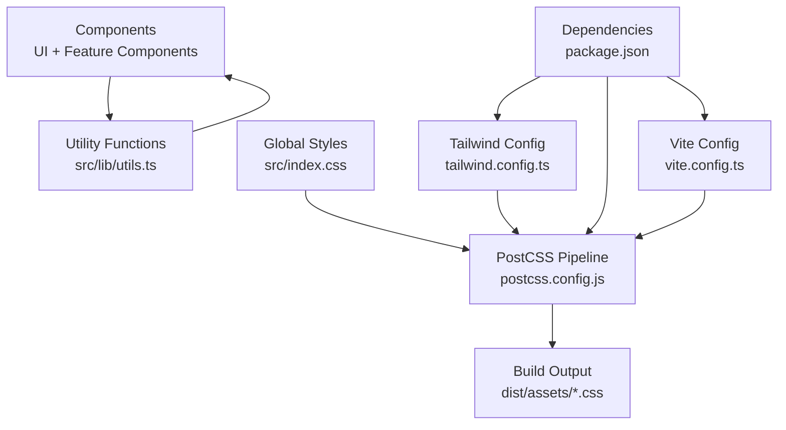
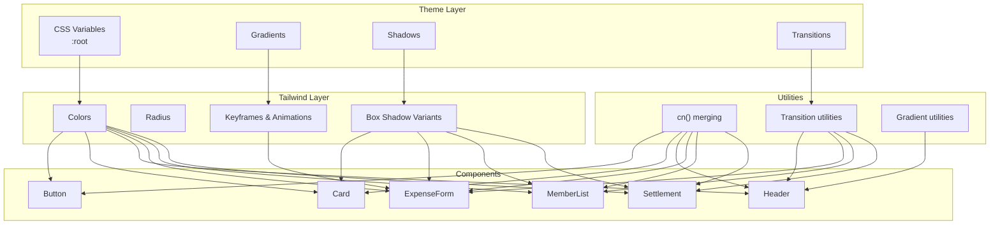
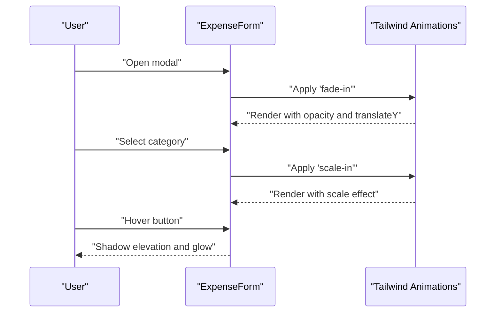
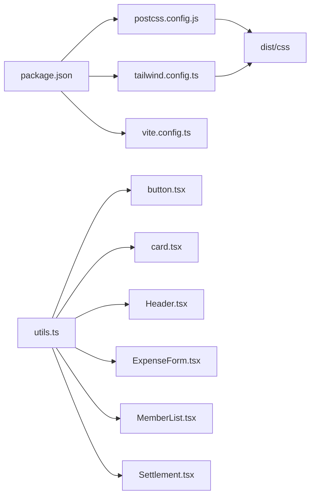

# Styling & Theming

<cite>
**Referenced Files in This Document**
- [tailwind.config.ts](file://travel-splitter/tailwind.config.ts)
- [index.css](file://travel-splitter/src/index.css)
- [postcss.config.js](file://travel-splitter/postcss.config.js)
- [package.json](file://travel-splitter/package.json)
- [vite.config.ts](file://travel-splitter/vite.config.ts)
- [utils.ts](file://travel-splitter/src/lib/utils.ts)
- [button.tsx](file://travel-splitter/src/components/ui/button.tsx)
- [card.tsx](file://travel-splitter/src/components/ui/card.tsx)
- [Header.tsx](file://travel-splitter/src/components/Header.tsx)
- [ExpenseForm.tsx](file://travel-splitter/src/components/ExpenseForm.tsx)
- [MemberList.tsx](file://travel-splitter/src/components/MemberList.tsx)
- [Settlement.tsx](file://travel-splitter/src/components/Settlement.tsx)
- [types.ts](file://travel-splitter/src/types.ts)
</cite>

## Table of Contents
1. [Introduction](#introduction)
2. [Project Structure](#project-structure)
3. [Core Components](#core-components)
4. [Architecture Overview](#architecture-overview)
5. [Detailed Component Analysis](#detailed-component-analysis)
6. [Dependency Analysis](#dependency-analysis)
7. [Performance Considerations](#performance-considerations)
8. [Troubleshooting Guide](#troubleshooting-guide)
9. [Conclusion](#conclusion)
10. [Appendices](#appendices)

## Introduction
This document explains the styling and theming system of the Travel Splitter application. It covers the Tailwind CSS configuration, custom animations, color palette extensions, responsive breakpoints, and the utility-first approach. It also documents how components leverage Tailwind classes for consistent styling, the role of CSS variables, theme customization options, and the animation system. Accessibility considerations and integration with the component system are included, along with guidance on extending the theme and maintaining design consistency.

## Project Structure
The styling pipeline is organized around Tailwind CSS with PostCSS and Vite. The configuration defines a modern design system built on CSS variables, custom shadows, and a curated color palette. Utility-first classes compose UI components consistently, while custom animations and transitions enhance interactivity.

**Diagram sources**
- [tailwind.config.ts:1-118](file://travel-splitter/tailwind.config.ts#L1-L118)
- [postcss.config.js:1-7](file://travel-splitter/postcss.config.js#L1-L7)
- [index.css:1-114](file://travel-splitter/src/index.css#L1-L114)
- [utils.ts:1-7](file://travel-splitter/src/lib/utils.ts#L1-L7)
- [vite.config.ts:1-13](file://travel-splitter/vite.config.ts#L1-L13)
- [package.json:1-32](file://travel-splitter/package.json#L1-L32)

**Section sources**
- [tailwind.config.ts:1-118](file://travel-splitter/tailwind.config.ts#L1-L118)
- [index.css:1-114](file://travel-splitter/src/index.css#L1-L114)
- [postcss.config.js:1-7](file://travel-splitter/postcss.config.js#L1-L7)
- [vite.config.ts:1-13](file://travel-splitter/vite.config.ts#L1-L13)
- [package.json:1-32](file://travel-splitter/package.json#L1-L32)

## Core Components
- Tailwind configuration extends fonts, colors, border radius, box shadows, keyframes, and animations. It enables dark mode via class strategy and integrates the animation plugin.
- Global CSS defines a Japanese Warm Palette with gradients, shadows, and smooth transitions. It also sets up base layer styles and utility helpers.
- Utility functions merge Tailwind classes safely and conditionally.
- UI primitives (Button, Card) demonstrate consistent class composition and variant-driven styling.
- Feature components showcase responsive layouts, interactive states, and animation usage.

**Section sources**
- [tailwind.config.ts:10-114](file://travel-splitter/tailwind.config.ts#L10-L114)
- [index.css:5-97](file://travel-splitter/src/index.css#L5-L97)
- [utils.ts:4-6](file://travel-splitter/src/lib/utils.ts#L4-L6)
- [button.tsx:5-32](file://travel-splitter/src/components/ui/button.tsx#L5-L32)
- [card.tsx:4-17](file://travel-splitter/src/components/ui/card.tsx#L4-L17)

## Architecture Overview
The styling architecture follows a layered approach:
- Base layer: resets and global typography/background.
- Utilities layer: reusable helpers for gradients, shadows, and transitions.
- Component layer: UI primitives and feature components using Tailwind classes.
- Theme layer: CSS variables driving colors, radii, shadows, and gradients.

**Diagram sources**
- [index.css:5-97](file://travel-splitter/src/index.css#L5-L97)
- [tailwind.config.ts:18-114](file://travel-splitter/tailwind.config.ts#L18-L114)
- [utils.ts:4-6](file://travel-splitter/src/lib/utils.ts#L4-L6)
- [button.tsx:5-32](file://travel-splitter/src/components/ui/button.tsx#L5-L32)
- [card.tsx:4-17](file://travel-splitter/src/components/ui/card.tsx#L4-L17)
- [Header.tsx:20-77](file://travel-splitter/src/components/Header.tsx#L20-L77)
- [ExpenseForm.tsx:99-272](file://travel-splitter/src/components/ExpenseForm.tsx#L99-L272)
- [MemberList.tsx:58-177](file://travel-splitter/src/components/MemberList.tsx#L58-L177)
- [Settlement.tsx:23-94](file://travel-splitter/src/components/Settlement.tsx#L23-L94)

## Detailed Component Analysis

### Tailwind Configuration
- Dark mode strategy: class-based enabling.
- Content scanning: includes index and TS/TSX sources.
- Font family extension: Inter with fallbacks.
- Color system: CSS variables mapped to Tailwind tokens for primary, secondary, muted, accent, card, background, foreground, borders, and ring.
- Border radius: CSS variable-driven variants for consistent corner scaling.
- Box shadows: custom variants for elegant, glow, card, and card-hover.
- Animations: accordion, fade-in, slide-in-right, scale-in, and pulse-soft with durations and easing.
- Plugin: tailwindcss-animate for enhanced animation support.

**Section sources**
- [tailwind.config.ts:3-114](file://travel-splitter/tailwind.config.ts#L3-L114)

### Global Styles and CSS Variables
- Root variables define a cohesive Japanese Warm Palette with terracotta primary, cream secondary, sakura pink accent, and complementary muted tones.
- Gradients: hero, primary, accent, and card gradients for visual depth.
- Shadows: elegant, glow, card, and card-hover for layered depth.
- Transitions: smooth transition property for consistent motion.
- Base layer: applies border tokens globally and sets body background and text colors.
- Utilities layer: gradient helpers, interactive card shadows, and smooth transitions.

**Section sources**
- [index.css:5-61](file://travel-splitter/src/index.css#L5-L61)
- [index.css:64-97](file://travel-splitter/src/index.css#L64-L97)

### Utility Functions
- cn() merges Tailwind classes using clsx and tailwind-merge to prevent conflicts and ensure deterministic outcomes.

**Section sources**
- [utils.ts:4-6](file://travel-splitter/src/lib/utils.ts#L4-L6)

### Button Primitive
- Uses class-variance-authority to define variants (default, destructive, outline, secondary, ghost, link) and sizes (default, sm, lg, icon).
- Inherits focus-visible ring behavior and disabled states.
- Composes with CSS variables for primary/secondary/accent/muted foregrounds and background tokens.

**Section sources**
- [button.tsx:5-32](file://travel-splitter/src/components/ui/button.tsx#L5-L32)

### Card Primitive
- Provides a consistent card shell with border, background, and shadow tokens.
- Includes header, title, description, content, and footer slots for structured layouts.

**Section sources**
- [card.tsx:4-78](file://travel-splitter/src/components/ui/card.tsx#L4-L78)

### Header Component
- Hero section with gradient background and blurred overlay.
- Responsive typography and spacing using Tailwind utilities.
- Currency toggle with active state highlighting and smooth transitions.
- Stat cards with backdrop blur and subtle shadows.

**Section sources**
- [Header.tsx:20-77](file://travel-splitter/src/components/Header.tsx#L20-L77)

### ExpenseForm Component
- Modal overlay with backdrop blur and animated entrance.
- Category selection with active/inactive states and shadow variants.
- Inputs styled with background, border, and ring focus states.
- Gradient primary button with shadow variants and smooth transitions.
- Responsive layout using grid and gap utilities.

**Section sources**
- [ExpenseForm.tsx:99-272](file://travel-splitter/src/components/ExpenseForm.tsx#L99-L272)

### MemberList Component
- Animated entrance and scale transitions for form elements.
- Interactive member chips with hover states and group-based visibility.
- Consistent background and shadow tokens across actions.

**Section sources**
- [MemberList.tsx:58-177](file://travel-splitter/src/components/MemberList.tsx#L58-L177)

### Settlement Component
- Clean card layout with hover transitions and subtle shadows.
- Avatar initials with color palette from types.
- Consistent typography and spacing using card foreground and muted tokens.

**Section sources**
- [Settlement.tsx:23-94](file://travel-splitter/src/components/Settlement.tsx#L23-L94)

### Animation System
- Defined keyframes: accordion-down/up, fade-in, slide-in-right, scale-in, and pulse-soft.
- Named animations: mapped to keyframes with timing and easing.
- Usage: animate-* classes on components for entrance and interaction feedback.

**Diagram sources**
- [tailwind.config.ts:78-111](file://travel-splitter/tailwind.config.ts#L78-L111)
- [ExpenseForm.tsx:105](file://travel-splitter/src/components/ExpenseForm.tsx#L105)
- [ExpenseForm.tsx:130-134](file://travel-splitter/src/components/ExpenseForm.tsx#L130-L134)
- [ExpenseForm.tsx:263](file://travel-splitter/src/components/ExpenseForm.tsx#L263)

### Responsive Design Implementation
- Breakpoints: default Tailwind breakpoints apply; custom container screen limit at 1400px.
- Typography: responsive text sizing (e.g., header text scales at small screens).
- Grid layouts: category and stat grids adapt to available space.
- Spacing: padding and margin utilities scale across device widths.

**Section sources**
- [tailwind.config.ts:14-16](file://travel-splitter/tailwind.config.ts#L14-L16)
- [Header.tsx:29-76](file://travel-splitter/src/components/Header.tsx#L29-L76)
- [ExpenseForm.tsx:123-141](file://travel-splitter/src/components/ExpenseForm.tsx#L123-L141)

### Accessibility Considerations
- Focus rings: consistent ring focus-visible behavior across interactive elements.
- Contrast: foreground/background tokens ensure readable text.
- Motion preferences: animations are defined with easing suitable for comfortable motion.
- Semantic structure: components use headings, labels, and lists appropriately.

**Section sources**
- [button.tsx:6](file://travel-splitter/src/components/ui/button.tsx#L6)
- [index.css:68-70](file://travel-splitter/src/index.css#L68-L70)

## Dependency Analysis
- Tailwind CSS and tailwindcss-animate are configured in dependencies and integrated via Tailwind config.
- PostCSS pipeline includes Tailwind and Autoprefixer.
- Vite resolves aliases for clean imports and builds the CSS pipeline.
- Utility functions depend on clsx and tailwind-merge for safe class composition.

**Diagram sources**
- [package.json:11-29](file://travel-splitter/package.json#L11-L29)
- [tailwind.config.ts:114](file://travel-splitter/tailwind.config.ts#L114)
- [postcss.config.js:1-7](file://travel-splitter/postcss.config.js#L1-L7)
- [vite.config.ts:7-11](file://travel-splitter/vite.config.ts#L7-L11)
- [utils.ts:1-7](file://travel-splitter/src/lib/utils.ts#L1-L7)
- [button.tsx:1-3](file://travel-splitter/src/components/ui/button.tsx#L1-L3)
- [card.tsx:1-2](file://travel-splitter/src/components/ui/card.tsx#L1-L2)
- [Header.tsx:1-3](file://travel-splitter/src/components/Header.tsx#L1-L3)
- [ExpenseForm.tsx:1-15](file://travel-splitter/src/components/ExpenseForm.tsx#L1-L15)
- [MemberList.tsx:1-5](file://travel-splitter/src/components/MemberList.tsx#L1-L5)
- [Settlement.tsx:1-4](file://travel-splitter/src/components/Settlement.tsx#L1-L4)

**Section sources**
- [package.json:11-29](file://travel-splitter/package.json#L11-L29)
- [postcss.config.js:1-7](file://travel-splitter/postcss.config.js#L1-L7)
- [vite.config.ts:7-11](file://travel-splitter/vite.config.ts#L7-L11)
- [utils.ts:1-7](file://travel-splitter/src/lib/utils.ts#L1-L7)

## Performance Considerations
- CSS variables centralize theme values, reducing duplication and enabling efficient updates.
- Tailwind’s JIT compilation and purge configuration minimize bundle size.
- Utility-first classes reduce custom CSS bloat and improve maintainability.
- Animations use hardware-accelerated properties (opacity, transform, box-shadow) for smooth performance.

[No sources needed since this section provides general guidance]

## Troubleshooting Guide
- Missing animations: ensure tailwindcss-animate is installed and enabled in Tailwind config.
- Inconsistent colors: verify CSS variables are defined in the base layer and referenced via hsl(var(--token)).
- Hover states not applying: confirm transition utilities and shadow variants are present in the utilities layer.
- Build errors: check PostCSS plugins and Tailwind directives are present in the CSS file.

**Section sources**
- [tailwind.config.ts:114](file://travel-splitter/tailwind.config.ts#L114)
- [index.css:68-97](file://travel-splitter/src/index.css#L68-L97)
- [postcss.config.js:1-7](file://travel-splitter/postcss.config.js#L1-L7)

## Conclusion
The Travel Splitter styling system combines a robust Tailwind configuration with a carefully curated palette and motion design. CSS variables unify theme tokens, while utility-first classes ensure consistent component styling. Animations and transitions elevate user experience without sacrificing performance. The architecture supports easy customization and maintains design consistency across components.

[No sources needed since this section summarizes without analyzing specific files]

## Appendices

### Custom Styling Patterns
- Gradient utilities: use gradient-* helpers for hero and card backgrounds.
- Shadow variants: apply shadow-* tokens for consistent depth cues.
- Transition utilities: use transition-smooth for consistent motion across components.

**Section sources**
- [index.css:73-97](file://travel-splitter/src/index.css#L73-L97)

### Theme Customization Options
- Extend colors: add new tokens under theme.extend.colors and map to CSS variables.
- Add shadows: introduce new shadow variants in theme.extend.boxShadow.
- Introduce animations: add keyframes and map to animation names.
- Adjust radii: modify CSS variable for --radius to change corner scaling.

**Section sources**
- [tailwind.config.ts:18-114](file://travel-splitter/tailwind.config.ts#L18-L114)
- [index.css:5-61](file://travel-splitter/src/index.css#L5-L61)

### Extending the Color Scheme
- Add new named colors in Tailwind config and map to CSS variables.
- Use the new tokens in components via background/text tokens.
- Maintain contrast ratios and accessibility guidelines.

**Section sources**
- [tailwind.config.ts:22-64](file://travel-splitter/tailwind.config.ts#L22-L64)
- [index.css:7-45](file://travel-splitter/src/index.css#L7-L45)

### Maintaining Design Consistency
- Prefer tokens over hardcoded values.
- Use primitives (Button, Card) to enforce consistent styles.
- Apply utility helpers (gradient, shadow, transition) uniformly.
- Keep animations subtle and purposeful.

**Section sources**
- [button.tsx:5-32](file://travel-splitter/src/components/ui/button.tsx#L5-L32)
- [card.tsx:4-17](file://travel-splitter/src/components/ui/card.tsx#L4-L17)
- [index.css:73-97](file://travel-splitter/src/index.css#L73-L97)