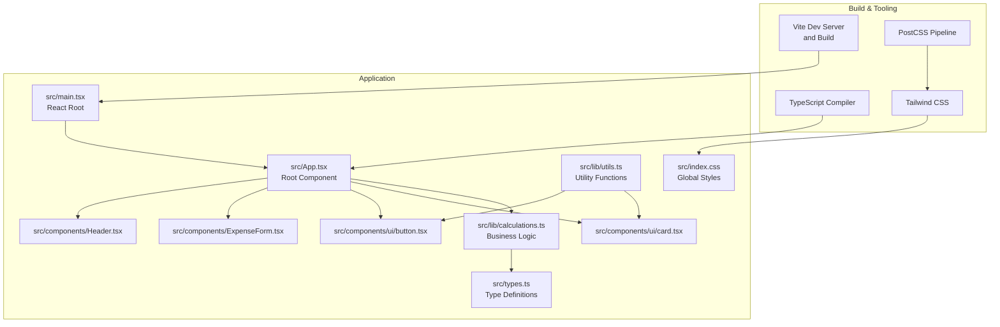
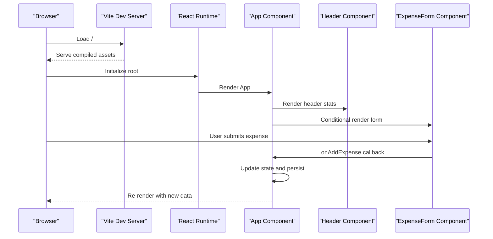
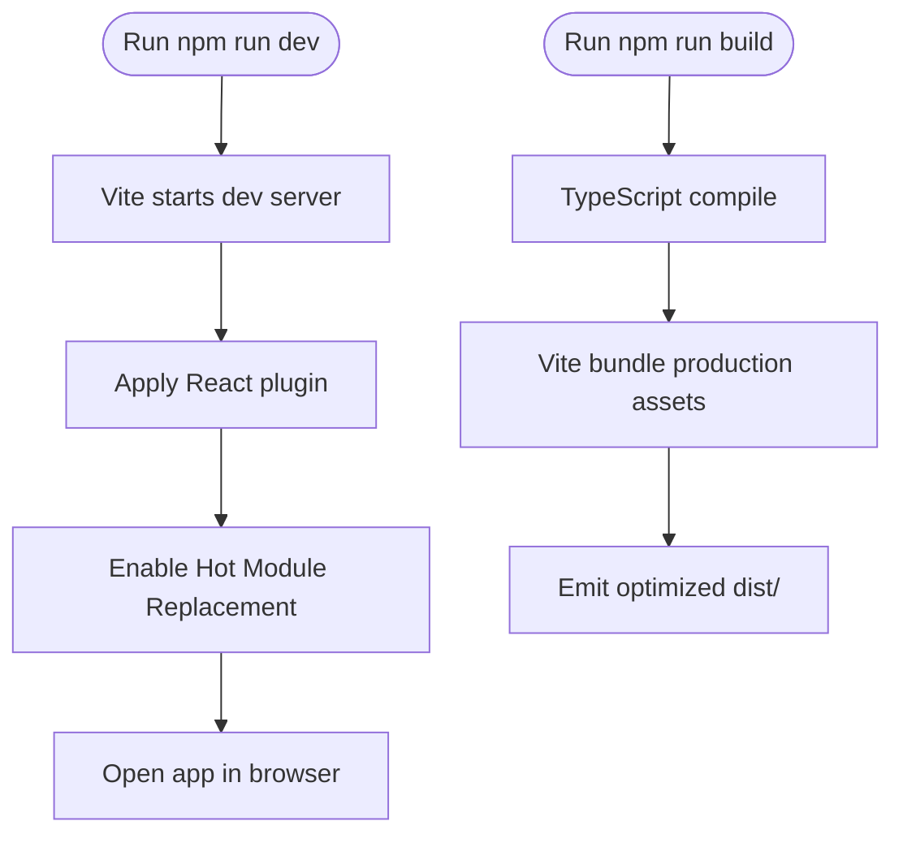
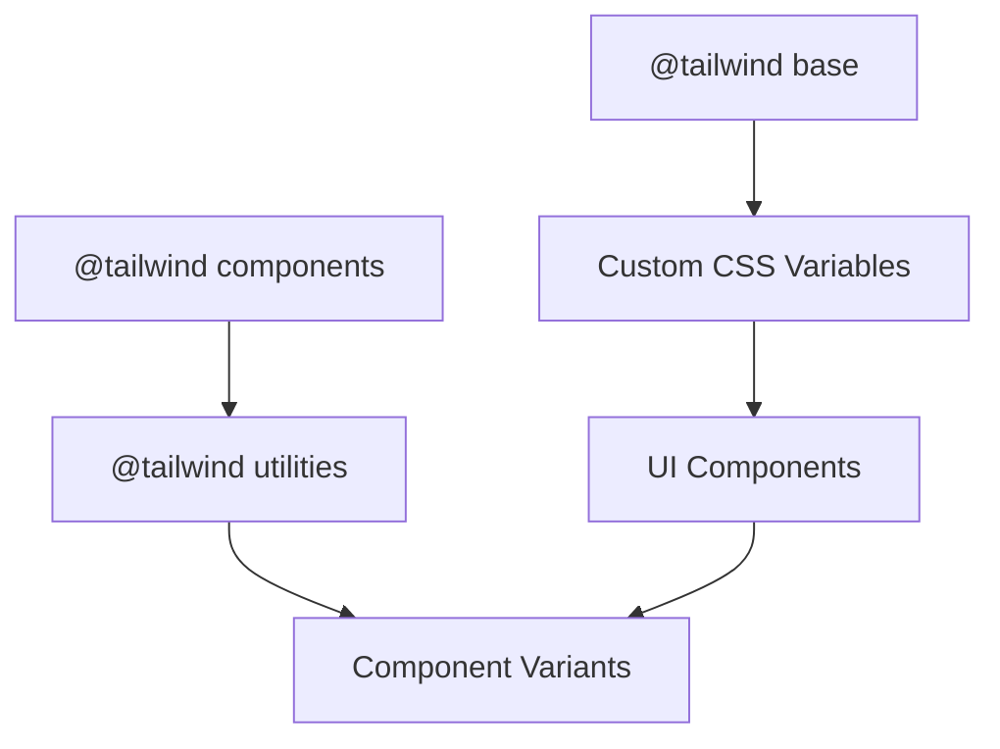
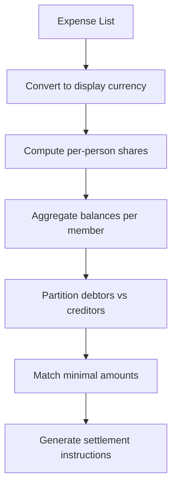
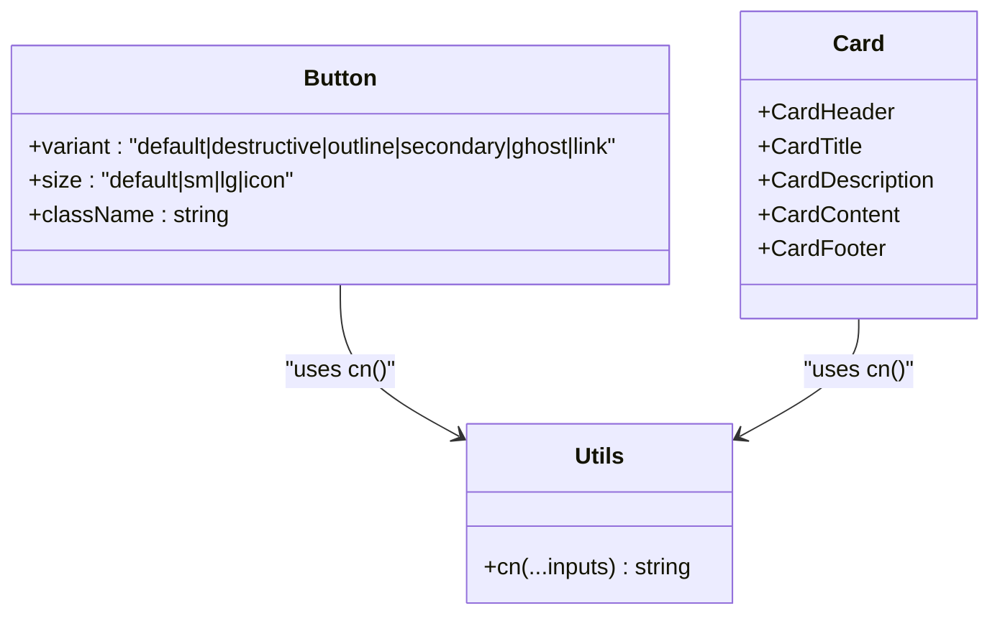
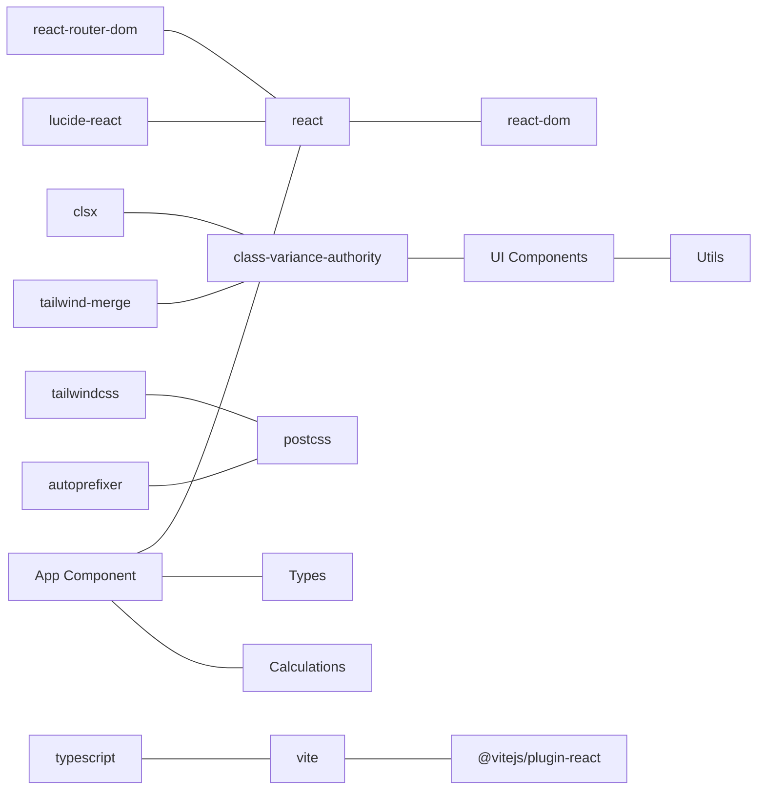

# Technology Stack & Dependencies

<cite>
**Referenced Files in This Document**
- [package.json](file://travel-splitter/package.json)
- [vite.config.ts](file://travel-splitter/vite.config.ts)
- [tsconfig.json](file://travel-splitter/tsconfig.json)
- [tsconfig.app.json](file://travel-splitter/tsconfig.app.json)
- [tailwind.config.ts](file://travel-splitter/tailwind.config.ts)
- [postcss.config.js](file://travel-splitter/postcss.config.js)
- [src/main.tsx](file://travel-splitter/src/main.tsx)
- [src/App.tsx](file://travel-splitter/src/App.tsx)
- [src/index.css](file://travel-splitter/src/index.css)
- [src/types.ts](file://travel-splitter/src/types.ts)
- [src/lib/utils.ts](file://travel-splitter/src/lib/utils.ts)
- [src/lib/calculations.ts](file://travel-splitter/src/lib/calculations.ts)
- [src/components/ui/button.tsx](file://travel-splitter/src/components/ui/button.tsx)
- [src/components/ui/card.tsx](file://travel-splitter/src/components/ui/card.tsx)
- [src/components/ExpenseForm.tsx](file://travel-splitter/src/components/ExpenseForm.tsx)
- [src/components/Header.tsx](file://travel-splitter/src/components/Header.tsx)
</cite>

## Table of Contents
1. [Introduction](#introduction)
2. [Project Structure](#project-structure)
3. [Core Components](#core-components)
4. [Architecture Overview](#architecture-overview)
5. [Detailed Component Analysis](#detailed-component-analysis)
6. [Dependency Analysis](#dependency-analysis)
7. [Performance Considerations](#performance-considerations)
8. [Troubleshooting Guide](#troubleshooting-guide)
9. [Conclusion](#conclusion)

## Introduction
This document explains the technology stack and dependencies powering the Travel Splitter application. It focuses on the frontend technologies (React, TypeScript, Tailwind CSS), the build toolchain (Vite), and supporting libraries that enable a modern, type-safe, and efficient development experience. The document also outlines how each technology contributes to application architecture, developer productivity, and runtime performance.

## Project Structure
The project follows a conventional React + TypeScript + Vite setup with a clear separation of concerns:
- Application entry point initializes React and mounts the root component.
- Feature components are organized under src/components, with shared UI primitives under src/components/ui.
- Shared logic resides in src/lib, including calculations and utility helpers.
- Global styles and design tokens are defined via Tailwind CSS and PostCSS.

**Diagram sources**
- [vite.config.ts:1-13](file://travel-splitter/vite.config.ts#L1-L13)
- [tsconfig.app.json:1-26](file://travel-splitter/tsconfig.app.json#L1-L26)
- [postcss.config.js:1-7](file://travel-splitter/postcss.config.js#L1-L7)
- [tailwind.config.ts:1-118](file://travel-splitter/tailwind.config.ts#L1-L118)
- [src/main.tsx:1-11](file://travel-splitter/src/main.tsx#L1-L11)
- [src/App.tsx:1-231](file://travel-splitter/src/App.tsx#L1-L231)
- [src/types.ts:1-97](file://travel-splitter/src/types.ts#L1-L97)
- [src/lib/utils.ts:1-7](file://travel-splitter/src/lib/utils.ts#L1-L7)
- [src/lib/calculations.ts:1-85](file://travel-splitter/src/lib/calculations.ts#L1-L85)
- [src/components/ui/button.tsx:1-54](file://travel-splitter/src/components/ui/button.tsx#L1-L54)
- [src/components/ui/card.tsx:1-79](file://travel-splitter/src/components/ui/card.tsx#L1-L79)
- [src/components/Header.tsx:1-93](file://travel-splitter/src/components/Header.tsx#L1-L93)
- [src/components/ExpenseForm.tsx:1-200](file://travel-splitter/src/components/ExpenseForm.tsx#L1-L200)
- [src/index.css:1-114](file://travel-splitter/src/index.css#L1-L114)

**Section sources**
- [vite.config.ts:1-13](file://travel-splitter/vite.config.ts#L1-L13)
- [tsconfig.app.json:1-26](file://travel-splitter/tsconfig.app.json#L1-L26)
- [postcss.config.js:1-7](file://travel-splitter/postcss.config.js#L1-L7)
- [tailwind.config.ts:1-118](file://travel-splitter/tailwind.config.ts#L1-L118)
- [src/main.tsx:1-11](file://travel-splitter/src/main.tsx#L1-L11)
- [src/App.tsx:1-231](file://travel-splitter/src/App.tsx#L1-L231)

## Core Components
- React 18.3.1: Provides the declarative UI framework with concurrent features, strict mode, and modern hooks for state and effects.
- TypeScript ~5.6.2: Adds static typing, improved IDE support, and safer refactoring across the codebase.
- Tailwind CSS ^3.4.17: Enables utility-first styling with a custom design system and animations.
- Vite ^6.0.5: Fast development server and optimized production builds with native ES modules and HMR.
- React Router DOM ^7.1.1: Handles client-side routing for navigation.
- Lucide React ^0.468.0: Delivers a comprehensive set of SVG icons for UI enhancement.
- Utility libraries: class-variance-authority, clsx, tailwind-merge for robust component variants and class merging.

Benefits and roles:
- React + Hooks: Centralized state management, memoization, and lifecycle handling in App and child components.
- TypeScript: Strongly typed props, state, and business logic to prevent runtime errors and improve maintainability.
- Tailwind CSS: Rapid UI iteration with a cohesive design system, animations, and responsive utilities.
- Vite: Instant server startup, efficient HMR, and optimized bundling for production.
- Routing: Navigation between views and deep-linkable URLs.
- Icons: Consistent, scalable, and accessible iconography integrated throughout components.

**Section sources**
- [package.json:11-30](file://travel-splitter/package.json#L11-L30)
- [src/App.tsx:1-231](file://travel-splitter/src/App.tsx#L1-L231)
- [src/types.ts:1-97](file://travel-splitter/src/types.ts#L1-L97)
- [src/index.css:1-114](file://travel-splitter/src/index.css#L1-L114)
- [vite.config.ts:1-13](file://travel-splitter/vite.config.ts#L1-L13)

## Architecture Overview
The application follows a component-driven architecture:
- Root entry initializes React Strict Mode and mounts the App component.
- App orchestrates state for members, expenses, currency, and UI toggles.
- Child components render UI and delegate actions to App via callbacks.
- Business logic resides in lib/calculations.ts for settlement computation and money formatting.
- Styling leverages Tailwind utilities and a custom theme with CSS variables and animations.

**Diagram sources**
- [src/main.tsx:1-11](file://travel-splitter/src/main.tsx#L1-L11)
- [src/App.tsx:1-231](file://travel-splitter/src/App.tsx#L1-L231)
- [src/components/Header.tsx:1-93](file://travel-splitter/src/components/Header.tsx#L1-L93)
- [src/components/ExpenseForm.tsx:1-200](file://travel-splitter/src/components/ExpenseForm.tsx#L1-L200)
- [vite.config.ts:1-13](file://travel-splitter/vite.config.ts#L1-L13)

## Detailed Component Analysis

### Frontend Technologies
- React 18.3.1: Used throughout for functional components, hooks (useState, useEffect, useMemo, useCallback), and concurrent features. Strict Mode is enabled at the root for early detection of potential issues.
- TypeScript: Enforced via tsconfig.app.json with strict checks, path aliases, and JSX transform. Types define props, state, and business entities.
- Tailwind CSS: Applied globally via src/index.css and configured in tailwind.config.ts with custom colors, shadows, animations, and content paths.

Key implementation patterns:
- State orchestration in App with localStorage persistence.
- Memoized computations for totals and settlements.
- Callback-based event handling to keep components pure and testable.

**Section sources**
- [src/main.tsx:1-11](file://travel-splitter/src/main.tsx#L1-L11)
- [src/App.tsx:1-231](file://travel-splitter/src/App.tsx#L1-L231)
- [tsconfig.app.json:1-26](file://travel-splitter/tsconfig.app.json#L1-L26)
- [src/index.css:1-114](file://travel-splitter/src/index.css#L1-L114)
- [tailwind.config.ts:1-118](file://travel-splitter/tailwind.config.ts#L1-L118)

### Build Tool Configuration (Vite)
- Plugin: @vitejs/plugin-react enables JSX transform and HMR.
- Alias: '@' resolves to src for cleaner imports.
- Scripts: dev, build, and preview commands streamline development and deployment.

**Diagram sources**
- [vite.config.ts:1-13](file://travel-splitter/vite.config.ts#L1-L13)
- [package.json:6-10](file://travel-splitter/package.json#L6-L10)

**Section sources**
- [vite.config.ts:1-13](file://travel-splitter/vite.config.ts#L1-L13)
- [package.json:6-10](file://travel-splitter/package.json#L6-L10)

### Styling Ecosystem (Tailwind CSS)
- Global base, components, and utilities layers define the design system.
- Custom CSS variables in :root establish color palettes, gradients, shadows, and transitions.
- Tailwind content globs scan index.html and src/**/*.{ts,tsx} to purge unused styles.
- Animations and utilities extend theme for interactive feedback.

**Diagram sources**
- [src/index.css:1-114](file://travel-splitter/src/index.css#L1-L114)
- [tailwind.config.ts:1-118](file://travel-splitter/tailwind.config.ts#L1-L118)

**Section sources**
- [src/index.css:1-114](file://travel-splitter/src/index.css#L1-L114)
- [tailwind.config.ts:1-118](file://travel-splitter/tailwind.config.ts#L1-L118)

### Dependency Ecosystem
- React Router DOM: Enables navigation and route-aware UI.
- Lucide React: Provides SVG icons used across forms and buttons.
- Utility libraries: class-variance-authority, clsx, tailwind-merge for robust component variants and safe class merging.

**Section sources**
- [package.json:11-20](file://travel-splitter/package.json#L11-L20)
- [src/components/ExpenseForm.tsx:1-200](file://travel-splitter/src/components/ExpenseForm.tsx#L1-L200)
- [src/components/ui/button.tsx:1-54](file://travel-splitter/src/components/ui/button.tsx#L1-L54)

### Development Dependencies
- TypeScript compiler: Strict type checking and module resolution.
- PostCSS: Processes Tailwind and autoprefixes vendor-prefixed properties.
- Tailwind CSS: Utility-first CSS framework with custom animations and design tokens.
- Vite: Lightning-fast dev server and build tool.
- React plugin: Optimizes React code paths and JSX transforms.

**Section sources**
- [package.json:21-30](file://travel-splitter/package.json#L21-L30)
- [postcss.config.js:1-7](file://travel-splitter/postcss.config.js#L1-L7)

### Business Logic Layer
- Calculations: Settlement computation and total expense aggregation.
- Money formatting and currency conversion utilities.

**Diagram sources**
- [src/lib/calculations.ts:1-85](file://travel-splitter/src/lib/calculations.ts#L1-L85)
- [src/types.ts:1-97](file://travel-splitter/src/types.ts#L1-L97)

**Section sources**
- [src/lib/calculations.ts:1-85](file://travel-splitter/src/lib/calculations.ts#L1-L85)
- [src/types.ts:1-97](file://travel-splitter/src/types.ts#L1-L97)

### UI Primitive Components
- Button: Variant and size system using class-variance-authority, clsx, and tailwind-merge.
- Card: Semantic layout primitives with consistent spacing and typography.

**Diagram sources**
- [src/components/ui/button.tsx:1-54](file://travel-splitter/src/components/ui/button.tsx#L1-L54)
- [src/components/ui/card.tsx:1-79](file://travel-splitter/src/components/ui/card.tsx#L1-L79)
- [src/lib/utils.ts:1-7](file://travel-splitter/src/lib/utils.ts#L1-L7)

**Section sources**
- [src/components/ui/button.tsx:1-54](file://travel-splitter/src/components/ui/button.tsx#L1-L54)
- [src/components/ui/card.tsx:1-79](file://travel-splitter/src/components/ui/card.tsx#L1-L79)
- [src/lib/utils.ts:1-7](file://travel-splitter/src/lib/utils.ts#L1-L7)

### Example Component: ExpenseForm
- Uses Lucide React icons for categories.
- Integrates UI primitives and types for controlled inputs.
- Emits validated expense data to parent via callback.

**Section sources**
- [src/components/ExpenseForm.tsx:1-200](file://travel-splitter/src/components/ExpenseForm.tsx#L1-L200)
- [src/types.ts:1-97](file://travel-splitter/src/types.ts#L1-L97)

## Dependency Analysis
The dependency graph highlights how core technologies and libraries interrelate to deliver a cohesive development and runtime experience.

**Diagram sources**
- [package.json:11-30](file://travel-splitter/package.json#L11-L30)
- [vite.config.ts:1-13](file://travel-splitter/vite.config.ts#L1-L13)
- [postcss.config.js:1-7](file://travel-splitter/postcss.config.js#L1-L7)
- [src/App.tsx:1-231](file://travel-splitter/src/App.tsx#L1-L231)
- [src/types.ts:1-97](file://travel-splitter/src/types.ts#L1-L97)
- [src/lib/calculations.ts:1-85](file://travel-splitter/src/lib/calculations.ts#L1-L85)
- [src/lib/utils.ts:1-7](file://travel-splitter/src/lib/utils.ts#L1-L7)

**Section sources**
- [package.json:11-30](file://travel-splitter/package.json#L11-L30)
- [vite.config.ts:1-13](file://travel-splitter/vite.config.ts#L1-L13)
- [postcss.config.js:1-7](file://travel-splitter/postcss.config.js#L1-L7)

## Performance Considerations
- Vite’s native ES modules and pre-bundling reduce cold-start times and improve HMR performance.
- Tailwind purging via content globs ensures minimal CSS footprint in production.
- React.memo and useMemo in App reduce unnecessary re-renders during frequent updates.
- Local storage persistence avoids network overhead and improves perceived performance.
- CSS variables and hardware-accelerated shadows/animations enhance smoothness on mobile devices.

[No sources needed since this section provides general guidance]

## Troubleshooting Guide
Common areas to check:
- Build failures: Verify TypeScript strictness and module resolution in tsconfig.app.json.
- Styling issues: Confirm Tailwind layers and content globs in tailwind.config.ts and postcss.config.js.
- Aliasing: Ensure '@' alias resolves to src in vite.config.ts and tsconfig.app.json.
- Runtime errors: Inspect localStorage persistence logic and type guards in App.

**Section sources**
- [tsconfig.app.json:1-26](file://travel-splitter/tsconfig.app.json#L1-L26)
- [tailwind.config.ts:1-118](file://travel-splitter/tailwind.config.ts#L1-L118)
- [postcss.config.js:1-7](file://travel-splitter/postcss.config.js#L1-L7)
- [vite.config.ts:1-13](file://travel-splitter/vite.config.ts#L1-L13)
- [src/App.tsx:26-70](file://travel-splitter/src/App.tsx#L26-L70)

## Conclusion
Travel Splitter leverages a modern frontend stack centered on React, TypeScript, and Tailwind CSS, powered by Vite for a fast and reliable development experience. The combination of strong typing, utility-first styling, and optimized tooling yields a maintainable, performant, and delightful application. The modular component architecture and centralized business logic further support scalability and ease of testing.