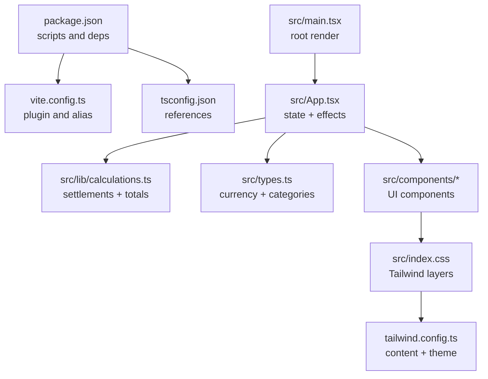
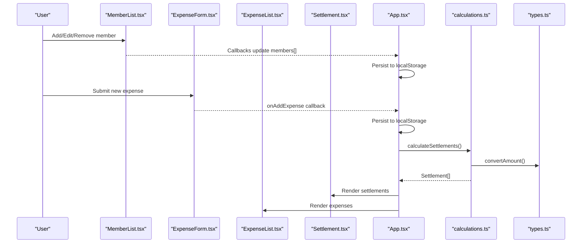
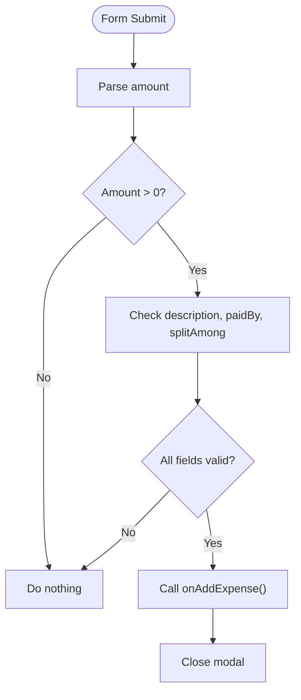
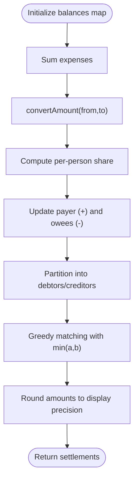
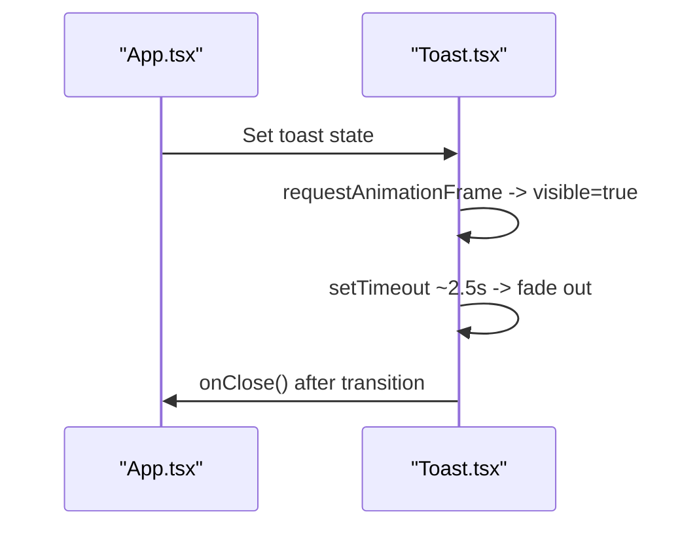
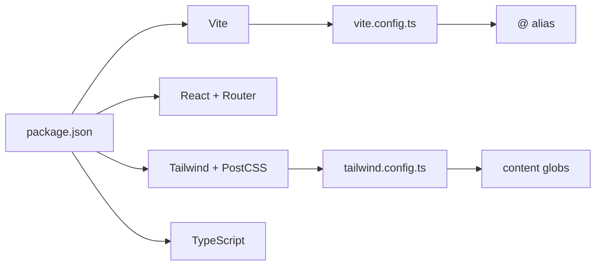

# Troubleshooting & FAQ

<cite>
**Referenced Files in This Document**
- [package.json](file://travel-splitter/package.json)
- [vite.config.ts](file://travel-splitter/vite.config.ts)
- [tailwind.config.ts](file://travel-splitter/tailwind.config.ts)
- [tsconfig.json](file://travel-splitter/tsconfig.json)
- [src/main.tsx](file://travel-splitter/src/main.tsx)
- [src/App.tsx](file://travel-splitter/src/App.tsx)
- [src/types.ts](file://travel-splitter/src/types.ts)
- [src/lib/calculations.ts](file://travel-splitter/src/lib/calculations.ts)
- [src/lib/utils.ts](file://travel-splitter/src/lib/utils.ts)
- [src/components/ExpenseForm.tsx](file://travel-splitter/src/components/ExpenseForm.tsx)
- [src/components/MemberList.tsx](file://travel-splitter/src/components/MemberList.tsx)
- [src/components/ExpenseList.tsx](file://travel-splitter/src/components/ExpenseList.tsx)
- [src/components/Settlement.tsx](file://travel-splitter/src/components/Settlement.tsx)
- [src/components/Toast.tsx](file://travel-splitter/src/components/Toast.tsx)
- [src/index.css](file://travel-splitter/src/index.css)
</cite>

## Table of Contents
1. [Introduction](#introduction)
2. [Project Structure](#project-structure)
3. [Core Components](#core-components)
4. [Architecture Overview](#architecture-overview)
5. [Detailed Component Analysis](#detailed-component-analysis)
6. [Dependency Analysis](#dependency-analysis)
7. [Performance Considerations](#performance-considerations)
8. [Troubleshooting Guide](#troubleshooting-guide)
9. [Conclusion](#conclusion)
10. [Appendices](#appendices)

## Introduction
This document provides a comprehensive troubleshooting and FAQ guide for the Travel Splitter application. It focuses on diagnosing and resolving common issues such as browser compatibility, localStorage quota exceeded errors, component rendering anomalies, and calculation discrepancies. It also covers debugging strategies for state management, build tool errors, and deployment failures, along with solutions for TypeScript compilation, Vite configuration, and Tailwind CSS styling. Guidance is included for performance optimization, memory management, and handling large datasets, as well as answers to frequently asked questions about expense categorization, settlement accuracy, member management workflows, and multi-currency handling. Diagnostic steps, logging strategies, and recovery procedures are provided, along with browser-specific considerations, mobile responsiveness troubleshooting, and accessibility verification.

## Project Structure
The application is a React + TypeScript project built with Vite and styled with Tailwind CSS. Key areas relevant to troubleshooting:
- Build and tooling: Vite configuration, TypeScript references, and package scripts
- Styling pipeline: Tailwind configuration and CSS layering
- Application state and persistence: localStorage-backed data storage
- Business logic: currency conversion and settlement calculations
- UI components: form validation, lists, settlement display, and toast notifications

**Diagram sources**
- [package.json:1-32](file://travel-splitter/package.json#L1-L32)
- [vite.config.ts:1-13](file://travel-splitter/vite.config.ts#L1-L13)
- [tsconfig.json:1-7](file://travel-splitter/tsconfig.json#L1-L7)
- [src/main.tsx:1-11](file://travel-splitter/src/main.tsx#L1-L11)
- [src/App.tsx:1-231](file://travel-splitter/src/App.tsx#L1-L231)
- [src/lib/calculations.ts:1-85](file://travel-splitter/src/lib/calculations.ts#L1-L85)
- [src/types.ts:1-97](file://travel-splitter/src/types.ts#L1-L97)
- [src/index.css:1-114](file://travel-splitter/src/index.css#L1-L114)
- [tailwind.config.ts:1-118](file://travel-splitter/tailwind.config.ts#L1-L118)

**Section sources**
- [package.json:1-32](file://travel-splitter/package.json#L1-L32)
- [vite.config.ts:1-13](file://travel-splitter/vite.config.ts#L1-L13)
- [tsconfig.json:1-7](file://travel-splitter/tsconfig.json#L1-L7)
- [src/main.tsx:1-11](file://travel-splitter/src/main.tsx#L1-L11)
- [src/App.tsx:1-231](file://travel-splitter/src/App.tsx#L1-L231)
- [src/index.css:1-114](file://travel-splitter/src/index.css#L1-L114)
- [tailwind.config.ts:1-118](file://travel-splitter/tailwind.config.ts#L1-L118)

## Core Components
- App state and persistence: centralized state with localStorage synchronization via an effect hook
- Calculations: settlement computation and total expense aggregation with currency conversion
- UI forms and lists: validation, selection, and display of members, expenses, and settlements
- Styling: Tailwind utilities and animations layered through CSS

Key implementation references:
- State initialization and persistence: [src/App.tsx:26-51](file://travel-splitter/src/App.tsx#L26-L51)
- Settlement and total computations: [src/lib/calculations.ts:4-85](file://travel-splitter/src/lib/calculations.ts#L4-L85)
- Currency and formatting: [src/types.ts:7-48](file://travel-splitter/src/types.ts#L7-L48)
- Expense form validation and submission: [src/components/ExpenseForm.tsx:75-89](file://travel-splitter/src/components/ExpenseForm.tsx#L75-L89)
- Member list actions and editing: [src/components/MemberList.tsx:25-55](file://travel-splitter/src/components/MemberList.tsx#L25-L55)
- Settlement display: [src/components/Settlement.tsx:11-97](file://travel-splitter/src/components/Settlement.tsx#L11-L97)
- Toast notification lifecycle: [src/components/Toast.tsx:10-44](file://travel-splitter/src/components/Toast.tsx#L10-L44)

**Section sources**
- [src/App.tsx:26-51](file://travel-splitter/src/App.tsx#L26-L51)
- [src/lib/calculations.ts:4-85](file://travel-splitter/src/lib/calculations.ts#L4-L85)
- [src/types.ts:7-48](file://travel-splitter/src/types.ts#L7-L48)
- [src/components/ExpenseForm.tsx:75-89](file://travel-splitter/src/components/ExpenseForm.tsx#L75-L89)
- [src/components/MemberList.tsx:25-55](file://travel-splitter/src/components/MemberList.tsx#L25-L55)
- [src/components/Settlement.tsx:11-97](file://travel-splitter/src/components/Settlement.tsx#L11-L97)
- [src/components/Toast.tsx:10-44](file://travel-splitter/src/components/Toast.tsx#L10-L44)

## Architecture Overview
The runtime architecture centers on React state updates, localStorage persistence, and calculation-driven UI updates. The build pipeline integrates Vite, TypeScript, and Tailwind.

**Diagram sources**
- [src/components/MemberList.tsx:14-180](file://travel-splitter/src/components/MemberList.tsx#L14-L180)
- [src/components/ExpenseForm.tsx:49-274](file://travel-splitter/src/components/ExpenseForm.tsx#L49-L274)
- [src/components/ExpenseList.tsx:30-152](file://travel-splitter/src/components/ExpenseList.tsx#L30-L152)
- [src/components/Settlement.tsx:11-97](file://travel-splitter/src/components/Settlement.tsx#L11-L97)
- [src/App.tsx:58-228](file://travel-splitter/src/App.tsx#L58-L228)
- [src/lib/calculations.ts:4-85](file://travel-splitter/src/lib/calculations.ts#L4-L85)
- [src/types.ts:25-48](file://travel-splitter/src/types.ts#L25-L48)

## Detailed Component Analysis

### Expense Form Validation Flow

**Diagram sources**
- [src/components/ExpenseForm.tsx:75-89](file://travel-splitter/src/components/ExpenseForm.tsx#L75-L89)

**Section sources**
- [src/components/ExpenseForm.tsx:75-89](file://travel-splitter/src/components/ExpenseForm.tsx#L75-L89)

### Settlement Calculation Logic

**Diagram sources**
- [src/lib/calculations.ts:4-70](file://travel-splitter/src/lib/calculations.ts#L4-L70)
- [src/types.ts:25-33](file://travel-splitter/src/types.ts#L25-L33)

**Section sources**
- [src/lib/calculations.ts:4-85](file://travel-splitter/src/lib/calculations.ts#L4-L85)
- [src/types.ts:25-48](file://travel-splitter/src/types.ts#L25-L48)

### Toast Notification Lifecycle

**Diagram sources**
- [src/App.tsx:71-76](file://travel-splitter/src/App.tsx#L71-L76)
- [src/components/Toast.tsx:10-44](file://travel-splitter/src/components/Toast.tsx#L10-L44)

**Section sources**
- [src/App.tsx:71-76](file://travel-splitter/src/App.tsx#L71-L76)
- [src/components/Toast.tsx:10-44](file://travel-splitter/src/components/Toast.tsx#L10-L44)

## Dependency Analysis
- Build dependencies: Vite, React plugin, TypeScript, PostCSS, Tailwind CSS
- Runtime dependencies: React, React DOM, React Router, Tailwind utilities and animations
- Aliasing: Vite alias resolves @ to src for imports
- Content scanning: Tailwind scans HTML and TS/TSX under src

**Diagram sources**
- [package.json:1-32](file://travel-splitter/package.json#L1-L32)
- [vite.config.ts:1-13](file://travel-splitter/vite.config.ts#L1-L13)
- [tailwind.config.ts:5-7](file://travel-splitter/tailwind.config.ts#L5-L7)

**Section sources**
- [package.json:1-32](file://travel-splitter/package.json#L1-L32)
- [vite.config.ts:1-13](file://travel-splitter/vite.config.ts#L1-L13)
- [tailwind.config.ts:5-7](file://travel-splitter/tailwind.config.ts#L5-L7)

## Performance Considerations
- State persistence: localStorage writes occur on every state change; consider debouncing or batching to reduce write frequency
- Rendering: Large lists (expenses/members) can trigger reflows; memoize derived values and avoid unnecessary re-renders
- Calculations: Settlement computation is O(n) for n expenses; ensure currency conversions are cached if reused
- Styling: Tailwind utilities are generated at build time; avoid dynamic class generation at runtime to prevent churn
- Memory: Avoid retaining references to removed items; clear arrays/maps promptly after deletions

[No sources needed since this section provides general guidance]

## Troubleshooting Guide

### Browser Compatibility Problems
Symptoms:
- Polyfills missing for older browsers
- CSS variables or modern APIs unsupported

Diagnostic steps:
- Verify target environments in build toolchain
- Check CSS variable usage and fallbacks
- Test on supported browsers listed in the project’s toolchain

Recovery procedures:
- Add polyfills or transpile targets as needed
- Replace unsupported CSS features with compatible alternatives
- Validate Tailwind utilities against browser support matrices

**Section sources**
- [package.json:21-30](file://travel-splitter/package.json#L21-L30)
- [tailwind.config.ts:1-118](file://travel-splitter/tailwind.config.ts#L1-L118)
- [src/index.css:5-71](file://travel-splitter/src/index.css#L5-L71)

### localStorage Quota Exceeded Errors
Symptoms:
- Errors when saving data to localStorage
- App fails to persist state after adding many entries

Diagnostic steps:
- Inspect stored data size and structure
- Confirm serialization of complex objects
- Check for duplicate or stale keys

Recovery procedures:
- Clear localStorage selectively or reset app data
- Reduce persisted payload size (e.g., trim old logs)
- Consider indexedDB for larger datasets

**Section sources**
- [src/App.tsx:26-51](file://travel-splitter/src/App.tsx#L26-L51)

### Component Rendering Issues
Common symptoms:
- UI not updating after state changes
- Missing icons or styles
- Lists not reflecting deletions

Diagnostic steps:
- Verify prop drilling and event handlers
- Check Tailwind classnames and CSS layering
- Confirm keys in list renders are stable

Recovery procedures:
- Ensure proper keys for list items
- Reorder imports and CSS layers if necessary
- Validate component composition and effects

**Section sources**
- [src/components/MemberList.tsx:14-180](file://travel-splitter/src/components/MemberList.tsx#L14-L180)
- [src/components/ExpenseList.tsx:30-152](file://travel-splitter/src/components/ExpenseList.tsx#L30-L152)
- [src/components/Settlement.tsx:11-97](file://travel-splitter/src/components/Settlement.tsx#L11-L97)
- [src/index.css:1-114](file://travel-splitter/src/index.css#L1-L114)

### Calculation Discrepancies
Symptoms:
- Settlement totals do not match expectations
- Amount rounding differences across currencies

Diagnostic steps:
- Trace convertAmount() and formatMoney() usage
- Validate exchange rates and rounding thresholds
- Inspect balances accumulation and greedy matching

Recovery procedures:
- Adjust rounding thresholds consistently
- Normalize amounts before splitting
- Recompute settlements after edits

**Section sources**
- [src/lib/calculations.ts:4-85](file://travel-splitter/src/lib/calculations.ts#L4-L85)
- [src/types.ts:25-48](file://travel-splitter/src/types.ts#L25-L48)

### State Management Debugging
Symptoms:
- State not persisting across reloads
- Unexpected re-renders or stale values

Diagnostic steps:
- Log state transitions and effect triggers
- Verify localStorage reads/writes on mount and updates
- Check for accidental mutations of state arrays/objects

Recovery procedures:
- Use immutable updates and spread operators
- Debounce persistence effects
- Normalize state shape and keep it serializable

**Section sources**
- [src/App.tsx:58-228](file://travel-splitter/src/App.tsx#L58-L228)

### Build Tool Errors
Symptoms:
- TypeScript compilation failures
- Vite dev/build errors
- Tailwind not generating styles

Diagnostic steps:
- Run dev/build scripts and inspect error messages
- Validate tsconfig references and Vite plugin configuration
- Confirm Tailwind content paths and CSS layer directives

Recovery procedures:
- Fix type errors reported by tsc
- Reinstall dependencies and clear node_modules caches
- Regenerate Tailwind classes and rebuild

**Section sources**
- [package.json:6-10](file://travel-splitter/package.json#L6-L10)
- [tsconfig.json:1-7](file://travel-splitter/tsconfig.json#L1-L7)
- [vite.config.ts:1-13](file://travel-splitter/vite.config.ts#L1-L13)
- [tailwind.config.ts:5-7](file://travel-splitter/tailwind.config.ts#L5-L7)

### Deployment Failures
Symptoms:
- Preview server fails to start
- Styles missing in production build

Diagnostic steps:
- Validate build artifacts and asset paths
- Check base href and public assets configuration
- Confirm environment variables and static hosting setup

Recovery procedures:
- Rebuild with production mode and preview locally
- Serve dist folder with a static server
- Verify CDN or host allows CSS/JS assets

**Section sources**
- [package.json:6-10](file://travel-splitter/package.json#L6-L10)
- [src/main.tsx:1-11](file://travel-splitter/src/main.tsx#L1-L11)

### TypeScript Compilation Errors
Common causes:
- Type mismatches in callbacks or props
- Incorrect usage of optional chaining or unknown casts

Recovery procedures:
- Fix type errors reported by tsc
- Avoid unsafe type assertions
- Align component props with their definitions

**Section sources**
- [src/App.tsx:14-16](file://travel-splitter/src/App.tsx#L14-L16)
- [src/types.ts:1-97](file://travel-splitter/src/types.ts#L1-L97)

### Vite Configuration Issues
Common causes:
- Alias resolution failing
- Plugin conflicts or missing plugins

Recovery procedures:
- Verify @ alias resolves to src
- Ensure React plugin is enabled
- Clear cache and reinstall dependencies

**Section sources**
- [vite.config.ts:1-13](file://travel-splitter/vite.config.ts#L1-L13)

### Tailwind CSS Styling Problems
Common causes:
- Missing content globs or CSS layers
- Utility class typos or conflicting styles

Recovery procedures:
- Confirm content paths include TS/TSX files
- Move utilities to correct layers (base/components/utilities)
- Remove conflicting inline styles

**Section sources**
- [tailwind.config.ts:5-7](file://travel-splitter/tailwind.config.ts#L5-L7)
- [src/index.css:1-114](file://travel-splitter/src/index.css#L1-L114)

### Performance Optimization and Memory Management
Recommendations:
- Debounce localStorage writes
- Memoize derived values (useMemo/useCallback)
- Virtualize long lists if data grows large
- Avoid storing large binary blobs in localStorage

**Section sources**
- [src/App.tsx:67-69](file://travel-splitter/src/App.tsx#L67-L69)

### Large Dataset Handling
Recommendations:
- Paginate or lazy-load lists
- Precompute and cache expensive calculations
- Consider IndexedDB for persistent storage beyond localStorage limits

**Section sources**
- [src/App.tsx:26-51](file://travel-splitter/src/App.tsx#L26-L51)

### Frequently Asked Questions

Q: How are expenses categorized?
- Categories include food, transport, hotel, ticket, shopping, and other. Icons and labels are mapped for display.

Q: How accurate are the settlement calculations?
- Balances are computed by converting all expenses to the selected display currency, splitting equally, and applying a greedy settlement algorithm with rounding thresholds.

Q: How do I manage members?
- Add members via the member list form, edit names inline, and remove members only if they have no related expenses.

Q: How does multi-currency work?
- Exchange rates are applied during conversion; amounts are formatted according to currency decimals and symbols.

**Section sources**
- [src/types.ts:61-85](file://travel-splitter/src/types.ts#L61-L85)
- [src/lib/calculations.ts:4-85](file://travel-splitter/src/lib/calculations.ts#L4-L85)
- [src/components/MemberList.tsx:25-55](file://travel-splitter/src/components/MemberList.tsx#L25-L55)

### Diagnostic Steps, Logging Strategies, and Recovery Procedures
- Logging: Add console logs around state updates and persistence; instrument callbacks for validation
- Recovery: Reset localStorage, clear browser cache, and rebuild the project
- Accessibility: Verify keyboard navigation, screen reader labels, and contrast ratios in Tailwind themes

**Section sources**
- [src/App.tsx:67-69](file://travel-splitter/src/App.tsx#L67-L69)
- [src/components/ExpenseForm.tsx:75-89](file://travel-splitter/src/components/ExpenseForm.tsx#L75-L89)
- [src/index.css:5-71](file://travel-splitter/src/index.css#L5-L71)

### Browser-Specific Considerations and Mobile Responsiveness
- Mobile: Ensure touch-friendly controls and adequate spacing; test on portrait/landscape
- Responsiveness: Use responsive utilities and container queries; validate on small screens
- Accessibility: Provide ARIA labels, skip links, and keyboard shortcuts

**Section sources**
- [tailwind.config.ts:10-17](file://travel-splitter/tailwind.config.ts#L10-L17)
- [src/components/ExpenseForm.tsx:99-274](file://travel-splitter/src/components/ExpenseForm.tsx#L99-L274)

## Conclusion
This guide consolidates actionable diagnostics and resolutions for common Travel Splitter issues. By aligning build tool configurations, validating state and calculation flows, and optimizing performance, most problems can be resolved quickly. Regular checks for browser compatibility, responsive behavior, and accessibility will improve the user experience across devices and assistive technologies.

## Appendices

### Quick Fix Checklist
- Re-run dev/build scripts and fix TypeScript errors
- Clear localStorage and refresh the page
- Reinstall dependencies and rebuild Tailwind
- Verify Vite alias and plugin configuration
- Check Tailwind content globs and CSS layers

**Section sources**
- [package.json:6-10](file://travel-splitter/package.json#L6-L10)
- [vite.config.ts:1-13](file://travel-splitter/vite.config.ts#L1-L13)
- [tailwind.config.ts:5-7](file://travel-splitter/tailwind.config.ts#L5-L7)
- [src/index.css:1-114](file://travel-splitter/src/index.css#L1-L114)