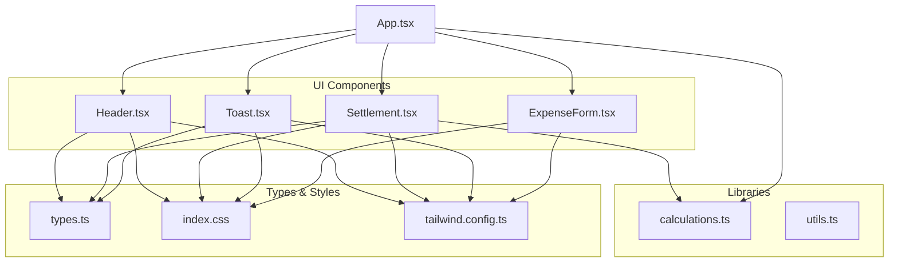
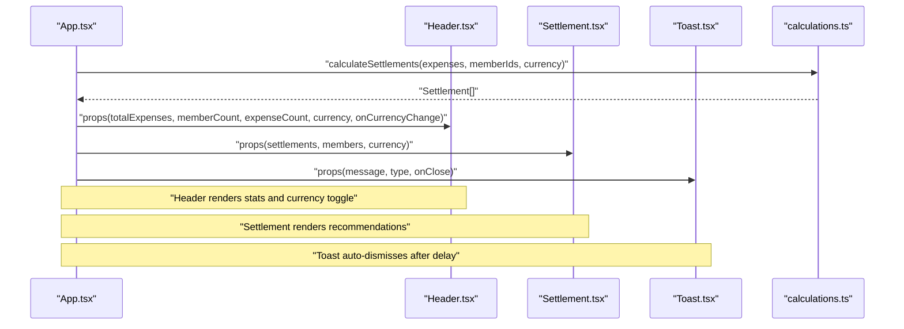
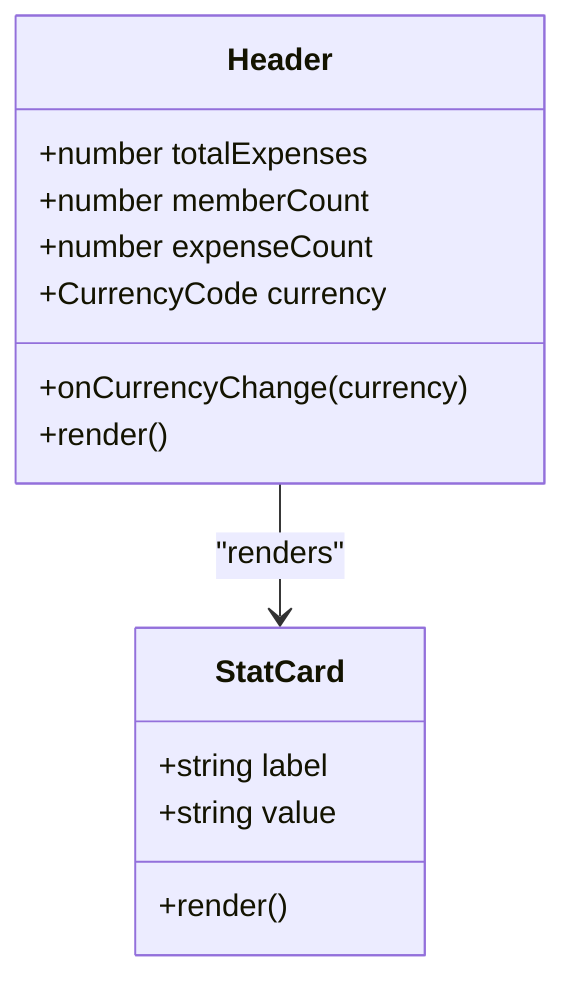
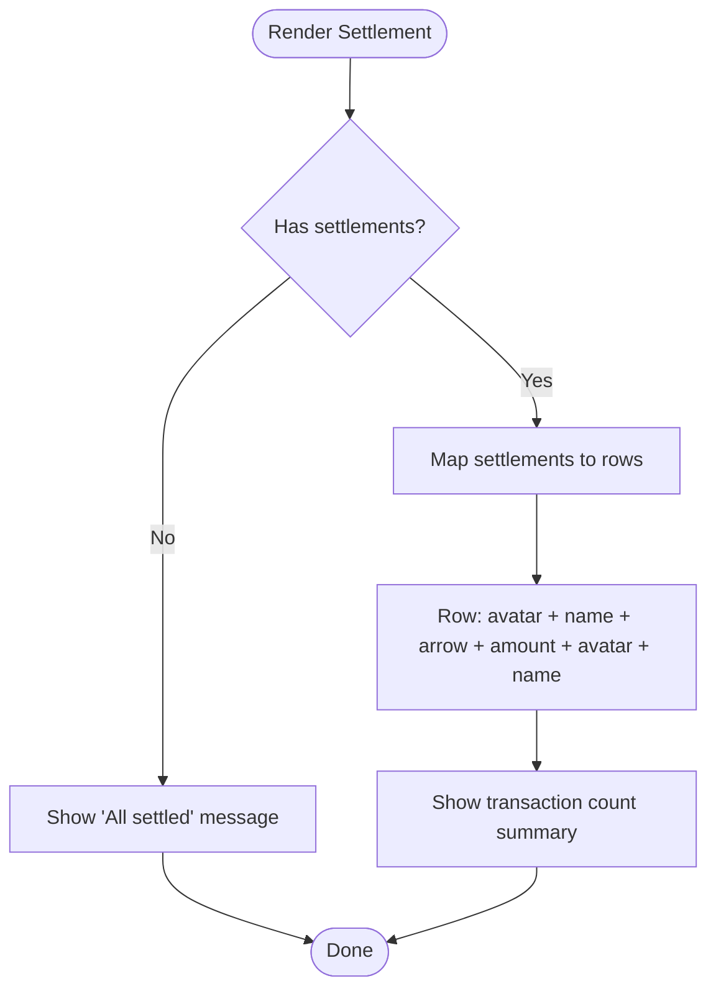
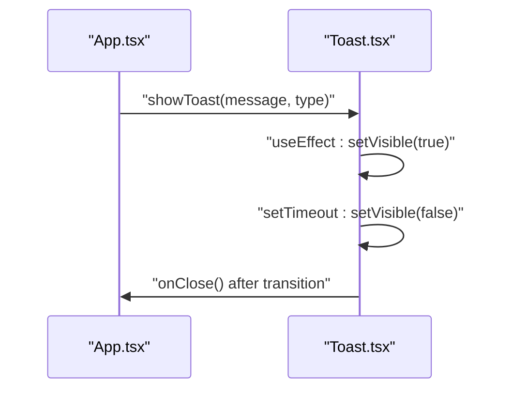
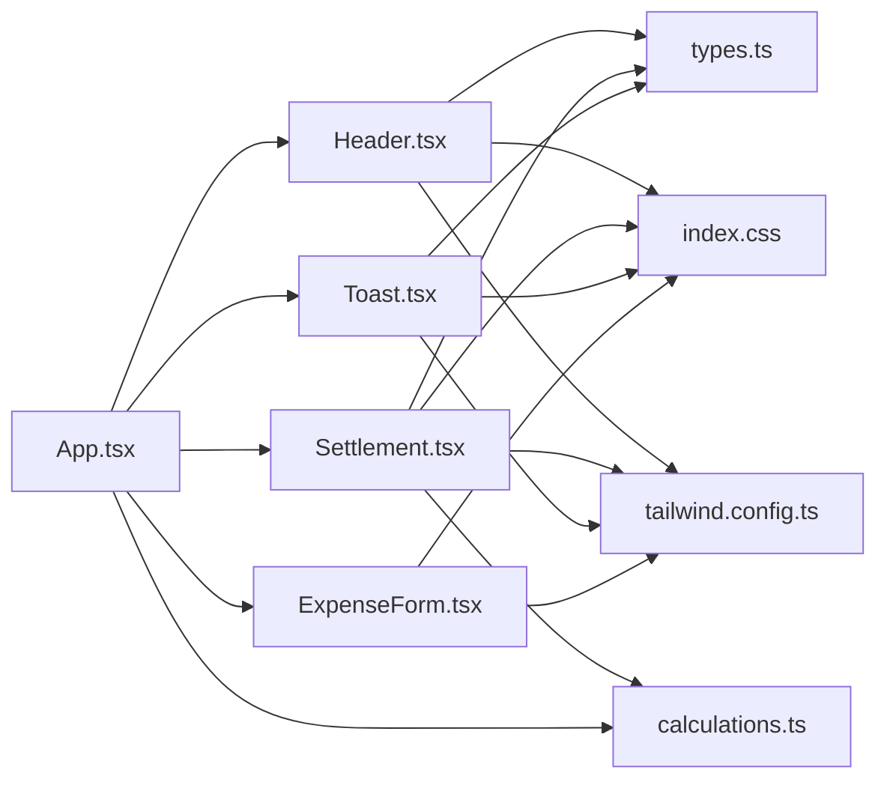

# Display Components

<cite>
**Referenced Files in This Document**
- [Header.tsx](file://travel-splitter/src/components/Header.tsx)
- [Settlement.tsx](file://travel-splitter/src/components/Settlement.tsx)
- [Toast.tsx](file://travel-splitter/src/components/Toast.tsx)
- [calculations.ts](file://travel-splitter/src/lib/calculations.ts)
- [types.ts](file://travel-splitter/src/types.ts)
- [App.tsx](file://travel-splitter/src/App.tsx)
- [ExpenseForm.tsx](file://travel-splitter/src/components/ExpenseForm.tsx)
- [index.css](file://travel-splitter/src/index.css)
- [tailwind.config.ts](file://travel-splitter/tailwind.config.ts)
</cite>

## Table of Contents
1. [Introduction](#introduction)
2. [Project Structure](#project-structure)
3. [Core Components](#core-components)
4. [Architecture Overview](#architecture-overview)
5. [Detailed Component Analysis](#detailed-component-analysis)
6. [Dependency Analysis](#dependency-analysis)
7. [Performance Considerations](#performance-considerations)
8. [Troubleshooting Guide](#troubleshooting-guide)
9. [Conclusion](#conclusion)

## Introduction
This document focuses on the display-focused components that shape the user experience of the travel expense splitting application. It covers:
- Header: Application branding, statistics cards, and currency toggle with gradient backgrounds
- Settlement: Debt visualization and payment recommendations with interactive elements
- Toast: Notification system with auto-dismiss and positioning strategies

It explains data binding patterns, dynamic content rendering, responsive design, animations, and accessibility considerations. It also provides guidance on performance optimization for real-time updates.

## Project Structure
The display components are organized under the components directory and integrate with shared utilities and types. The application orchestrates state and passes computed props to these components.

**Diagram sources**
- [Header.tsx:1-93](file://travel-splitter/src/components/Header.tsx#L1-L93)
- [Settlement.tsx:1-97](file://travel-splitter/src/components/Settlement.tsx#L1-L97)
- [Toast.tsx:1-44](file://travel-splitter/src/components/Toast.tsx#L1-L44)
- [calculations.ts:1-85](file://travel-splitter/src/lib/calculations.ts#L1-L85)
- [types.ts:1-97](file://travel-splitter/src/types.ts#L1-L97)
- [App.tsx:1-231](file://travel-splitter/src/App.tsx#L1-L231)
- [ExpenseForm.tsx:1-274](file://travel-splitter/src/components/ExpenseForm.tsx#L1-L274)
- [index.css:1-114](file://travel-splitter/src/index.css#L1-L114)
- [tailwind.config.ts:1-118](file://travel-splitter/tailwind.config.ts#L1-L118)

**Section sources**
- [App.tsx:163-227](file://travel-splitter/src/App.tsx#L163-L227)
- [Header.tsx:12-78](file://travel-splitter/src/components/Header.tsx#L12-L78)
- [Settlement.tsx:11-95](file://travel-splitter/src/components/Settlement.tsx#L11-L95)
- [Toast.tsx:10-43](file://travel-splitter/src/components/Toast.tsx#L10-L43)

## Core Components
This section introduces the three display components and their roles in the application.

- Header: Displays branding, statistics cards, and a currency toggle. It uses gradient backgrounds and blur effects for visual depth.
- Settlement: Visualizes debt and payment recommendations, showing who owes whom and how much.
- Toast: Provides transient user feedback notifications with auto-dismiss and manual close.

**Section sources**
- [Header.tsx:12-92](file://travel-splitter/src/components/Header.tsx#L12-L92)
- [Settlement.tsx:11-96](file://travel-splitter/src/components/Settlement.tsx#L11-L96)
- [Toast.tsx:10-43](file://travel-splitter/src/components/Toast.tsx#L10-L43)

## Architecture Overview
The application computes derived data (totals, settlements) and passes them down as props to the display components. The Header receives totals and currency; Settlement receives settlement recommendations and member metadata; Toast receives message and type to render notifications.

**Diagram sources**
- [App.tsx:148-161](file://travel-splitter/src/App.tsx#L148-L161)
- [calculations.ts:4-70](file://travel-splitter/src/lib/calculations.ts#L4-L70)
- [Header.tsx:12-78](file://travel-splitter/src/components/Header.tsx#L12-L78)
- [Settlement.tsx:11-95](file://travel-splitter/src/components/Settlement.tsx#L11-L95)
- [Toast.tsx:10-43](file://travel-splitter/src/components/Toast.tsx#L10-L43)

## Detailed Component Analysis

### Header Component
The Header component serves as the application’s branding and statistics hub. It renders:
- Brand identity with a gradient hero background and lazy-loaded hero image
- Currency toggle buttons for switching between JPY and HKD
- Three statistics cards: total expenses, member count, and expense count

Key implementation patterns:
- Gradient background system via CSS variables and Tailwind utilities
- Currency toggle with active-state styling and controlled selection
- Stat card pattern with consistent typography and spacing
- Responsive sizing for mobile and tablet

**Diagram sources**
- [Header.tsx:4-18](file://travel-splitter/src/components/Header.tsx#L4-L18)
- [Header.tsx:81-92](file://travel-splitter/src/components/Header.tsx#L81-L92)

Responsive and accessibility considerations:
- Uses responsive breakpoints for padding and typography
- Blur backdrop and overlay provide readability against images
- Semantic headings and labels improve screen reader support

**Section sources**
- [Header.tsx:12-78](file://travel-splitter/src/components/Header.tsx#L12-L78)
- [Header.tsx:81-92](file://travel-splitter/src/components/Header.tsx#L81-L92)
- [index.css:47-97](file://travel-splitter/src/index.css#L47-L97)
- [tailwind.config.ts:78-111](file://travel-splitter/tailwind.config.ts#L78-L111)

### Settlement Component
The Settlement component visualizes debt and payment recommendations:
- Displays a “no settlements” state with a success icon
- Renders a list of transactions with avatars, names, arrows, and amounts
- Provides a summary of total transactions needed

Interactive features:
- Hover states with subtle shadows and transitions
- Avatar colorization based on member index
- Amount formatting according to selected currency

**Diagram sources**
- [Settlement.tsx:11-95](file://travel-splitter/src/components/Settlement.tsx#L11-L95)
- [types.ts:87-96](file://travel-splitter/src/types.ts#L87-L96)

Accessibility and responsiveness:
- Truncated text with readable truncation for long names
- Color contrast maintained for avatars and text
- Responsive layout with flexible widths and truncation

**Section sources**
- [Settlement.tsx:11-96](file://travel-splitter/src/components/Settlement.tsx#L11-L96)
- [types.ts:87-96](file://travel-splitter/src/types.ts#L87-L96)

### Toast Component
The Toast component provides transient notifications:
- Auto-appear animation on mount
- Auto-dismiss after a fixed duration with exit animation
- Manual close via button
- Type-specific styling (success/error)

**Diagram sources**
- [App.tsx:71-76](file://travel-splitter/src/App.tsx#L71-L76)
- [Toast.tsx:10-43](file://travel-splitter/src/components/Toast.tsx#L10-L43)

Positioning and animation:
- Fixed position at top-right corner
- Smooth opacity and vertical translation transitions
- Z-index ensures visibility above other content

**Section sources**
- [Toast.tsx:10-43](file://travel-splitter/src/components/Toast.tsx#L10-L43)
- [index.css:22-40](file://travel-splitter/src/index.css#L22-L40)

## Dependency Analysis
The display components depend on shared types and utilities, and the app composes them with derived data.

**Diagram sources**
- [App.tsx:1-231](file://travel-splitter/src/App.tsx#L1-L231)
- [Header.tsx:1-93](file://travel-splitter/src/components/Header.tsx#L1-L93)
- [Settlement.tsx:1-97](file://travel-splitter/src/components/Settlement.tsx#L1-L97)
- [Toast.tsx:1-44](file://travel-splitter/src/components/Toast.tsx#L1-L44)
- [calculations.ts:1-85](file://travel-splitter/src/lib/calculations.ts#L1-L85)
- [types.ts:1-97](file://travel-splitter/src/types.ts#L1-L97)
- [index.css:1-114](file://travel-splitter/src/index.css#L1-L114)
- [tailwind.config.ts:1-118](file://travel-splitter/tailwind.config.ts#L1-L118)

**Section sources**
- [App.tsx:148-161](file://travel-splitter/src/App.tsx#L148-L161)
- [calculations.ts:4-70](file://travel-splitter/src/lib/calculations.ts#L4-L70)
- [types.ts:17-48](file://travel-splitter/src/types.ts#L17-L48)

## Performance Considerations
- Memoized computations: The app memoizes total expenses and settlement recommendations to prevent unnecessary re-renders.
- Efficient rendering: Settlement lists use simple mapping and minimal DOM nodes; avatars compute styles inline but are lightweight.
- Animation budget: Animations are modest (opacity and translate) and use CSS transitions for smoothness.
- Real-time updates: Local storage persistence avoids heavy network calls; frequent updates rely on React state and memoization.

Recommendations:
- Batch UI updates when adding multiple expenses to reduce reflows.
- Consider virtualizing long lists if settlement lists grow large.
- Debounce currency change handlers if extended logic is added.

**Section sources**
- [App.tsx:148-161](file://travel-splitter/src/App.tsx#L148-L161)
- [calculations.ts:4-70](file://travel-splitter/src/lib/calculations.ts#L4-L70)

## Troubleshooting Guide
Common issues and resolutions:
- Currency toggle not updating totals: Ensure the parent passes the selected currency and that formatting functions use the correct currency code.
- Settlement list empty unexpectedly: Verify that members and expenses arrays are populated and that the currency passed to calculations matches the display currency.
- Toast not dismissing: Confirm the onClose callback is invoked after the exit transition completes.
- Accessibility: Ensure labels and icons have sufficient contrast and that interactive elements are keyboard focusable.

**Section sources**
- [Header.tsx:46-61](file://travel-splitter/src/components/Header.tsx#L46-L61)
- [Settlement.tsx:11-27](file://travel-splitter/src/components/Settlement.tsx#L11-L27)
- [Toast.tsx:13-20](file://travel-splitter/src/components/Toast.tsx#L13-L20)
- [types.ts:35-48](file://travel-splitter/src/types.ts#L35-L48)

## Conclusion
The Header, Settlement, and Toast components form a cohesive visual system that communicates branding, financial status, and user feedback effectively. They leverage Tailwind CSS for responsive design and animations, maintain accessibility through semantic markup and contrast, and are optimized for performance via memoization and efficient rendering. Together, they deliver a polished, real-time experience for managing travel expenses.