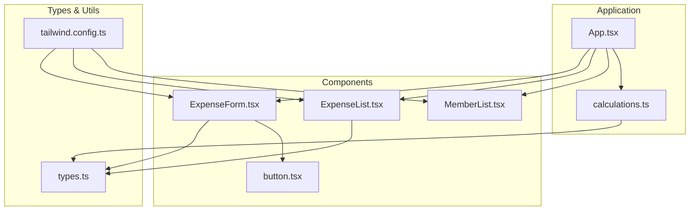
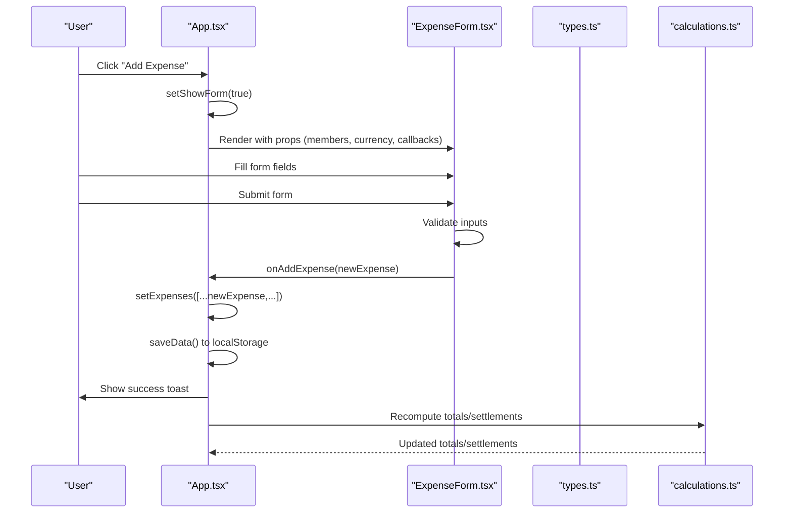
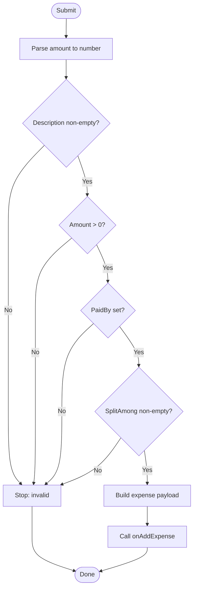
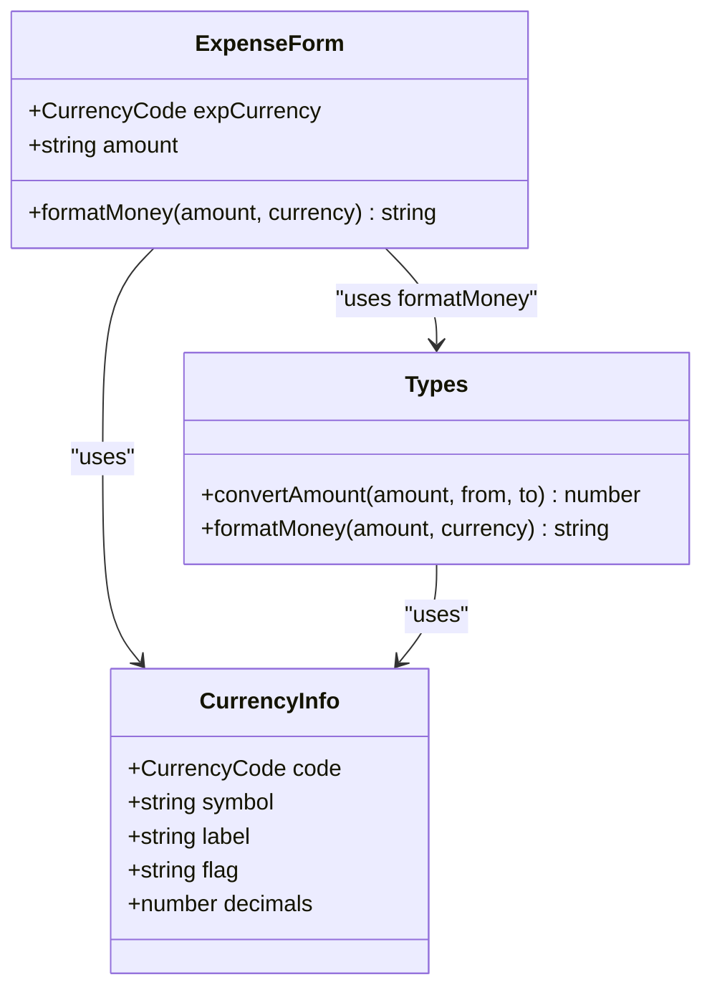
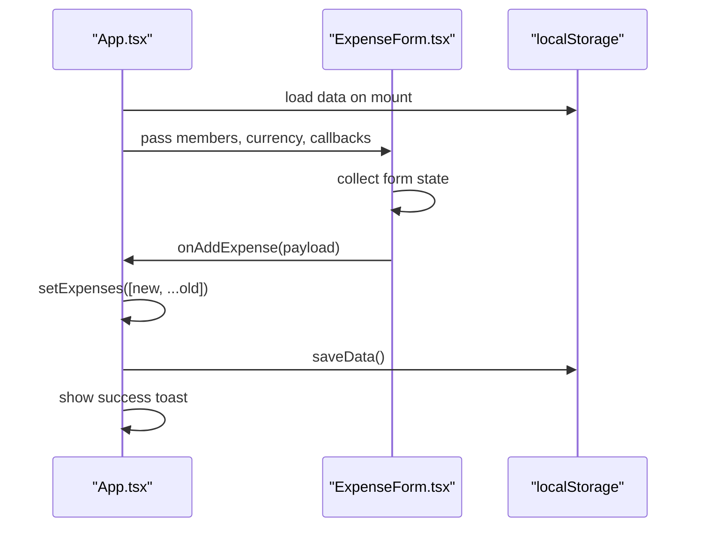

# Form Components

<cite>
**Referenced Files in This Document**
- [ExpenseForm.tsx](file://travel-splitter/src/components/ExpenseForm.tsx)
- [App.tsx](file://travel-splitter/src/App.tsx)
- [types.ts](file://travel-splitter/src/types.ts)
- [calculations.ts](file://travel-splitter/src/lib/calculations.ts)
- [button.tsx](file://travel-splitter/src/components/ui/button.tsx)
- [ExpenseList.tsx](file://travel-splitter/src/components/ExpenseList.tsx)
- [MemberList.tsx](file://travel-splitter/src/components/MemberList.tsx)
- [tailwind.config.ts](file://travel-splitter/tailwind.config.ts)
- [package.json](file://travel-splitter/package.json)
</cite>

## Table of Contents
1. [Introduction](#introduction)
2. [Project Structure](#project-structure)
3. [Core Components](#core-components)
4. [Architecture Overview](#architecture-overview)
5. [Detailed Component Analysis](#detailed-component-analysis)
6. [Dependency Analysis](#dependency-analysis)
7. [Performance Considerations](#performance-considerations)
8. [Troubleshooting Guide](#troubleshooting-guide)
9. [Conclusion](#conclusion)
10. [Appendices](#appendices)

## Introduction
This document provides comprehensive documentation for the ExpenseForm component responsible for creating and editing expense entries in the travel splitter application. It covers form structure, input validation, currency handling, submission logic, component props, state management, accessibility, responsive design, and integration with the main App component and localStorage persistence.

## Project Structure
The ExpenseForm resides in the components directory alongside other UI components and shared utilities. It integrates with the global App state, types, and calculation utilities.

**Diagram sources**
- [ExpenseForm.tsx:1-274](file://travel-splitter/src/components/ExpenseForm.tsx#L1-L274)
- [App.tsx:1-231](file://travel-splitter/src/App.tsx#L1-L231)
- [types.ts:1-97](file://travel-splitter/src/types.ts#L1-L97)
- [calculations.ts:1-85](file://travel-splitter/src/lib/calculations.ts#L1-L85)
- [button.tsx:1-54](file://travel-splitter/src/components/ui/button.tsx#L1-L54)
- [ExpenseList.tsx:1-152](file://travel-splitter/src/components/ExpenseList.tsx#L1-L152)
- [tailwind.config.ts:1-118](file://travel-splitter/tailwind.config.ts#L1-L118)

**Section sources**
- [ExpenseForm.tsx:1-274](file://travel-splitter/src/components/ExpenseForm.tsx#L1-L274)
- [App.tsx:1-231](file://travel-splitter/src/App.tsx#L1-L231)
- [types.ts:1-97](file://travel-splitter/src/types.ts#L1-L97)
- [calculations.ts:1-85](file://travel-splitter/src/lib/calculations.ts#L1-L85)
- [button.tsx:1-54](file://travel-splitter/src/components/ui/button.tsx#L1-L54)
- [ExpenseList.tsx:1-152](file://travel-splitter/src/components/ExpenseList.tsx#L1-L152)
- [tailwind.config.ts:1-118](file://travel-splitter/tailwind.config.ts#L1-L118)

## Core Components
- ExpenseForm: Modal form for adding new expenses with category, description, amount, currency, payer, and split participants.
- App: Central state manager that persists data to localStorage and passes props to ExpenseForm.
- Types: Shared interfaces and utilities for members, expenses, categories, currencies, and formatting.
- Calculations: Utilities for settlement computation and totals.

Key responsibilities:
- ExpenseForm manages local form state, validates inputs, and submits to App.
- App maintains members, expenses, and currency, persists to localStorage, and triggers UI updates.
- Types define the data contract and formatting helpers.
- Calculations derive financial insights from stored data.

**Section sources**
- [ExpenseForm.tsx:34-47](file://travel-splitter/src/components/ExpenseForm.tsx#L34-L47)
- [App.tsx:20-76](file://travel-splitter/src/App.tsx#L20-L76)
- [types.ts:50-97](file://travel-splitter/src/types.ts#L50-L97)
- [calculations.ts:1-85](file://travel-splitter/src/lib/calculations.ts#L1-L85)

## Architecture Overview
The ExpenseForm is rendered conditionally by the App component. On submit, it invokes a callback prop to add a new expense to the App state, which is persisted to localStorage.

**Diagram sources**
- [App.tsx:119-138](file://travel-splitter/src/App.tsx#L119-L138)
- [ExpenseForm.tsx:75-89](file://travel-splitter/src/components/ExpenseForm.tsx#L75-L89)
- [types.ts:50-68](file://travel-splitter/src/types.ts#L50-L68)
- [calculations.ts:4-80](file://travel-splitter/src/lib/calculations.ts#L4-L80)

## Detailed Component Analysis

### ExpenseForm Props and Data Model
- Props interface:
  - members: array of Member objects passed from App state
  - currency: CurrencyCode default currency
  - onAddExpense: callback receiving a normalized expense payload
  - onClose: callback to close the modal
- Expense payload shape:
  - description: string
  - amount: number
  - currency: CurrencyCode
  - paidBy: string (member id)
  - splitAmong: string[]
  - category: ExpenseCategory
  - date: ISO date string (injected by App on submit)

- Expense data structure (shared):
  - id: string
  - description: string
  - amount: number
  - currency: CurrencyCode
  - paidBy: string
  - splitAmong: string[]
  - category: ExpenseCategory
  - date: string

- Member data structure:
  - id: string
  - name: string
  - avatar: string

- Currency and category configuration:
  - CurrencyInfo: code, symbol, label, flag, decimals
  - ExpenseCategory union type
  - CATEGORY_CONFIG mapping for labels/icons

**Section sources**
- [ExpenseForm.tsx:34-47](file://travel-splitter/src/components/ExpenseForm.tsx#L34-L47)
- [ExpenseForm.tsx:75-89](file://travel-splitter/src/components/ExpenseForm.tsx#L75-L89)
- [types.ts:1-97](file://travel-splitter/src/types.ts#L1-L97)

### Form State Management
Local state managed by ExpenseForm:
- description: string
- amount: string (controlled input)
- paidBy: string (selected member id)
- splitAmong: string[] (selected member ids)
- category: ExpenseCategory
- expCurrency: CurrencyCode (currency for this expense)
- date: string (today by default)

State transitions:
- Toggle split participant: add/remove id from splitAmong
- Select all: initialize splitAmong with all member ids
- Change category: update category state
- Change currency: update expCurrency
- Change amount: update amount string (parsed on submit)
- Change paidBy: update selected member id

Validation state:
- isValid computed from description, amount, paidBy, and splitAmong length

**Section sources**
- [ExpenseForm.tsx:55-63](file://travel-splitter/src/components/ExpenseForm.tsx#L55-L63)
- [ExpenseForm.tsx:65-79](file://travel-splitter/src/components/ExpenseForm.tsx#L65-L79)
- [ExpenseForm.tsx:91-95](file://travel-splitter/src/components/ExpenseForm.tsx#L91-L95)

### Input Validation Rules
Validation occurs on submit:
- description must be non-empty after trimming
- amount must parse to a positive number
- paidBy must be non-empty
- splitAmong must not be empty

Additional UX feedback:
- Per-person share is shown when amount > 0 and splitAmong.length > 0
- Submit button is disabled when isValid is false

**Diagram sources**
- [ExpenseForm.tsx:75-89](file://travel-splitter/src/components/ExpenseForm.tsx#L75-L89)

**Section sources**
- [ExpenseForm.tsx:75-89](file://travel-splitter/src/components/ExpenseForm.tsx#L75-L89)
- [ExpenseForm.tsx:91-95](file://travel-splitter/src/components/ExpenseForm.tsx#L91-L95)

### Currency Handling
- Currency selection: two tabs for JPY/HKD
- Symbol placement: left-aligned inside the amount input
- Step handling: integer step for JPY, decimal step for HKD
- Formatting: formatMoney helper displays amounts consistently
- Exchange conversion: convertAmount utility used by calculations

**Diagram sources**
- [ExpenseForm.tsx:97-98](file://travel-splitter/src/components/ExpenseForm.tsx#L97-L98)
- [types.ts:9-48](file://travel-splitter/src/types.ts#L9-L48)

**Section sources**
- [ExpenseForm.tsx:163-196](file://travel-splitter/src/components/ExpenseForm.tsx#L163-L196)
- [ExpenseForm.tsx:250-258](file://travel-splitter/src/components/ExpenseForm.tsx#L250-L258)
- [types.ts:9-48](file://travel-splitter/src/types.ts#L9-L48)

### Submission Logic and Integration with App
- App initializes state from localStorage and persists changes on updates
- App passes members, currency, and onAddExpense callback to ExpenseForm
- On successful submission, ExpenseForm calls onAddExpense with normalized payload
- App adds the new expense to the beginning of the list, closes the form, and shows a toast

**Diagram sources**
- [App.tsx:26-51](file://travel-splitter/src/App.tsx#L26-L51)
- [App.tsx:119-138](file://travel-splitter/src/App.tsx#L119-L138)
- [ExpenseForm.tsx:75-89](file://travel-splitter/src/components/ExpenseForm.tsx#L75-L89)

**Section sources**
- [App.tsx:26-51](file://travel-splitter/src/App.tsx#L26-L51)
- [App.tsx:119-138](file://travel-splitter/src/App.tsx#L119-L138)
- [ExpenseForm.tsx:75-89](file://travel-splitter/src/components/ExpenseForm.tsx#L75-L89)

### Accessibility and Responsive Design
- Accessibility:
  - Proper labels for each field
  - Focusable inputs and buttons with visible focus styles
  - Semantic HTML elements (form, button, select, input)
  - Keyboard navigation support (enter to confirm edits in sibling components)
- Responsive design:
  - Mobile-first layout with bottom sheet on small screens
  - Centered modal on larger screens
  - Flexible grid for category selection
  - Adaptive spacing and typography

Styling and animations:
- Tailwind utilities for consistent spacing, colors, and shadows
- Custom animations (fade-in, scale-in) for smooth transitions
- Gradient button styling and shadow effects

**Section sources**
- [ExpenseForm.tsx:99-273](file://travel-splitter/src/components/ExpenseForm.tsx#L99-L273)
- [tailwind.config.ts:18-112](file://travel-splitter/tailwind.config.ts#L18-L112)

### Data Binding Patterns
- Controlled inputs: each field binds to a local state variable
- Event handlers update state on change
- Computed values: isValid derived from state
- Dynamic rendering: category icons, per-person share, and currency symbol

Member selection:
- Select dropdown for payer
- Interactive chips for split participants with toggle behavior
- Select-all helper to quickly include everyone

**Section sources**
- [ExpenseForm.tsx:149-155](file://travel-splitter/src/components/ExpenseForm.tsx#L149-L155)
- [ExpenseForm.tsx:204-214](file://travel-splitter/src/components/ExpenseForm.tsx#L204-L214)
- [ExpenseForm.tsx:231-249](file://travel-splitter/src/components/ExpenseForm.tsx#L231-L249)

### Example Workflows

#### Form Initialization
- Members and currency are injected by App
- Default values:
  - description: empty
  - amount: empty
  - paidBy: first member id
  - splitAmong: all member ids
  - category: food
  - expCurrency: App currency
  - date: today’s date

#### Data Binding
- Input fields bind to state variables
- Category chips reflect current category
- Currency tabs reflect expCurrency
- Split chips reflect splitAmong membership

#### Submission Workflow
- User fills description, amount, selects category, currency, payer, and participants
- Submit button becomes enabled when isValid is true
- On submit, ExpenseForm parses amount and validates
- App receives normalized payload and updates state

**Section sources**
- [ExpenseForm.tsx:55-63](file://travel-splitter/src/components/ExpenseForm.tsx#L55-L63)
- [ExpenseForm.tsx:91-95](file://travel-splitter/src/components/ExpenseForm.tsx#L91-L95)
- [ExpenseForm.tsx:75-89](file://travel-splitter/src/components/ExpenseForm.tsx#L75-L89)

## Dependency Analysis
Direct dependencies:
- ExpenseForm depends on:
  - types.ts for data contracts and formatting
  - button.tsx for UI primitives
  - lucide-react for icons
- App depends on:
  - ExpenseForm for rendering
  - calculations.ts for derived values
  - localStorage for persistence

External libraries:
- react, react-dom for framework
- lucide-react for icons
- tailwindcss and related plugins for styling

Potential circular dependencies:
- None observed between ExpenseForm and App
- calculations.ts imports types but not App

**Section sources**
- [ExpenseForm.tsx:13-15](file://travel-splitter/src/components/ExpenseForm.tsx#L13-L15)
- [ExpenseForm.tsx:14-15](file://travel-splitter/src/components/ExpenseForm.tsx#L14-L15)
- [App.tsx:6-16](file://travel-splitter/src/App.tsx#L6-L16)
- [calculations.ts:1-3](file://travel-splitter/src/lib/calculations.ts#L1-L3)
- [package.json:11-20](file://travel-splitter/package.json#L11-L20)

## Performance Considerations
- Parsing amount on every render is unnecessary; memoize or compute only on change
- Re-rendering of category chips and split chips could be optimized with stable keys
- Using a single controlled input for amount with numeric validation reduces re-renders
- Consider debouncing expensive computations if added later

## Troubleshooting Guide
Common validation issues:
- Empty description: ensure description.trim() is non-empty
- Non-positive amount: amount must parse to a number greater than zero
- No payer selected: paidBy must be a valid member id
- No participants selected: splitAmong must not be empty

User input problems:
- Decimal precision: JPY uses integer steps, HKD uses two-decimal steps
- Currency symbol placement: symbol appears inside input; ensure proper padding
- Category selection: clicking a category updates state immediately
- Split participant toggling: ensure at least one participant remains selected

Integration issues:
- App state not updating: verify onAddExpense callback is invoked and App sets state
- Data not persisting: check localStorage availability and saveData invocation
- Currency mismatch: ensure convertAmount is used for display totals

Accessibility checks:
- Focus order: verify tab order follows logical sequence
- Screen reader labels: ensure labels are associated with inputs
- Color contrast: verify sufficient contrast for interactive states

**Section sources**
- [ExpenseForm.tsx:75-89](file://travel-splitter/src/components/ExpenseForm.tsx#L75-L89)
- [ExpenseForm.tsx:169-178](file://travel-splitter/src/components/ExpenseForm.tsx#L169-L178)
- [App.tsx:67-69](file://travel-splitter/src/App.tsx#L67-L69)

## Conclusion
The ExpenseForm component provides a robust, accessible, and responsive interface for capturing expense data. It integrates tightly with App state, enforces validation, handles currency nuances, and persists data to localStorage. The component’s design emphasizes usability with clear feedback, keyboard-friendly controls, and thoughtful responsive behavior.

## Appendices

### Props Reference
- ExpenseForm props:
  - members: Member[]
  - currency: CurrencyCode
  - onAddExpense: (payload) => void
  - onClose: () => void

- Expense payload fields:
  - description: string
  - amount: number
  - currency: CurrencyCode
  - paidBy: string
  - splitAmong: string[]
  - category: ExpenseCategory
  - date: string

**Section sources**
- [ExpenseForm.tsx:34-47](file://travel-splitter/src/components/ExpenseForm.tsx#L34-L47)
- [ExpenseForm.tsx:75-89](file://travel-splitter/src/components/ExpenseForm.tsx#L75-L89)
- [types.ts:50-68](file://travel-splitter/src/types.ts#L50-L68)