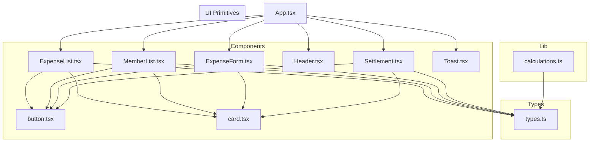
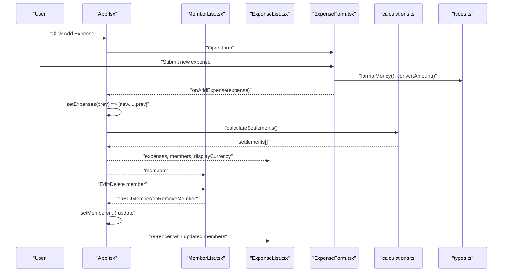
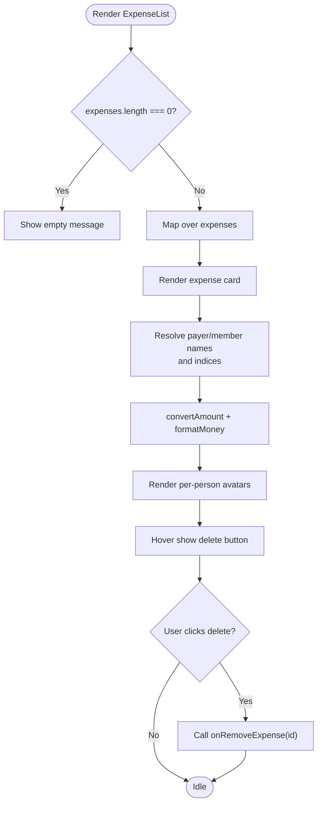
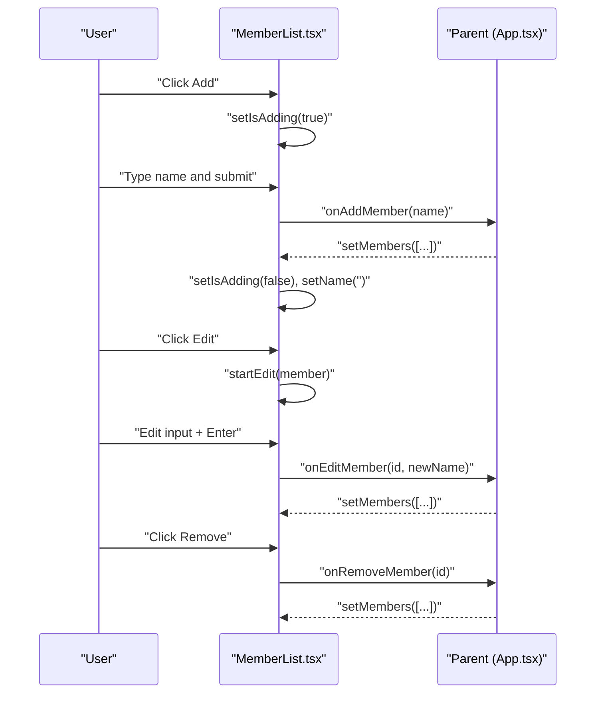
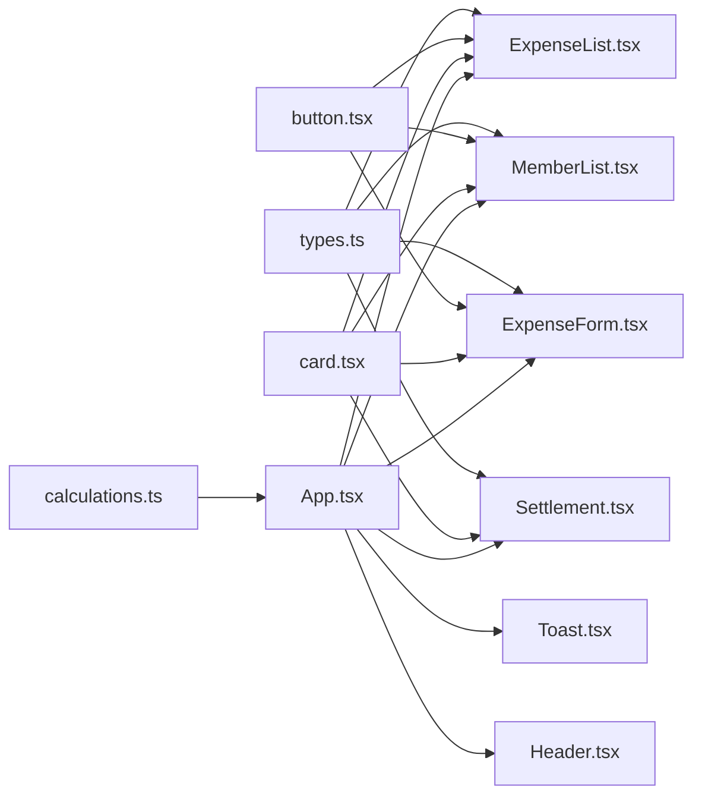

# List Components

<cite>
**Referenced Files in This Document**
- [ExpenseList.tsx](file://travel-splitter/src/components/ExpenseList.tsx)
- [MemberList.tsx](file://travel-splitter/src/components/MemberList.tsx)
- [types.ts](file://travel-splitter/src/types.ts)
- [App.tsx](file://travel-splitter/src/App.tsx)
- [ExpenseForm.tsx](file://travel-splitter/src/components/ExpenseForm.tsx)
- [calculations.ts](file://travel-splitter/src/lib/calculations.ts)
- [index.css](file://travel-splitter/src/index.css)
- [button.tsx](file://travel-splitter/src/components/ui/button.tsx)
- [card.tsx](file://travel-splitter/src/components/ui/card.tsx)
- [Toast.tsx](file://travel-splitter/src/components/Toast.tsx)
- [Header.tsx](file://travel-splitter/src/components/Header.tsx)
</cite>

## Table of Contents
1. [Introduction](#introduction)
2. [Project Structure](#project-structure)
3. [Core Components](#core-components)
4. [Architecture Overview](#architecture-overview)
5. [Detailed Component Analysis](#detailed-component-analysis)
6. [Dependency Analysis](#dependency-analysis)
7. [Performance Considerations](#performance-considerations)
8. [Troubleshooting Guide](#troubleshooting-guide)
9. [Conclusion](#conclusion)
10. [Appendices](#appendices)

## Introduction
This document provides comprehensive documentation for the list components system focused on:
- ExpenseList: renders and manages recorded expenses with currency conversion and per-person sharing visualization.
- MemberList: manages travel companions with inline editing, adding, and removing members.

It covers rendering patterns, item manipulation, interactive features, props interfaces, data structures, sorting and filtering capabilities, edit/delete operations, virtualization strategies, performance optimizations, responsive design, accessibility, and common operational concerns such as list reordering and batch operations.

## Project Structure
The list components are part of a React application using TypeScript and Tailwind CSS. The core list components reside under src/components, with shared types and utilities under src/types and src/lib respectively. Styling is centralized in src/index.css with reusable UI primitives under src/components/ui.



**Diagram sources**
- [ExpenseList.tsx](file://travel-splitter/src/components/ExpenseList.tsx)
- [MemberList.tsx](file://travel-splitter/src/components/MemberList.tsx)
- [ExpenseForm.tsx](file://travel-splitter/src/components/ExpenseForm.tsx)
- [Header.tsx](file://travel-splitter/src/components/Header.tsx)
- [Settlement.tsx](file://travel-splitter/src/components/Settlement.tsx)
- [Toast.tsx](file://travel-splitter/src/components/Toast.tsx)
- [button.tsx](file://travel-splitter/src/components/ui/button.tsx)
- [card.tsx](file://travel-splitter/src/components/ui/card.tsx)
- [calculations.ts](file://travel-splitter/src/lib/calculations.ts)
- [types.ts](file://travel-splitter/src/types.ts)
- [App.tsx](file://travel-splitter/src/App.tsx)

**Section sources**
- [ExpenseList.tsx](file://travel-splitter/src/components/ExpenseList.tsx)
- [MemberList.tsx](file://travel-splitter/src/components/MemberList.tsx)
- [types.ts](file://travel-splitter/src/types.ts)
- [App.tsx](file://travel-splitter/src/App.tsx)

## Core Components
This section documents the props interfaces, data structures, and rendering patterns for both ExpenseList and MemberList.

- ExpenseList props:
  - expenses: Expense[]
  - members: Member[]
  - displayCurrency: CurrencyCode
  - onRemoveExpense: (id: string) => void
- MemberList props:
  - members: Member[]
  - onAddMember: (name: string) => void
  - onRemoveMember: (id: string) => void
  - onEditMember: (id: string, newName: string) => void

Data structures:
- Member: id, name, avatar
- Expense: id, description, amount, currency, paidBy, splitAmong[], category, date
- CurrencyCode: "JPY" | "HKD"
- ExpenseCategory: "food" | "transport" | "hotel" | "ticket" | "shopping" | "other"

Rendering patterns:
- ExpenseList renders a list of expense cards with category icons, payer avatar, per-person avatars, and a delete button.
- MemberList renders a horizontal wrap of member chips with inline edit mode and action buttons.

Sorting and filtering:
- No explicit sorting/filtering is implemented in these components. Sorting is handled by parent App via state ordering (e.g., new expenses appear first).

Edit/delete operations:
- ExpenseList supports delete via onRemoveExpense callback.
- MemberList supports add/edit/remove with inline editing and form submission.

Accessibility:
- Buttons use title attributes for tooltips.
- Inline edit inputs support Enter to confirm and Escape to cancel.
- Focus management is handled by autoFocus on inputs and controlled state.

Responsive design:
- Flexbox and grid layouts adapt to small and medium screens.
- Scrollable container for forms and lists on mobile.

Virtualization:
- Not implemented. The components render all items in DOM. For large datasets, consider react-window or react-virtualized.

**Section sources**
- [ExpenseList.tsx](file://travel-splitter/src/components/ExpenseList.tsx)
- [MemberList.tsx](file://travel-splitter/src/components/MemberList.tsx)
- [types.ts](file://travel-splitter/src/types.ts)
- [App.tsx](file://travel-splitter/src/App.tsx)

## Architecture Overview
The list components are coordinated by App.tsx, which maintains state for members and expenses, persists to localStorage, and computes derived values like totals and settlements. ExpenseList consumes members to resolve payer and per-person identities, while MemberList manages membership lifecycle.



**Diagram sources**
- [App.tsx](file://travel-splitter/src/App.tsx)
- [MemberList.tsx](file://travel-splitter/src/components/MemberList.tsx)
- [ExpenseList.tsx](file://travel-splitter/src/components/ExpenseList.tsx)
- [ExpenseForm.tsx](file://travel-splitter/src/components/ExpenseForm.tsx)
- [calculations.ts](file://travel-splitter/src/lib/calculations.ts)
- [types.ts](file://travel-splitter/src/types.ts)

## Detailed Component Analysis

### ExpenseList Analysis
- Props interface: expenses, members, displayCurrency, onRemoveExpense
- Rendering:
  - Header with count and receipt icon
  - Empty state message
  - List of expense cards with category icon, description, payer identity, amount, and per-person avatars
  - Hover-triggered delete button
- Currency handling:
  - Converts amounts to displayCurrency using convertAmount and formats with formatMoney
  - Shows original amount/currency when different from display currency
- Member resolution:
  - Uses a Map of members keyed by id with index for avatar color assignment
- Interaction:
  - Delete button triggers onRemoveExpense with expense id
- Accessibility:
  - Tooltips via title attributes
  - Hover-triggered actions for discoverability



**Diagram sources**
- [ExpenseList.tsx](file://travel-splitter/src/components/ExpenseList.tsx)
- [types.ts](file://travel-splitter/src/types.ts)

**Section sources**
- [ExpenseList.tsx](file://travel-splitter/src/components/ExpenseList.tsx)
- [types.ts](file://travel-splitter/src/types.ts)

### MemberList Analysis
- Props interface: members, onAddMember, onRemoveMember, onEditMember
- Rendering:
  - Header with add button
  - Inline add form with submit and cancel
  - Horizontal wrap of member chips
  - Inline edit input with Enter confirm and Escape cancel
- State management:
  - Local state for form input, add mode, editing id, and edit input
- Interactions:
  - Add: Submit validates non-empty name, calls onAddMember, resets form
  - Edit: StartEdit sets editingId and editName; ConfirmEdit validates and calls onEditMember
  - Remove: Calls onRemoveMember with id
- Accessibility:
  - Auto-focus on inputs
  - Keyboard shortcuts for inline edit (Enter to confirm, Escape to cancel)
  - Hover-triggered action buttons



**Diagram sources**
- [MemberList.tsx](file://travel-splitter/src/components/MemberList.tsx)
- [App.tsx](file://travel-splitter/src/App.tsx)

**Section sources**
- [MemberList.tsx](file://travel-splitter/src/components/MemberList.tsx)
- [App.tsx](file://travel-splitter/src/App.tsx)

### Supporting Types and Utilities
- Currency and money formatting:
  - CurrencyCode union, CURRENCIES map, convertAmount, formatMoney
- Expense categories:
  - ExpenseCategory union and CATEGORY_CONFIG mapping
- Avatar colors:
  - AVATAR_COLORS array for deterministic per-member colors
- Calculations:
  - calculateSettlements and getTotalExpenses used by App to derive derived state

```mermaid
classDiagram
class Member {
+string id
+string name
+string avatar
}
class Expense {
+string id
+string description
+number amount
+CurrencyCode currency
+string paidBy
+string[] splitAmong
+ExpenseCategory category
+string date
}
class Settlement {
+string from
+string to
+number amount
}
class CurrencyCode {
<<union>>
"JPY"|"HKD"
}
class ExpenseCategory {
<<union>>
"food"|"transport"|"hotel"|"ticket"|"shopping"|"other"
}
Expense --> Member : "paidBy"
Expense --> Member : "splitAmong[]"
Settlement --> Member : "from,to"
```

**Diagram sources**
- [types.ts](file://travel-splitter/src/types.ts)

**Section sources**
- [types.ts](file://travel-splitter/src/types.ts)
- [calculations.ts](file://travel-splitter/src/lib/calculations.ts)

## Dependency Analysis
- ExpenseList depends on:
  - types.ts for Expense, Member, CurrencyCode, ExpenseCategory, AVATAR_COLORS, CURRENCIES, formatMoney, convertAmount
  - UI primitives via Tailwind classes and button.tsx/card.tsx
- MemberList depends on:
  - types.ts for Member, AVATAR_COLORS
  - button.tsx for styled buttons
- App.tsx orchestrates:
  - Maintains members and expenses state
  - Persists to localStorage
  - Computes totals and settlements
  - Passes callbacks to child components



**Diagram sources**
- [ExpenseList.tsx](file://travel-splitter/src/components/ExpenseList.tsx)
- [MemberList.tsx](file://travel-splitter/src/components/MemberList.tsx)
- [ExpenseForm.tsx](file://travel-splitter/src/components/ExpenseForm.tsx)
- [Settlement.tsx](file://travel-splitter/src/components/Settlement.tsx)
- [Toast.tsx](file://travel-splitter/src/components/Toast.tsx)
- [Header.tsx](file://travel-splitter/src/components/Header.tsx)
- [button.tsx](file://travel-splitter/src/components/ui/button.tsx)
- [card.tsx](file://travel-splitter/src/components/ui/card.tsx)
- [calculations.ts](file://travel-splitter/src/lib/calculations.ts)
- [types.ts](file://travel-splitter/src/types.ts)
- [App.tsx](file://travel-splitter/src/App.tsx)

**Section sources**
- [App.tsx](file://travel-splitter/src/App.tsx)
- [ExpenseList.tsx](file://travel-splitter/src/components/ExpenseList.tsx)
- [MemberList.tsx](file://travel-splitter/src/components/MemberList.tsx)
- [types.ts](file://travel-splitter/src/types.ts)
- [calculations.ts](file://travel-splitter/src/lib/calculations.ts)

## Performance Considerations
- Current implementation:
  - Renders all items in DOM; no virtualization.
  - Uses useMemo for derived values (totals, settlements) to avoid recomputation.
  - useCallback for event handlers to prevent unnecessary re-renders.
- Recommendations for large datasets:
  - Implement virtualization (e.g., react-window) to render only visible items.
  - Batch updates when applying edits/deletes to minimize reflows.
  - Memoize expensive computations (e.g., per-item currency conversions) with useMemo/useCallback.
  - Debounce user input in forms to reduce frequent re-renders.
- Responsive design:
  - Flex/wrap layouts adapt to screen sizes; consider limiting item width and using scroll containers on small screens.
- Styling:
  - Tailwind utilities are efficient; avoid excessive dynamic class concatenations.

[No sources needed since this section provides general guidance]

## Troubleshooting Guide
Common issues and resolutions:
- Deleting a member with existing expenses:
  - App prevents removal if the member appears as payer or in splitAmong; shows an error toast.
- Editing a member name:
  - Inline edit requires non-empty input; Enter confirms, Escape cancels.
- Adding a member:
  - Form requires non-empty name; submit disabled until valid.
- Expense deletion:
  - Ensure onRemoveExpense is passed down correctly; verify id matches.
- Currency conversion:
  - Expenses are converted to displayCurrency for consistent totals; verify exchange rates and formatting.
- Data consistency:
  - App persists to localStorage; ensure state updates occur before persistence effects run.

**Section sources**
- [App.tsx](file://travel-splitter/src/App.tsx)
- [MemberList.tsx](file://travel-splitter/src/components/MemberList.tsx)
- [ExpenseList.tsx](file://travel-splitter/src/components/ExpenseList.tsx)
- [types.ts](file://travel-splitter/src/types.ts)

## Conclusion
The list components provide a clean, modular foundation for managing travel expenses and companions. They leverage shared types and utilities for currency handling and avatar coloring, and integrate with parent state management for persistence and derived computations. While the current implementation does not include virtualization, it offers a solid baseline for future enhancements such as virtualization, advanced sorting/filtering, and batch operations.

[No sources needed since this section summarizes without analyzing specific files]

## Appendices

### Props Reference

- ExpenseList
  - expenses: Expense[]
  - members: Member[]
  - displayCurrency: CurrencyCode
  - onRemoveExpense: (id: string) => void

- MemberList
  - members: Member[]
  - onAddMember: (name: string) => void
  - onRemoveMember: (id: string) => void
  - onEditMember: (id: string, newName: string) => void

- ExpenseForm
  - members: Member[]
  - currency: CurrencyCode
  - onAddExpense: (expense: Omit<Expense, "id" | "date">) => void
  - onClose: () => void

- Settlement
  - settlements: Settlement[]
  - members: Member[]
  - currency: CurrencyCode

- Toast
  - message: string
  - type: "success" | "error"
  - onClose: () => void

- Header
  - totalExpenses: number
  - memberCount: number
  - expenseCount: number
  - currency: CurrencyCode
  - onCurrencyChange: (currency: CurrencyCode) => void

**Section sources**
- [ExpenseList.tsx](file://travel-splitter/src/components/ExpenseList.tsx)
- [MemberList.tsx](file://travel-splitter/src/components/MemberList.tsx)
- [ExpenseForm.tsx](file://travel-splitter/src/components/ExpenseForm.tsx)
- [Settlement.tsx](file://travel-splitter/src/components/Settlement.tsx)
- [Toast.tsx](file://travel-splitter/src/components/Toast.tsx)
- [Header.tsx](file://travel-splitter/src/components/Header.tsx)
- [types.ts](file://travel-splitter/src/types.ts)

### Accessibility Notes
- Buttons include title attributes for tooltips.
- Inline edit inputs receive autoFocus and support Enter/Escape keys.
- Hover-triggered actions improve discoverability on touch devices.
- Consider adding aria-labels and roles for improved screen reader support.

**Section sources**
- [ExpenseList.tsx](file://travel-splitter/src/components/ExpenseList.tsx)
- [MemberList.tsx](file://travel-splitter/src/components/MemberList.tsx)

### Responsive Design Patterns
- Flexbox and grid layouts adapt to small and medium screens.
- Scrollable containers for forms and lists on mobile.
- Tailwind utilities manage spacing and shadows consistently.

**Section sources**
- [index.css](file://travel-splitter/src/index.css)
- [ExpenseList.tsx](file://travel-splitter/src/components/ExpenseList.tsx)
- [MemberList.tsx](file://travel-splitter/src/components/MemberList.tsx)
- [ExpenseForm.tsx](file://travel-splitter/src/components/ExpenseForm.tsx)