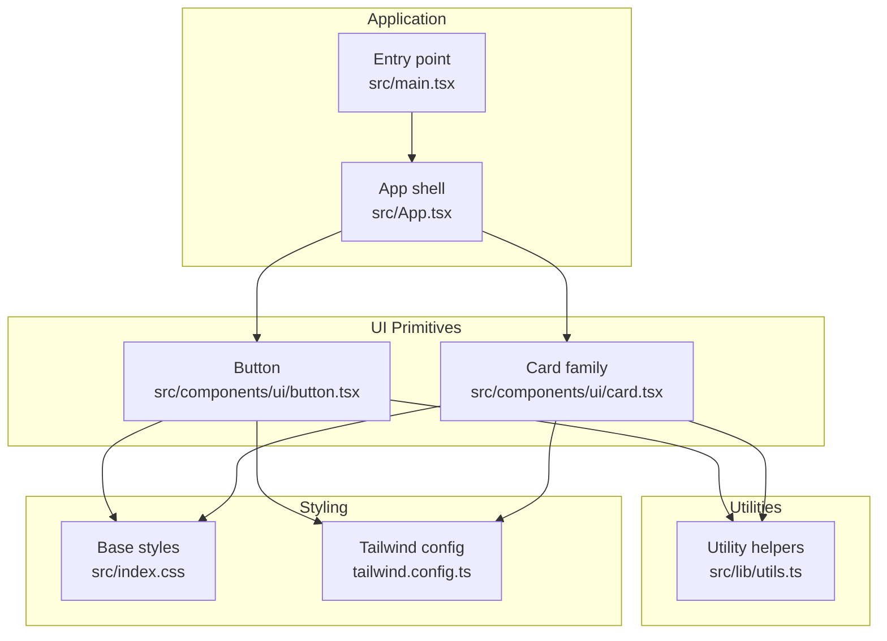
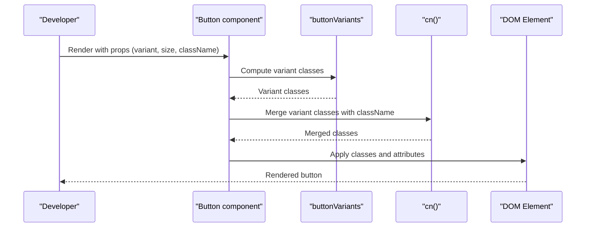
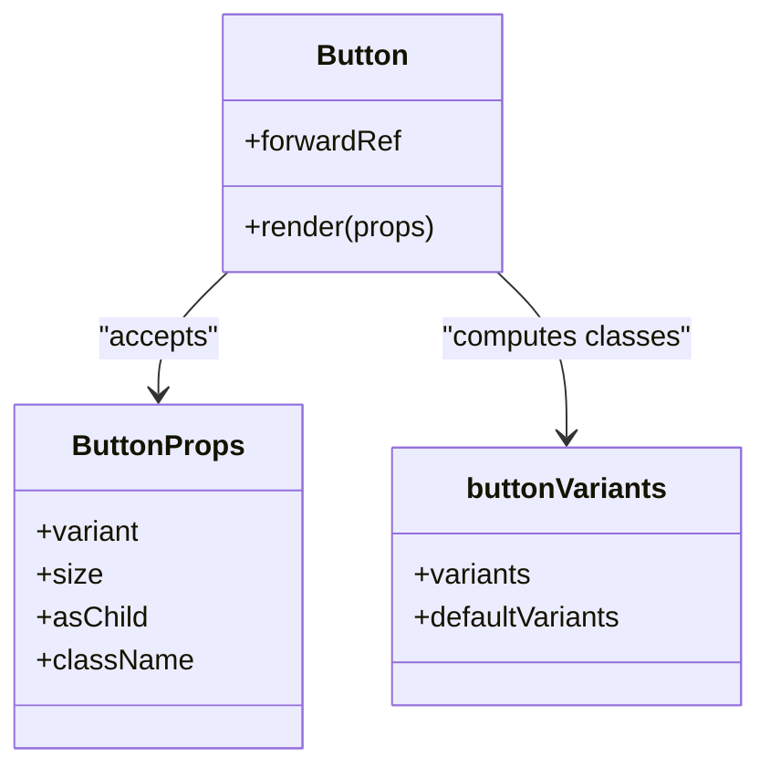
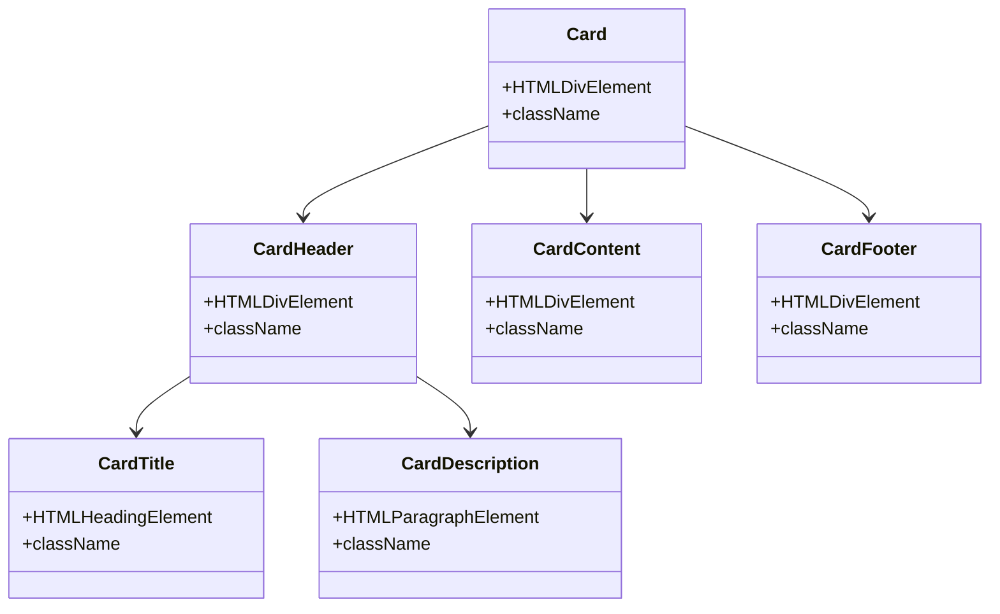
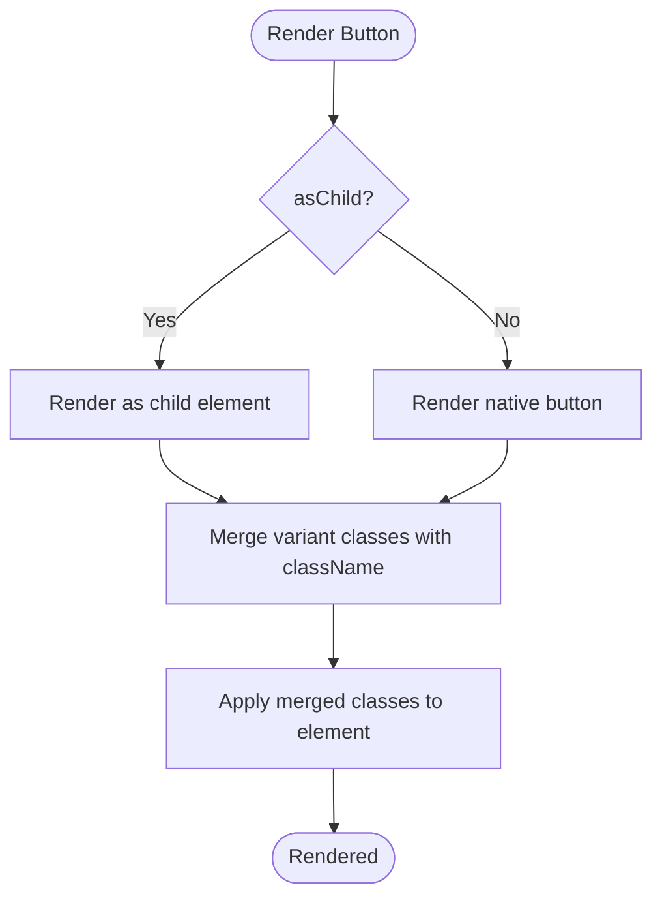
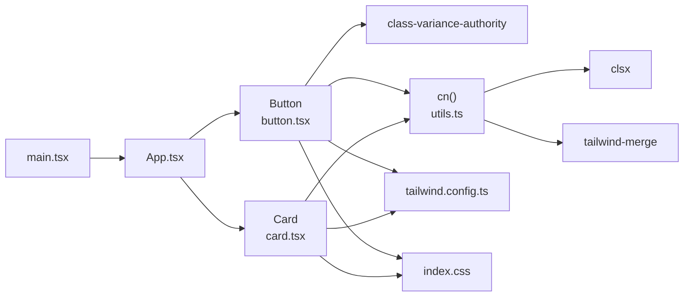

# Reusable UI Primitives

<cite>
**Referenced Files in This Document**
- [button.tsx](file://travel-splitter/src/components/ui/button.tsx)
- [card.tsx](file://travel-splitter/src/components/ui/card.tsx)
- [utils.ts](file://travel-splitter/src/lib/utils.ts)
- [index.css](file://travel-splitter/src/index.css)
- [tailwind.config.ts](file://travel-splitter/tailwind.config.ts)
- [App.tsx](file://travel-splitter/src/App.tsx)
- [main.tsx](file://travel-splitter/src/main.tsx)
- [package.json](file://travel-splitter/package.json)
</cite>

## Table of Contents
1. [Introduction](#introduction)
2. [Project Structure](#project-structure)
3. [Core Components](#core-components)
4. [Architecture Overview](#architecture-overview)
5. [Detailed Component Analysis](#detailed-component-analysis)
6. [Dependency Analysis](#dependency-analysis)
7. [Performance Considerations](#performance-considerations)
8. [Troubleshooting Guide](#troubleshooting-guide)
9. [Conclusion](#conclusion)
10. [Appendices](#appendices)

## Introduction
This document describes the reusable UI primitive components used across the application, focusing on Button and Card. It explains component variants, sizes, styling options, customization capabilities, and how they integrate with the Tailwind CSS-based design system. It also covers accessibility features, keyboard navigation, focus management, and guidelines for extending or modifying these primitives while maintaining design consistency.

## Project Structure
The UI primitives live under the shared UI module and are consumed by page-level components. The design system is configured via Tailwind CSS and CSS variables, enabling consistent theming and responsive behavior.

**Diagram sources**
- [button.tsx:1-54](file://travel-splitter/src/components/ui/button.tsx#L1-L54)
- [card.tsx:1-79](file://travel-splitter/src/components/ui/card.tsx#L1-L79)
- [utils.ts:1-7](file://travel-splitter/src/lib/utils.ts#L1-L7)
- [index.css:1-114](file://travel-splitter/src/index.css#L1-L114)
- [tailwind.config.ts:1-118](file://travel-splitter/tailwind.config.ts#L1-L118)
- [App.tsx:1-230](file://travel-splitter/src/App.tsx#L1-L230)
- [main.tsx:1-11](file://travel-splitter/src/main.tsx#L1-L11)

**Section sources**
- [button.tsx:1-54](file://travel-splitter/src/components/ui/button.tsx#L1-L54)
- [card.tsx:1-79](file://travel-splitter/src/components/ui/card.tsx#L1-L79)
- [utils.ts:1-7](file://travel-splitter/src/lib/utils.ts#L1-L7)
- [index.css:1-114](file://travel-splitter/src/index.css#L1-L114)
- [tailwind.config.ts:1-118](file://travel-splitter/tailwind.config.ts#L1-L118)
- [App.tsx:1-230](file://travel-splitter/src/App.tsx#L1-L230)
- [main.tsx:1-11](file://travel-splitter/src/main.tsx#L1-L11)

## Core Components
This section documents the Button and Card primitives, their props, variants, sizes, and styling behavior.

- Button
  - Variants: default, destructive, outline, secondary, ghost, link
  - Sizes: default, sm, lg, icon
  - Props:
    - Inherits standard button attributes (disabled, type, aria-*)
    - variant: selects visual palette and hover behavior
    - size: controls height, padding, and corner radius
    - asChild: renders as a child element (see Composition Patterns)
    - className: allows additional Tailwind classes
  - Accessibility: includes focus-visible ring and disabled pointer-events
  - Theme integration: uses CSS variables for colors and shadows

- Card
  - Composition: Card, CardHeader, CardTitle, CardDescription, CardContent, CardFooter
  - Props: standard HTML div attributes plus className
  - Theme integration: uses card background and foreground tokens

**Section sources**
- [button.tsx:5-38](file://travel-splitter/src/components/ui/button.tsx#L5-L38)
- [card.tsx:4-78](file://travel-splitter/src/components/ui/card.tsx#L4-L78)
- [index.css:5-71](file://travel-splitter/src/index.css#L5-L71)

## Architecture Overview
The primitives are built with a variant-driven approach using class-variance-authority and merged with utility classes via a helper. Tailwind CSS provides the design tokens, while CSS variables define the theme.

**Diagram sources**
- [button.tsx:5-50](file://travel-splitter/src/components/ui/button.tsx#L5-L50)
- [utils.ts:4-6](file://travel-splitter/src/lib/utils.ts#L4-L6)

**Section sources**
- [button.tsx:1-54](file://travel-splitter/src/components/ui/button.tsx#L1-L54)
- [utils.ts:1-7](file://travel-splitter/src/lib/utils.ts#L1-L7)

## Detailed Component Analysis

### Button Primitive
- Implementation highlights
  - Uses class-variance-authority to define variants and sizes
  - Merges computed classes with user-provided className via cn()
  - Inherits native button attributes and adds variant/sizing props
  - Focus-visible ring and disabled state handled consistently
- Props interface
  - Inherits all button attributes (onClick, aria-label, disabled, etc.)
  - variant: variant selection
  - size: sizing selection
  - asChild: renders as a child element (useful for composing with links or other elements)
  - className: additional Tailwind classes
- Styling and customization
  - Variant classes target color tokens (primary, destructive, secondary, etc.)
  - Size classes adjust height, padding, and border radius
  - Additional className can override or augment defaults
- Accessibility and focus
  - Focus ring via focus-visible utilities
  - Disabled state prevents interactions and reduces opacity
- Usage examples
  - Floating action button with gradient and shadow utilities
  - Icon-only buttons using the icon size variant

**Diagram sources**
- [button.tsx:34-50](file://travel-splitter/src/components/ui/button.tsx#L34-L50)

**Section sources**
- [button.tsx:1-54](file://travel-splitter/src/components/ui/button.tsx#L1-L54)
- [App.tsx:197-208](file://travel-splitter/src/App.tsx#L197-L208)

### Card Primitive Family
- Composition model
  - Card: base container with border, background, and shadow
  - CardHeader: vertical stack with spacing and padding
  - CardTitle: heading with typography tokens
  - CardDescription: muted description text
  - CardContent: main content area with top padding reset
  - CardFooter: footer layout with spacing and alignment
- Props
  - All components accept standard HTML attributes plus className
- Styling and customization
  - Uses card background and foreground tokens
  - Footer aligns items and resets top padding
- Accessibility and focus
  - No interactive elements; focus behavior is inherited from parent context

**Diagram sources**
- [card.tsx:4-78](file://travel-splitter/src/components/ui/card.tsx#L4-L78)

**Section sources**
- [card.tsx:1-79](file://travel-splitter/src/components/ui/card.tsx#L1-L79)

### Composition Patterns and Custom Styling
- Composition with asChild
  - The Button component accepts an asChild prop, enabling rendering as a child element (e.g., a link or another component) while preserving variant and size styling
- Utility merging
  - The cn() helper merges variant classes with user-provided className using clsx and tailwind-merge, preventing class conflicts and ensuring predictable overrides
- Theme integration
  - CSS variables define color palettes, radii, and shadows
  - Tailwind theme extends tokens to match the design system
  - Utilities layer defines gradients and interactive shadows

**Diagram sources**
- [button.tsx:34-50](file://travel-splitter/src/components/ui/button.tsx#L34-L50)
- [utils.ts:4-6](file://travel-splitter/src/lib/utils.ts#L4-L6)

**Section sources**
- [button.tsx:34-50](file://travel-splitter/src/components/ui/button.tsx#L34-L50)
- [utils.ts:1-7](file://travel-splitter/src/lib/utils.ts#L1-L7)

## Dependency Analysis
- Internal dependencies
  - Button depends on class-variance-authority for variants and cn() for class merging
  - Card depends on cn() for class merging
  - cn() depends on clsx and tailwind-merge
- External dependencies
  - Tailwind CSS and Tailwind plugins for animations and utilities
  - Tailwind configuration extends design tokens and keyframes
- Application integration
  - App imports Button and Card and applies them in layouts and interactions
  - Entry point initializes the app with global styles

**Diagram sources**
- [button.tsx:1-3](file://travel-splitter/src/components/ui/button.tsx#L1-L3)
- [card.tsx:1-2](file://travel-splitter/src/components/ui/card.tsx#L1-L2)
- [utils.ts:1-6](file://travel-splitter/src/lib/utils.ts#L1-L6)
- [tailwind.config.ts:1-118](file://travel-splitter/tailwind.config.ts#L1-L118)
- [index.css:1-3](file://travel-splitter/src/index.css#L1-L3)
- [App.tsx:1-10](file://travel-splitter/src/App.tsx#L1-L10)
- [main.tsx:1-11](file://travel-splitter/src/main.tsx#L1-L11)

**Section sources**
- [package.json:11-20](file://travel-splitter/package.json#L11-L20)
- [button.tsx:1-3](file://travel-splitter/src/components/ui/button.tsx#L1-L3)
- [card.tsx:1-2](file://travel-splitter/src/components/ui/card.tsx#L1-L2)
- [utils.ts:1-6](file://travel-splitter/src/lib/utils.ts#L1-L6)
- [tailwind.config.ts:1-118](file://travel-splitter/tailwind.config.ts#L1-L118)
- [index.css:1-3](file://travel-splitter/src/index.css#L1-L3)
- [App.tsx:1-10](file://travel-splitter/src/App.tsx#L1-L10)
- [main.tsx:1-11](file://travel-splitter/src/main.tsx#L1-L11)

## Performance Considerations
- Variant computation
  - class-variance-authority computes variant classes efficiently; keep variant sets minimal to reduce CSS bloat
- Class merging
  - Using clsx and tailwind-merge avoids redundant classes and ensures deterministic outcomes
- Rendering
  - Prefer native button elements for performance; asChild should be used sparingly and only when necessary for semantics or composition
- Theming
  - CSS variables enable efficient light/dark mode switching without re-rendering components

## Troubleshooting Guide
- Button not responding to clicks
  - Verify disabled prop is not set; disabled state prevents interactions
- Focus ring not visible
  - Ensure focus-visible utilities are included; the component relies on focus-visible ring classes
- Variant or size not applying
  - Confirm variant and size values match the defined sets; extra className may override defaults unintentionally
- Card layout issues
  - Use CardHeader/CardTitle/CardDescription/CardContent/CardFooter composition to ensure proper spacing and typography
- Theme inconsistencies
  - Check that CSS variables are defined and Tailwind content paths include the UI modules

**Section sources**
- [button.tsx:5-38](file://travel-splitter/src/components/ui/button.tsx#L5-L38)
- [card.tsx:4-78](file://travel-splitter/src/components/ui/card.tsx#L4-L78)
- [index.css:5-71](file://travel-splitter/src/index.css#L5-L71)
- [tailwind.config.ts:1-118](file://travel-splitter/tailwind.config.ts#L1-L118)

## Conclusion
The Button and Card primitives provide a consistent, theme-aware foundation for building UI surfaces. Their variant-driven design, strong accessibility defaults, and seamless Tailwind integration enable rapid development while maintaining design system coherence. Extending these primitives should respect the existing variant and size taxonomy, leverage the utility merging strategy, and preserve focus and interaction semantics.

## Appendices

### Props Reference

- ButtonProps
  - variant: default | destructive | outline | secondary | ghost | link
  - size: default | sm | lg | icon
  - asChild: boolean
  - className: string
  - Inherits standard button attributes

- Card family
  - Card: HTMLDivElement attributes + className
  - CardHeader: HTMLDivElement attributes + className
  - CardTitle: HTMLHeadingElement attributes + className
  - CardDescription: HTMLParagraphElement attributes + className
  - CardContent: HTMLDivElement attributes + className
  - CardFooter: HTMLDivElement attributes + className

**Section sources**
- [button.tsx:34-50](file://travel-splitter/src/components/ui/button.tsx#L34-L50)
- [card.tsx:4-78](file://travel-splitter/src/components/ui/card.tsx#L4-L78)

### Theme Tokens and Utilities
- Color tokens
  - Primary, secondary, destructive, muted, accent, card, background, foreground, border, input, ring
- Typography and spacing
  - Font families, border radii, shadows, and spacing units
- Utilities
  - Gradients, interactive shadows, transitions, and custom scrollbars

**Section sources**
- [tailwind.config.ts:18-111](file://travel-splitter/tailwind.config.ts#L18-L111)
- [index.css:5-97](file://travel-splitter/src/index.css#L5-L97)