# UI Components

<cite>
**Referenced Files in This Document**
- [button.tsx](file://src/components/ui/button.tsx)
- [card.tsx](file://src/components/ui/card.tsx)
- [Header.tsx](file://src/components/Header.tsx)
- [ExpenseForm.tsx](file://src/components/ExpenseForm.tsx)
- [ExpenseList.tsx](file://src/components/ExpenseList.tsx)
- [MemberList.tsx](file://src/components/MemberList.tsx)
- [Settlement.tsx](file://src/components/Settlement.tsx)
- [Toast.tsx](file://src/components/Toast.tsx)
- [types.ts](file://src/types.ts)
- [utils.ts](file://src/lib/utils.ts)
- [calculations.ts](file://src/lib/calculations.ts)
- [App.tsx](file://src/App.tsx)
- [index.css](file://src/index.css)
- [tailwind.config.ts](file://src/tailwind.config.ts)
</cite>

## Table of Contents
1. [Introduction](#introduction)
2. [Project Structure](#project-structure)
3. [Core Components](#core-components)
4. [Architecture Overview](#architecture-overview)
5. [Detailed Component Analysis](#detailed-component-analysis)
6. [Dependency Analysis](#dependency-analysis)
7. [Performance Considerations](#performance-considerations)
8. [Troubleshooting Guide](#troubleshooting-guide)
9. [Conclusion](#conclusion)
10. [Appendices](#appendices)

## Introduction
This document describes the UI component system of the Travel Splitter application. It covers major functional components (Header, ExpenseForm, ExpenseList, MemberList, Settlement, Toast), reusable UI primitives (Button, Card), and supporting utilities. It explains props, events, state management, composition patterns, responsiveness, accessibility, animations, and styling via Tailwind CSS. The goal is to help developers understand how components work together, how to customize them, and how to extend the system efficiently.

## Project Structure
The UI components live under src/components and src/components/ui. Shared types and utilities are under src/types.ts and src/lib. Styling is configured via Tailwind CSS with custom design tokens and animations defined in src/index.css and src/tailwind.config.ts. The main app orchestrates state and composes components in src/App.tsx.

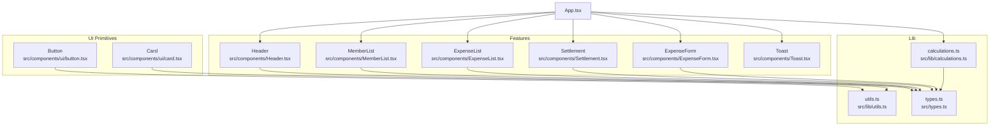

**Diagram sources**
- [App.tsx](file://src/App.tsx)
- [button.tsx](file://src/components/ui/button.tsx)
- [card.tsx](file://src/components/ui/card.tsx)
- [Header.tsx](file://src/components/Header.tsx)
- [MemberList.tsx](file://src/components/MemberList.tsx)
- [ExpenseForm.tsx](file://src/components/ExpenseForm.tsx)
- [ExpenseList.tsx](file://src/components/ExpenseList.tsx)
- [Settlement.tsx](file://src/components/Settlement.tsx)
- [Toast.tsx](file://src/components/Toast.tsx)
- [utils.ts](file://src/lib/utils.ts)
- [calculations.ts](file://src/lib/calculations.ts)
- [types.ts](file://src/types.ts)

**Section sources**
- [App.tsx](file://src/App.tsx)
- [index.css](file://src/index.css)
- [tailwind.config.ts](file://src/tailwind.config.ts)

## Core Components
This section documents each major component, including props, behavior, and integration points.

- Header
  - Purpose: Branding, navigation context, and global currency selection.
  - Props:
    - totalExpenses: number
    - memberCount: number
    - expenseCount: number
    - currency: CurrencyCode
    - onCurrencyChange: (code: CurrencyCode) => void
  - Behavior: Renders a hero area with stats cards and a currency selector. Uses CURRENCIES and formatMoney from types.
  - Accessibility: Buttons use semantic roles and keyboard-friendly interactions.
  - Responsiveness: Responsive typography and layout using Tailwind utilities.

- ExpenseForm
  - Purpose: Add new expenses with category, description, amount, currency, payer, and split participants.
  - Props:
    - members: Member[]
    - currency: CurrencyCode
    - onAddExpense: (expense) => void
    - onClose: () => void
  - Behavior: Form validation, amount parsing, split calculation preview, and submission to parent.
  - Events: Emits onAddExpense and onClose.
  - State: Manages form fields internally; validates before submit.

- ExpenseList
  - Purpose: Display recorded expenses, show who paid and who owes, and allow removal.
  - Props:
    - expenses: Expense[]
    - members: Member[]
    - displayCurrency: CurrencyCode
    - onRemoveExpense: (id: string) => void
  - Behavior: Converts amounts to display currency, renders avatars, and shows per-person share.

- MemberList
  - Purpose: Manage travel companions: add, edit, remove.
  - Props:
    - members: Member[]
    - onAddMember: (name: string) => void
    - onRemoveMember: (id: string) => void
    - onEditMember: (id: string, newName: string) => void
  - Behavior: Inline editing, keyboard shortcuts (Enter to confirm, Escape to cancel), and avatar coloring.

- Settlement
  - Purpose: Visualize minimal debt transfers needed to settle balances.
  - Props:
    - settlements: Settlement[]
    - members: Member[]
    - currency: CurrencyCode
  - Behavior: Renders transfer pairs with colored initials and amounts.

- Toast
  - Purpose: Provide transient user feedback (success/error).
  - Props:
    - message: string
    - type: "success" | "error"
    - onClose: () => void
  - Behavior: Auto-dismiss after delay with fade/slide animation.

**Section sources**
- [Header.tsx](file://src/components/Header.tsx)
- [ExpenseForm.tsx](file://src/components/ExpenseForm.tsx)
- [ExpenseList.tsx](file://src/components/ExpenseList.tsx)
- [MemberList.tsx](file://src/components/MemberList.tsx)
- [Settlement.tsx](file://src/components/Settlement.tsx)
- [Toast.tsx](file://src/components/Toast.tsx)
- [types.ts](file://src/types.ts)

## Architecture Overview
The app composes components around a central state model stored in App.tsx. Components communicate via props and callbacks. Calculations are encapsulated in lib/calculations.ts, and shared types and helpers live in types.ts and lib/utils.ts. Styling leverages Tailwind with custom CSS variables and animations.

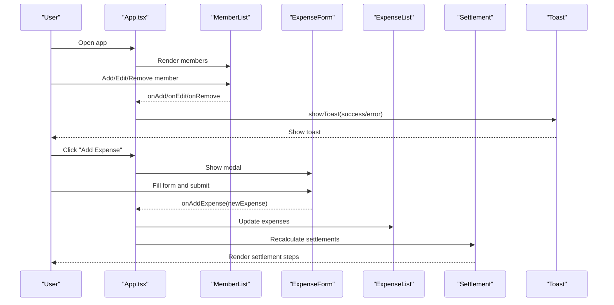

**Diagram sources**
- [App.tsx](file://src/App.tsx)
- [MemberList.tsx](file://src/components/MemberList.tsx)
- [ExpenseForm.tsx](file://src/components/ExpenseForm.tsx)
- [ExpenseList.tsx](file://src/components/ExpenseList.tsx)
- [Settlement.tsx](file://src/components/Settlement.tsx)
- [Toast.tsx](file://src/components/Toast.tsx)

## Detailed Component Analysis

### Button Primitive
- Variants: default, destructive, outline, secondary, ghost, link
- Sizes: default, sm, lg, icon
- Composition: Uses class-variance-authority (cva) with cn merging utility.
- Accessibility: Inherits native button semantics; supports asChild pattern via forwardRef.
- Usage: Used across components for actions and controls.

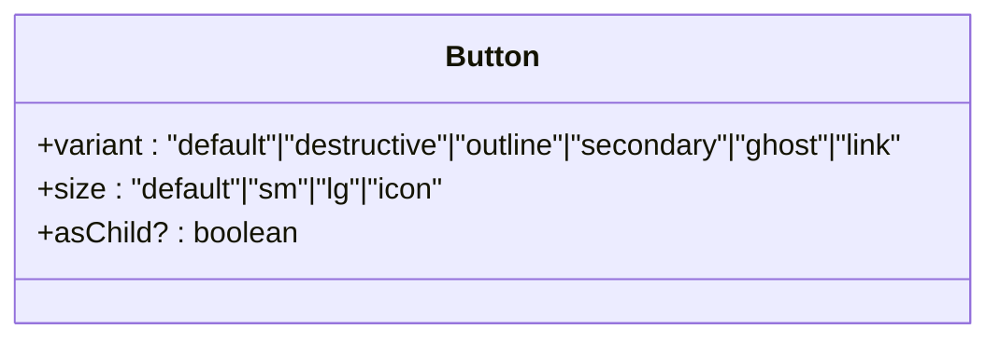

**Diagram sources**
- [button.tsx](file://src/components/ui/button.tsx)

**Section sources**
- [button.tsx](file://src/components/ui/button.tsx)
- [utils.ts](file://src/lib/utils.ts)

### Card Primitive
- Composition: Card, CardHeader, CardTitle, CardDescription, CardContent, CardFooter.
- Styling: Uses Tailwind classes and cn utility; maintains consistent spacing and typography.
- Usage: Wraps feature sections like MemberList, ExpenseList, Settlement.

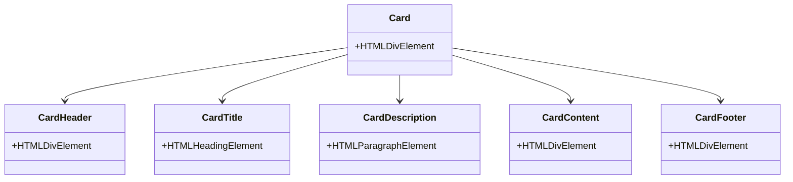

**Diagram sources**
- [card.tsx](file://src/components/ui/card.tsx)

**Section sources**
- [card.tsx](file://src/components/ui/card.tsx)

### Header
- Props: totalExpenses, memberCount, expenseCount, currency, onCurrencyChange
- Behavior: Renders hero background, brand identity, exchange rate hint, and three stat cards.
- Currency toggle: Iterates over CURRENCIES keys to render selectable options.

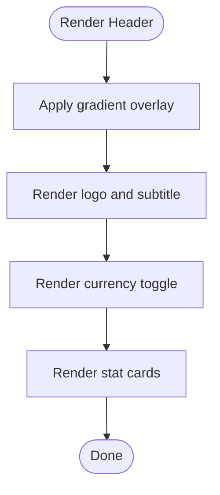

**Diagram sources**
- [Header.tsx](file://src/components/Header.tsx)
- [types.ts](file://src/types.ts)

**Section sources**
- [Header.tsx](file://src/components/Header.tsx)
- [types.ts](file://src/types.ts)

### ExpenseForm
- Props: members, currency, onAddExpense, onClose
- Validation: Requires description, positive numeric amount, selected payer, and at least one splitter.
- State: Tracks description, amount, paidBy, splitAmong, category, expCurrency, date.
- Preview: Shows per-person share when splitAmong and amount are valid.
- Submission: Calls onAddExpense with normalized data.

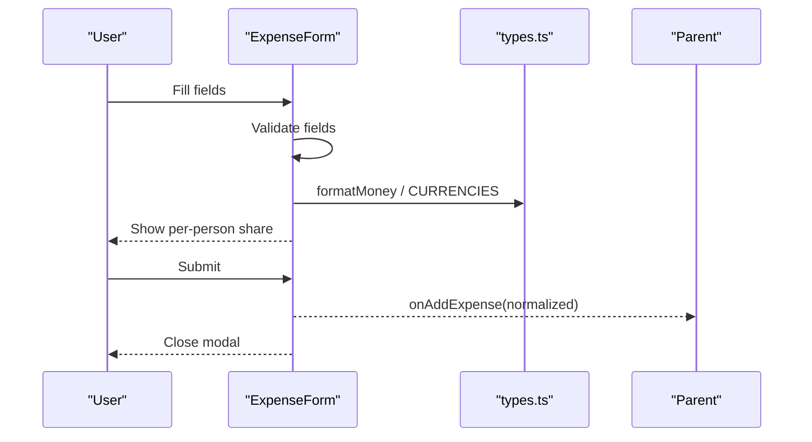

**Diagram sources**
- [ExpenseForm.tsx](file://src/components/ExpenseForm.tsx)
- [types.ts](file://src/types.ts)

**Section sources**
- [ExpenseForm.tsx](file://src/components/ExpenseForm.tsx)
- [types.ts](file://src/types.ts)

### ExpenseList
- Props: expenses, members, displayCurrency, onRemoveExpense
- Behavior: Converts amounts to display currency, renders category icons, avatars, and per-person indicators.
- Interaction: Hover reveals delete action; deletion delegated to parent.

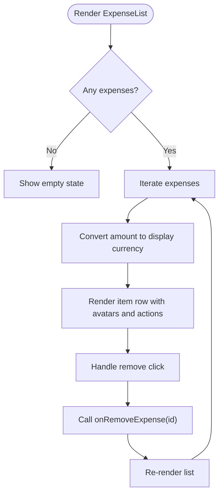

**Diagram sources**
- [ExpenseList.tsx](file://src/components/ExpenseList.tsx)
- [types.ts](file://src/types.ts)

**Section sources**
- [ExpenseList.tsx](file://src/components/ExpenseList.tsx)
- [types.ts](file://src/types.ts)

### MemberList
- Props: members, onAddMember, onRemoveMember, onEditMember
- Behavior: Add member form, inline edit mode, avatar coloring, keyboard support (Enter/Escape).
- State: Local form state and editing state.

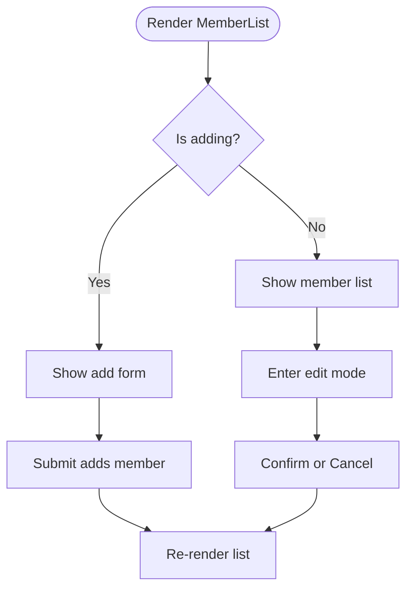

**Diagram sources**
- [MemberList.tsx](file://src/components/MemberList.tsx)
- [types.ts](file://src/types.ts)

**Section sources**
- [MemberList.tsx](file://src/components/MemberList.tsx)
- [types.ts](file://src/types.ts)

### Settlement
- Props: settlements, members, currency
- Behavior: Renders minimal transfer steps with colored initials and amounts. Shows completion message when no debts remain.

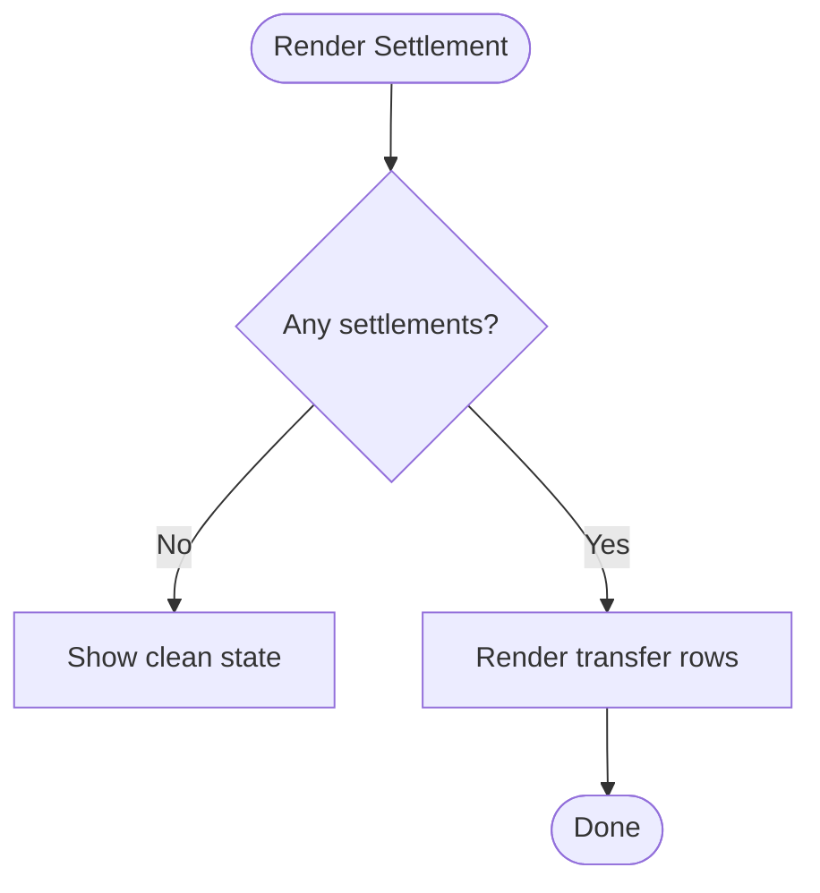

**Diagram sources**
- [Settlement.tsx](file://src/components/Settlement.tsx)
- [types.ts](file://src/types.ts)

**Section sources**
- [Settlement.tsx](file://src/components/Settlement.tsx)
- [types.ts](file://src/types.ts)

### Toast
- Props: message, type, onClose
- Behavior: Auto-shows with animation, auto-hides after delay, supports manual close.

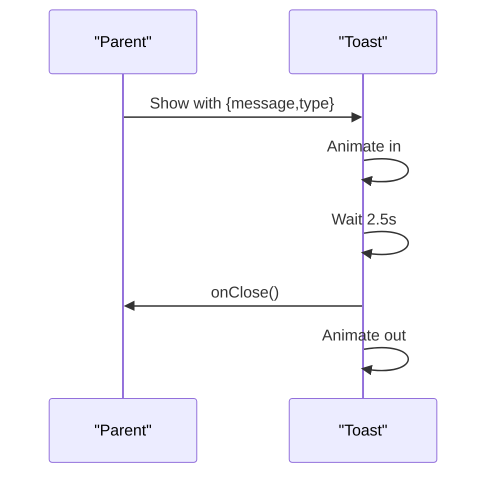

**Diagram sources**
- [Toast.tsx](file://src/components/Toast.tsx)

**Section sources**
- [Toast.tsx](file://src/components/Toast.tsx)

## Dependency Analysis
- Component coupling:
  - Feature components depend on types.ts for shapes and helpers (formatMoney, convertAmount, CURRENCIES).
  - App.tsx orchestrates state and passes props down; child components emit callbacks.
- Utility dependencies:
  - utils.ts provides cn for Tailwind class merging.
  - calculations.ts provides pure functions for balances and settlements.
- Styling:
  - Tailwind config defines design tokens, shadows, borders, and animations.
  - index.css defines CSS variables for gradients, shadows, transitions, and custom utilities.

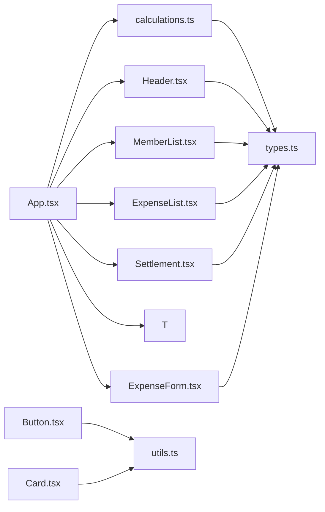

**Diagram sources**
- [App.tsx](file://src/App.tsx)
- [ExpenseForm.tsx](file://src/components/ExpenseForm.tsx)
- [ExpenseList.tsx](file://src/components/ExpenseList.tsx)
- [MemberList.tsx](file://src/components/MemberList.tsx)
- [Settlement.tsx](file://src/components/Settlement.tsx)
- [Header.tsx](file://src/components/Header.tsx)
- [Toast.tsx](file://src/components/Toast.tsx)
- [types.ts](file://src/types.ts)
- [calculations.ts](file://src/lib/calculations.ts)
- [utils.ts](file://src/lib/utils.ts)

**Section sources**
- [App.tsx](file://src/App.tsx)
- [types.ts](file://src/types.ts)
- [calculations.ts](file://src/lib/calculations.ts)
- [utils.ts](file://src/lib/utils.ts)
- [tailwind.config.ts](file://src/tailwind.config.ts)
- [index.css](file://src/index.css)

## Performance Considerations
- Memoization:
  - App.tsx uses useMemo for total expenses and settlements to avoid recomputation on unrelated updates.
- Efficient rendering:
  - ExpenseList and MemberList render lists with minimal re-renders; avoid unnecessary keys and ensure stable arrays.
- Animations:
  - Tailwind animations are lightweight; keep durations reasonable to prevent jank on low-end devices.
- State locality:
  - ExpenseForm and MemberList manage local state to reduce prop drilling and improve interactivity.
- Storage:
  - LocalStorage persistence is batched in a single effect to minimize writes.

[No sources needed since this section provides general guidance]

## Troubleshooting Guide
- Form validation failures:
  - Ensure amount is a positive number and description is non-empty. Verify paidBy and splitAmong are selected.
- Currency conversion:
  - When displayCurrency differs from expense currency, amounts are converted before rendering totals and per-person shares.
- Member removal blocked:
  - App prevents removing members who have associated expenses; prompt to delete records first.
- Toast not dismissing:
  - Ensure onClose is called after animation completes; Toast uses a timeout and transition to hide.

**Section sources**
- [ExpenseForm.tsx](file://src/components/ExpenseForm.tsx)
- [App.tsx](file://src/App.tsx)
- [Toast.tsx](file://src/components/Toast.tsx)

## Conclusion
The Travel Splitter UI system emphasizes composability, type safety, and consistent styling. Reusable primitives (Button, Card) enable rapid construction of feature components. Clear separation of concerns—state in App.tsx, logic in calculations.ts, and presentation in components—supports maintainability and scalability. Tailwind CSS with custom tokens and animations delivers a polished, responsive experience.

[No sources needed since this section summarizes without analyzing specific files]

## Appendices

### Props and Events Reference

- Button
  - Props: variant, size, asChild, plus standard button attributes.
  - Events: onClick, etc., inherited from HTMLButtonElement.

- Card
  - Props: className, style, etc., for each part (Card, CardHeader, CardTitle, CardDescription, CardContent, CardFooter).

- Header
  - Props: totalExpenses, memberCount, expenseCount, currency, onCurrencyChange.

- ExpenseForm
  - Props: members, currency, onAddExpense, onClose.
  - Events: none; communicates via callback.

- ExpenseList
  - Props: expenses, members, displayCurrency, onRemoveExpense.

- MemberList
  - Props: members, onAddMember, onRemoveMember, onEditMember.

- Settlement
  - Props: settlements, members, currency.

- Toast
  - Props: message, type, onClose.

**Section sources**
- [button.tsx](file://src/components/ui/button.tsx)
- [card.tsx](file://src/components/ui/card.tsx)
- [Header.tsx](file://src/components/Header.tsx)
- [ExpenseForm.tsx](file://src/components/ExpenseForm.tsx)
- [ExpenseList.tsx](file://src/components/ExpenseList.tsx)
- [MemberList.tsx](file://src/components/MemberList.tsx)
- [Settlement.tsx](file://src/components/Settlement.tsx)
- [Toast.tsx](file://src/components/Toast.tsx)

### Styling and Animation Tokens
- Design tokens:
  - Colors, radii, gradients, and shadows defined in CSS variables and Tailwind theme.
- Animations:
  - fade-in, slide-in-right, scale-in, pulse-soft; applied via Tailwind utilities on components.
- Utilities:
  - Transition-smooth and gradient-* utilities for consistent motion and backgrounds.

**Section sources**
- [index.css](file://src/index.css)
- [tailwind.config.ts](file://src/tailwind.config.ts)